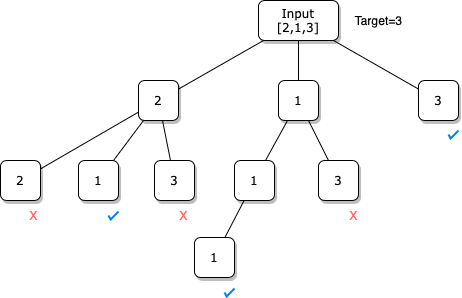
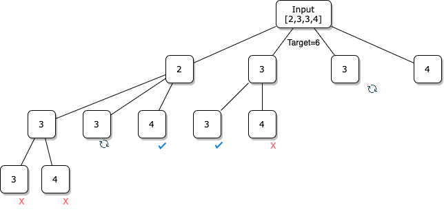

# Practice Questions

## Hints

- Use scratch paper
- Try brutal force when optimal solution can't be find immediately
- Read example cases carefully when you are under pressure
- Practice questions with a timer
- Try to debug by reading the code only
- Track variable values with inline comments
  - use notation like `n: 12` for constant
  - use notation like `i: 3-5` for iterables
- Maximize short term memory before coding by completing the following steps in order:
  - cardio -> a balanced meal -> 8 hours of sleep -> relaxing -> meditation

## LeetCode

### 1. Two Sum

- Input:
  - An array of integers
  - A integer as target
- Output:
  - A list of the indices from the given list, the sum of two number equals the target
- Assumption:
  - Each set of input only has one solution
  - The number from the list can't add itself
  - The order of the solution list doesn't matter
- Solution:

  - Brute force with two nested loop - `O(n^2)`
  - Hashmap with elements in list as keys and their indices as values - `O(n)`

    - [Two-pass Hash Table](https://leetcode.com/problems/two-sum/editorial/) - For each element in list, find its difference between itself and the target as complement. A solution is found when the complement exists in the keys and the complement is not the element itself

    ```py
    class Solution:
    def twoSum(self, nums: List[int], target: int) -> List[int]:
        hashmap = {}
        for i in range(len(nums)):
            complement = target - nums[i]
            if complement in hashmap:
                return [i, hashmap[complement]]
            hashmap[nums[i]] = i
    ```

    - [One-pass Hash Table](https://leetcode.com/problems/two-sum/editorial/) - Instead of creating a hashmap (dictionary) and finding the complement in two full loop as a two-pass, the two steps can be done in one iteration
      - the only difference is one-pass can only pairing the complement before it in the list, two-pass can find solution from both sides in list
      - When the input list has duplicated values, this method still works as the last index is always saved, when the algorithm is looking at the key that is not saved in the hashmap it can still be paired with the other one with a different index

    ```py
    class Solution:
        def twoSum(self, nums: List[int], target: int) -> List[int]:
            hashmap = {}
            for i in range(len(nums)): # iterate whole list
                complement = target - nums[i]
                if complement in hashmap: # look back for solution
                    return [i, hashmap[complement]]
                hashmap[nums[i]] = i # otherwise, put current value to the dictionary
    ```

### 7. Reverse Integer

- Input:
  - A signed 32-bit integer
- Output:
  - A reversed input
  - the signs are kept the same
- Assumption:
  - Return `0` when the reversed integer is out of range
  - the environment does not allow you to store 64-bit integers
- Solution:
  - convert int to string, then check edge cases if its values are out of ranges - `O(log_10(n))` where `log_10(n)` is the length of the string
    - N bit unsigned integar has range `[0, 2^n-1]`
    - N bit signed integar has range `[-2^(n-1), 2^(n-1)-1]`, as an extra bit is used to represent the sign

```py
class Solution:
    def reverse(self, x: int) -> int:
        x = int(str(x)[::-1]) if x >= 0 else int('-' + str(x)[:0:-1])
        return 0 if x < -2**31 or x > 2**31 - 1 else x
```

### 9. Palindrome Number

- Input:
  - An integer number
- Output:
  - Return true when the number is palindrome
    - Palindrome - An integer is a palindrome when it reads the same forward and backward
- Solution:

  - Compare Splitted Digit in a List - Construct a new reversed number and compare - `O(log_10(n))`
    - Edge cases:
      - return false when the number is negative
      - return true when it equals zero
    - One can only compare half of the number until midpoint

  ```py
  class Solution:
      def isPalindrome(self, x: int) -> bool:
          if x == 0:
              return True
          elif x < 0:
              return False
          else:
              # Convert x into int list
              numList = []
              while x > 0:
                  numList.append(x % 10)
                  x = x // 10
              # Test Palindrome
              for i in range(int(len(numList)/2)):
                  if numList[i] != numList[(i+1)*(-1)]:
                      return False
          return True
  ```

  - String Solution - Consider the input integer as string, reverse and compare it - `O(log_10(n))` where `log_10(n)` is the length of the string

  ```py
  class Solution:
      def isPalindrome(self, x: int) -> bool:
          return str(x) == str(x)[::-1]
  ```

### 12. Integer to Roman

- Input:
  - The equivalent integer value of the input Roman number
- Output:
  - Roman numerals in a string
- Assumption:
  - Input number are in range `[1, 3999]`
- Solution

  - Divide from large char to small and replace `4`, `9` patterns

  ```py
  class Solution:
      def intToRoman(self, num: int) -> str:
          ROMAN_CHAR = {1: "I", 5: "V", 10: "X", 50: "L", 100: "C", 500: "D", 1000: "M"}
          raw_str = ""
          for base in list(ROMAN_CHAR.keys())[::-1]: # Use base number from 1000 to 1 for division
              count = num // base # Use result from floor division to generate simple Roman string
              raw_str += ROMAN_CHAR[base] * count
              num -= count * base
          return raw_str.replace('VIIII','IX').replace('LXXXX','XC').replace('DCCCC','CM').replace('IIII','IV').replace('XXXX','XL').replace('CCCC','CD') # Match 9, 90, 900 first as they are longer
  ```

- Use translate dictionary that includes `4`, `9` chars in Roman numerals

  ```py
  class Solution:
      def intToRoman(self, num: int) -> str:
          # Creating Dictionary for Lookup
          ROMAN_CHAR = {1000: "M", 900: "CM", 500: "D", 400: "CD", 100: "C", 90: "XC", 50: "L", 40: "XL", 10: "X", 9: "IX", 5: "V", 4: "IV", 1: "I"}
          raw_str = ''
          for base, char in ROMAN_CHAR.keys(): # Use base number from 1000 to 1 for division
              raw_str += char * (num // base) # Use result from floor division to generate Roman string from left to right
              num %= base # Use the remainder to generate remaining string
          return raw_str
  ```

  - [Reference Table Method](https://leetcode.com/problems/integer-to-roman/solutions/3421938/awesome-python-solution/)
    - All combination of numbers within range `1-3999` can be predicted with a table, from right to left

  ```py
  class Solution:
      def intToRoman(self, num: int) -> str:
          M=["","M","MM","MMM"] # index represents the number of thousands from 0 to 3000
          C=["","C","CC","CCC","CD","D","DC","DCC","DCCC","CM"] # index represents the number of hundreds from 0 to 900
          X=["","X","XX","XXX","XL","L","LX","LXX","LXXX","XC"] # index represents the number of tenth from 0 to 90
          I=["","I","II","III","IV","V","VI","VII","VIII","IX"] # index represents the number of ones from 0 to 9
          return M[num//1000]+C[num%1000//100]+X[num%1000%100//10]+I[num%1000%100%10] # Use remainders find the number of 1000, 100, 10, and 1
  ```

### 13. Roman to Integer

- Input:
  - Roman numerals in a string
- Output:
  - The equivalent integer value of the input Roman number
- Assumption:
  - Input Roman numerals are all valid
  - Input Roman numerals are in range `[1, 3999]`
- Solution:

  - Logic translate from right to left - `O(n)`
    - Since Roman numbers are written from large to small with exception for `4`, `9`, `40`, `90`, `400`, `900` etc. Translate the characters from right to left as long as the char value is growing. Otherviews, substract the values

  ```py
  class Solution:
      def romanToInt(self, s: str) -> int:
          ROMAN_CHAR = {"I": 1, "V": 5, "X": 10, "L": 50, "C": 100, "D": 500, "M": 1000}
          value = 0
          isSubstract = False
          for i in range(len(s)-1,-1,-1): # Always add the last char
              if i == len(s)-1: value += ROMAN_CHAR[s[i]]
              else: # For all other chars
                  if ROMAN_CHAR[s[i]] > ROMAN_CHAR[s[i+1]]: # If the char size is reducing
                      value += ROMAN_CHAR[s[i]] # add the current char value
                      isSubstract = False # Set the current operation type
                  elif ROMAN_CHAR[s[i]] < ROMAN_CHAR[s[i+1]]: # If the char size is growing
                      value -= ROMAN_CHAR[s[i]] # minus the current char value
                      isSubstract = True # Set the current operation type
                  else: # If the char is repeating, use the last operation type
                      if isSubstract: # If last operation is substraction, minus its value
                          value -= ROMAN_CHAR[s[i]]
                      else: # If last operation is adding, plus its value
                          value += ROMAN_CHAR[s[i]]
          return value # Code can be optimized as there is actually no duplicated minus char
  ```

  - Replace all six `4`, `9` patterns to regular order from big to small, then translate and sum up the values - `O(n)`

  ```py
  class Solution:
      def romanToInt(self, s: str) -> int:
          ROMAN_CHAR = {"I": 1, "V": 5, "X": 10, "L": 50, "C": 100, "D": 500, "M": 1000}
          return sum([ROMAN_CHAR[char] for char in s.replace("IV", "IIII").replace("IX", "VIIII").replace("XL", "XXXX").replace("XC", "LXXXX").replace("CD", "CCCC").replace("CM", "DCCCC")])
  ```

### 20. Valid Parentheses

- Input:
  - Given a string s containing just the characters '(', ')', '{', '}', '[' and ']'
- Output:
  - A boolean value indicating if the input string contains valid pairs
- Example:
  - Input: `"([)]"`
  - Output: `False`
- Solution:

  - Stack Method - `O(n)`
    - Push opening brackets, and pop closing brackets in pairs
    - Return true when stack is empty after all characters are processed
    - Store pair records in a dictionary where open bracket is the key and its close bracket is the value

  ```py
  class Solution:
      def isValid(self, s: str) -> bool:
          pairs = {'(': ')', '{': '}', '[': ']'}
          brackets = []
          for c in s:
              if c in pairs.keys(): # If character is an opening bracket
                  brackets.append(c) # Push it directly
              elif c in pairs.values(): # If character is an closing bracket
                  if brackets: # If stack is not empty
                      if pairs[brackets[-1]] == c:
                          brackets.pop() # Pop when the top bracket is its paired opening bracket
                      else: # If the current close bracket can't form a valid pair
                          return False
                  else: # If closing bracket are about to push to a empty list
                      return False
          if brackets: return False # if brackets list is not cleared, not all chars form valid pairs
          else: return True # if all check are passed
  ```

  - [String Replacement Method](https://leetcode.com/problems/valid-parentheses/solutions/885074/python-solution-in-5-lines/) - `O(N^2)`
    - Keep replacing pairs of brackets to empty string until nothing left to replace
    - return `True` when the final string become empty

  ```py
  class Solution:
      def isValid(self, s: str) -> bool:
          while '()' in s or '[]'in s or '{}' in s:
              s = s.replace('()','').replace('[]','').replace('{}','')
          return False if len(s) !=0 else True
  ```

### 22. Generate Parentheses

- Input:
  - Given an integer `n`
- Output:
  - all combinations `n` pairs of well-formed parentheses
- Example:
  - Input: `n = 3`
  - Output: `["((()))","(()())","(())()","()(())","()()()"]`
- Solution:

  - DFS in Binary Tree - If opening bracket is `1` and closing bracket is `-1`, the sum of valid parentheses is zero. Find all combinations of valid brackets in a binary tree
    - Sum can't go below `-1` as no valid pair can start with closing bracket
    - Optionally, use two counters for opening and closing brackets

  ```py
  class Solution:
      def generateParenthesis(self, n: int) -> List[str]:
          res = []
          def dfs(brackets, bracket_strs): # brackets tracks the number representation, bracket_strs tracks the string representation
              if len(brackets) == n * 2: # n pairs has n * 2 chars
                  if sum(brackets)==0: res.append(bracket_strs)
                  return
              dfs(brackets+[1], bracket_strs+'(')
              if sum(brackets) > 0: dfs(brackets+[-1], bracket_strs+')') # No new closing bracket when all brackets are paired
          dfs([1], '(')
          return res
  ```

  - [Pruned DFS Tree](https://leetcode.com/problems/generate-parentheses/solutions/2542620/python-java-w-explanation-faster-than-96-w-proof-easy-to-understand/) - To eliminate unnecesscery branch in the above tree when the number of left bracket is more than the number of pairs given, add a condition for the left branches

  ```py
  class Solution:
      def generateParenthesis(self, n: int) -> List[str]:
          def dfs(left, right, s):
            if len(s) == n * 2:
              res.append(s)
              return
            if left < n:
              dfs(left + 1, right, s + '(')
            if right < left:
              dfs(left, right + 1, s + ')')
          res = []
          dfs(0, 0, '')
          return res
  ```

### 28. Find the Index of the First Occurrence in a String

- Input: Given two strings `needle` and `haystack`
- Output:
  - return the index of the first occurrence of needle in haystack
  - return `-1` if needle is not part of haystack
- Assumption:
  - haystack and needle consist of only lowercase English characters
- Solution:

  - String Slicing - `Time: O(N*M)`, check string equality of `needle` with length `N` at nearly every possible indexs of string `haystack` with length `M`

  ```py
  class Solution:
      def strStr(self, haystack: str, needle: str) -> int:
          for i in range(len(haystack)-len(needle)+1): # The last possible index plus one for end of range
              if needle == haystack[i:i+len(needle)]: return i
          return -1
  ```

### 39. Combination Sum

- Input:
  - An array of distinct integers
  - a target integer
- Output:
  - a list of all unique combinations of the given list where the sum of this list equals the target
- Assumption:
  - The order of the combinations in the output doesn't matter
  - The same number may be chosen from candidates for an unlimited number of times
- Solution:

  - DFS (Backtracking) - Time: $$N^{\frac{T}{M}}$$ : `N` is the length of the given list, `T` is the target value, and `M` is the smallest element in the given list
    - Recursively check the combinations of `N` numbers at `T/M` depth
    - The worst case will keep repeating the smallest number and check if their sum is a solution
    - 

```py
class Solution:
    def combinationSum(self, candidates: List[int], target: int) -> List[List[int]]:
        res = []
        def dfs(idx, path, cur):
            if cur > target: return # Exit when sum is too large
            if cur == target:  # Check if current equals the target value
                res.append(path) # Save the result
                return
            for i in range(idx, len(candidates)):
                dfs(i, path+[candidates[i]], cur+candidates[i]) # pass starting index, sum list, sum value
        dfs(0, [], 0)
        return res
```

- DP

### 40. Combination Sum II

- Input:
  - An array of integers (can have duplicates)
  - a target integer
- Output:
  - a list of all unique combinations of the given list where the sum of this list equals the target
  - The solution set must not contain duplicate combinations
    - e.g. from candidates `[1,2,2,3]`, if target is `3`, only one `[1, 2]` can in inserted into the result
- Assumption:
  - The order of the combinations in the output doesn't matter
  - Each member from the candidates can only be used once
- Solution:

  - DFS (Backtracking) - `Time: O(N^2)`, `N` branch times `N` depth
    - 

```py
class Solution:
    def combinationSum2(self, candidates: List[int], target: int) -> List[List[int]]:
        res = []
        candidates.sort() # Sort to find duplicate answers
        def dfs(idx, path, cur):
            if cur > target: return
            if cur == target:
                res.append(path)
                return
            for i in range(idx, len(candidates)):
                # if the node is not left-most at the current depth and it equals the previous candidate
                if i > idx and candidates[i] == candidates[i-1]:
                    continue # Skip duplicated result in the same
                dfs(i+1, path+[candidates[i]], cur+candidates[i])
        dfs(0, [], 0)
        return res
```

### 48. Rotate Image

- Input:
  - given an 2D square matrix representing an image
- Output:
  - Return rotated matrix by 90 degree clockwise
- Assumption:
  - Matrix can only be replaced in-place. The allocation of another empty matrix is not allowed
- [Solution](https://leetcode.com/problems/rotate-image/solutions/18884/seven-short-solutions-1-to-7-lines/):

  - Double Flip - 90 degree clockwise rotation is equivalent to flip the rows from top to bottom and take the transpose
    - 90 degree counter-clockwise rotation is equivalent to flip the rows from left to right and take the transpose

  ```py
  class Solution:
      def rotate(self, A):
          A[:] = zip(*A[::-1]) # use [::-1] to flip, then use zip to transpose
  ```

  - Rotate the top-left quadrant - For every element in each quadrant, rotate it from `I` to `II`, `II` to `III`, `III` to `IV`, `IV` to `I`

  ```py
  class Solution:
      def rotate(self, A):
          n = len(A)
          for i in range(n//2):
              for j in range(n-n//2):
                  A[i][j], A[~j][i], A[~i][~j], A[j][~i] = A[~j][i], A[~i][~j], A[j][~i], A[i][j]
  ```

### 69. Sqrt(x)

- Input:
  - Given a non-negative integer
- Output:
  - return the square root of the given integer
  - rounded the result down to the nearest integer
  - answer must be `>=` zero
- Assumption:
  - Built-in function or operator is not available
- Solution:

  - Brutal - `O(n)`
  - Iterative Binary Search - `O(logN)`

  ```py
  class Solution:
      def mySqrt(self, x: int) -> int:
          l, r = 0, x # set left and right range for the binary search
          while l <= r: # Exit when l value reaches r value
              mid = l + (r-l)//2 # return mid point of r and l
              if mid * mid <= x < (mid+1)*(mid+1): return mid # check if mid is the answer
              elif x < mid * mid: r = mid - 1 # reduce mid when it's too big
              else:  l = mid + 1 # increase mid when it's too small

  ```

  - Recursive Binary Search - `O(logN)`

  ```py
  def binarySearch(l, r, x):
      if l > r: return
      mid = l + (r-l)//2
      if mid * mid <= x < (mid+1)*(mid+1): return mid
      elif x < mid * mid: return binarySearch(l, mid - 1, x)
      else: return binarySearch(mid + 1, r, x)
  class Solution:
      def mySqrt(self, x: int) -> int:
          return binarySearch(0, x, x)
  ```

  - [Newton's method I](https://leetcode.com/problems/sqrtx/solutions/2350089/very-easy-100-fully-explained-java-c-python-js-c-python3/) for solving `r^2-x=0`
    - Newton's method $$x_{n+1}=x_n+(/frac{f(x)}{f'(x)})$$

  ```py
  class Solution:
      def mySqrt(self, x: int) -> int:
          r = x
          while r*r > x: #continue to optimaize from a largest number until r square is less than x
              r = (r + x//r) // 2 # use simplified formula
          return r
  ```

  - [Newton's method II](https://leetcode.com/problems/sqrtx/solutions/2732386/o-1-solution-in-python-newton-raphson-method/)

  ```py
  class Solution:
      def mySqrt(self, x: int) -> int:
          res = x//2 + 1
          for i in range(20): # The range is beased on the size of largest number and precision (integer)
              res = res - (res*res - x)/(2 * res) # Use the original formula
          return int(res)
  ```

### 70. Climbing Stairs

- Input:
  - Number of stairs
- Output:
  - Number of possible ways of climbing if 1 or 2 steps is allowed to take each time
- Solution

  - Brutal force with dps - `O(2^n)`
    - Not practical for large `n`

  ```py
  class Solution:
      count = 0
      def climb(self, height, n):
          if height == n:
              self.count += 1 # Add a possible way when height meet target
              return
          elif height > n:
              return # Ignore when it goes beyond
          self.climb(height + 1, n) # Try climb 1 step next
          self.climb(height + 2, n) # Try climb 2 steps next
      def climbStairs(self, n: int) -> int:
          self.climb(1, n) # starts with 1 steps
          self.climb(2, n) # starts with 2 steps
          return self.count
  class Solution: # Refactor and clean up
      def climbStairs(self, n: int) -> int:
          def climb(height, n):
              if height == n:
                  return 1
              elif height > n:
                  return 0
              return climb(height + 1, n) + climb(height + 2, n)
          return climb(1, n) + climb(2, n)
  ```

  - Fibonacci sequence with a forward for loop - `O(n)`
    - The number of stairs and the result are the Fibonacci sequence position and its value

  ```py
  class Solution(object):
      def climbStairs(self, n):
          if n<=2: return n # handle base case
          n1, n2 = 1, 2
          for _ in range(2, n): # calculate third terms and above
              current = n1 + n2 # get sum of previous two terms
              n1, n2 = n2, current # update n1, n2
          return current
  ```

  - [Fibonacci sequence with Top-Down DP](https://leetcode.com/problems/climbing-stairs/solutions/1792723/python-in-depth-walkthrough-explanation-dp-top-down-bottom-up/) - `O(n)`
    - Store result in a dictionary backwards

  ```py
  class Solution:
      def climbStairs(self, n: int) -> int:
          memo = {1: 1, 2: 2} # Init base case
          def climb(n):
              if n in memo:
                  return memo[n] # Return res if dict has n in keys
              else: # If n is not found
                  memo[n] = climb(n-1) + climb(n-2) # Get n from previous terms
                  return memo[n] # Return res
          return climb(n)
  class Solution: # Optionally, use python cache decorator
      @cache
      def climbStairs(self, n: int) -> int:
          if n <= 2: return n # base case
          return self.climbStairs(n - 1) + self.climbStairs(n - 2)
  ```

  - [Fibonacci sequence with Bottom-Up DP](https://leetcode.com/problems/climbing-stairs/solutions/1792723/python-in-depth-walkthrough-explanation-dp-top-down-bottom-up/)

  ```py
  class Solution:
      def climbStairs(self, n: int) -> int:
          if n <= 2: return n # Return base case early or n = 1 is too small to save base case
          dp = [0] * n # Generate list with n length
          dp[0], dp[1] = 1, 2 # Save base case
          for i in range(2, n): # Processing when n > 2
              dp[i] = dp[i - 1] + dp[i - 2]
          return dp[n-1] # find result for n with its index n - 1
  ```

  - Recursive solution - `O(2^n)`

  ```py
  class Solution:
      def climbStairs(self, n: int) -> int:
          if n <= 1:
              return n
          else:
              return climbStairs(n-1) + climbStairs(n-2)
  ```

### 89. Gray Code

- Input:
  - Integer `n`
- Output:
  - An `n-bit gray code sequence` with `2^n` elements where:
    - Every integer is in the inclusive range `[0, 2^n - 1]`,
    - The first integer is `0`,
    - An integer appears no more than once in the sequence,
    - The binary representation of every pair of adjacent integers differs by exactly one bit, and
    - The binary representation of the first and last integers differs by exactly one bit
- Example:
  - Input: `n = 3`
  - Output: `[0,1,3,2]` where the binary representation is `[00,01,11,10]`
    - There are other valid outputs for a given input
- Solution

  - [XOR](https://leetcode.com/problems/gray-code/solutions/245076/4-lines-elegant-fast-and-easy-understand-python-solution/) lowest one-bit of the integer counter `i` for `n` times
    - Lowest one-bit of `i` equals `Y&(~Y+1)`, since `(~Y+1)=-Y` according 2's complement used in Python for signed integers, `Y&(~Y+1) = Y&-Y`
    - | i   | bin(i) | i&-i | output[i] |
      | --- | ------ | ---- | --------- |
      | 0   | 000    | 000  | 000       |
      | 1   | 001    | 001  | 001       |
      | 2   | 010    | 010  | 011       |
      | 3   | 011    | 001  | 010       |
      | 4   | 100    | 100  | 110       |
      | 5   | 101    | 001  | 111       |
      | 6   | 110    | 010  | 101       |
      | 7   | 111    | 001  | 100       |
    - `output[i]=output[i-1]^(i&-i)` given `output[0]=000`

  ```py
  def grayCode(self, n: int) -> 'List[int]':
    res = [0]
    for i in range(1, 2**n):
      res.append(res[-1] ^ (i & -i))
    return res
  ```

  - [Mirror Pattern](https://leetcode.com/problems/gray-code/solutions/30007/python-easy-bit-manipulation-solution/)
    - Procedure:
      - For `n=1`: 0 1
      - For `n=2`:
        - First half is results from `n=1` with leading zeros (00 01)
        - Second half the reversed result from `n=1` with leading ones (11 10)
        - As a result the output is `00 01 11 10`
      - For `n=3`:
        - First half: `00 01 11 10` add zeros -> `000 001 011 010`
        - Second half: `00 01 11 10` reverse -> `10 11 01 00` add leading ones -> `110 111 101 100`

  ```py
  def grayCode(self, n: int) -> List[int]:
      res = [0,1]
      for i in range(2,n+1): # iterate n-1 times starting from n=2 for n=3, n=4, n=5 ...
          for j in range(len(res)-1,-1,-1): # reverse first half and add leading ones for each n length
              res.append(res[j] | 1<<i-1) # Add element in second half to res one by one
      return res
  ```

### 94. Binary Tree Inorder Traversal

- Input:
  - A given tree object, with the following structure

```py
class TreeNode:
    def __init__(self, val=0, left=None, right=None):
        self.val = val
        self.left = left
        self.right = right
```

- Output:
  - list of nodes' value after a inorder traversal
- Solution

  - [Recursion](https://leetcode.com/problems/binary-tree-inorder-traversal/solutions/283746/all-dfs-traversals-preorder-inorder-postorder-in-python-in-1-line/) - `O(n)` - `T(n) = 2T(n/2)+1`

  ```py
  class Solution:
      def inorderTraversal(self, root: TreeNode):
          return self.inorderTraversal(root.left) + [root.val] + self.inorderTraversal(root.right) if root else []
  ```

  - Iteration I - `O(n)`
    - More efficient approach

  ```py
  class Solution:
      def inorderTraversal(self, root: TreeNode):
          res, stack = [], []
          while root or stack:
              while root: # Put all left node in stack first
                  stack.append(root)
                  root = root.left
              node = stack.pop() # Check the last element in stack which is the left most child node in tree
              res.append(node.val) # Save value
              # Save left child's right node as root, so all of its left nodes can be pushed to end of stack in next while root loop
              root = node.right
              # Visit the parent of the left leave in next interation until stack is empty or no more right node
          return res
  ```

  - [Iteration II](https://leetcode.com/problems/binary-tree-inorder-traversal/solutions/713539/python-3-all-iterative-traversals-inorder-preorder-postorder-similar-solutions/) - `O(n)`
    - More flexible for postorder and preorder tranversal

  ```py
  class Solution:
      def inorderTraversal(self, root: TreeNode):
          res, stack = [], [(root, False)] # Use flag to track visit
          while stack: # Visit root node first
              node, visited = stack.pop() # Pop the last node in list
              if node: # Check if node has a value
                  if visited: # Only save value to list if the node is visited in the else block in the previous interation
                      res.append(node.val)
                  else:  # Push right node first so it will be popped last
                      stack.append((node.right, False)) # Save child node to be expanded further
                      stack.append((node, True)) # Mark the current node visited to save its value when it get popped next time
                      stack.append((node.left, False))
          return res
  ```

### 100. Same Tree

- Input:

  - Two trees with the following structure

  ```py
  class TreeNode:
      def __init__(self, val=0, left=None, right=None):
          self.val = val
          self.left = left
          self.right = right
  ```

- Output:
  - True if two trees are identical
- [Solution](https://leetcode.com/problems/same-tree/solutions/642761/easy-to-understand-faster-simple-recursive-iterative-dfs-python-solution/):

  - Recursion - `O(n)`

  ```py
  class Solution:
      def isSameTree(self, p: TreeNode, q: TreeNode) -> bool:
          if not p and not q:
              return True # Two none node is the same
          if not q or not p:
              return False # Only one none node is not the same
          if p.val != q.val:
              return False # Check if node value is equal
          return self.isSameTree(p.right, q.right) and self.isSameTree(p.left, q.left) # Split comparision and use 'and' operator for all results
  ```

  - Iteration - `O(n)`

  ```py
  class Solution:
      def isSameTree(self, p: TreeNode, q: TreeNode) -> bool:
        stack = [(p, q)] # Access two trees in tuple
        while len(stack):
            first, second = stack.pop()
            if not first and not second: pass # Pass both none
            elif not first or not second: return False # One none one not none is False
            else: # If both has value
                if first.val != second.val: return False # False if not equal
                stack.append((first.left, second.left)) # Save both tree's left nodes in stack for comparision in next iteration
                stack.append((first.right, second.right)) # Save both tree's right nodes in stack
        return True # Only equal when all comparsion is passed
  ```

### 110. Balanced Binary Tree

- Input:

  - One binary tree with the following structure

  ```py
  class TreeNode:
      def __init__(self, val=0, left=None, right=None):
          self.val = val
          self.left = left
          self.right = right
  ```

- Output:
  - `True` if the binary tree is balanced
- Assumption:
  - Return `True` when tree is empty
- Solution:

  - Check depth of nodes from from top to bottom - `O(n^2)`
    - Parent node height equals the max height of right or left child trees plus one
    - `O(n^2)` as each node will check all its child nodes for height difference
    - From the example below, each `isBalance()` will trigger the `getDepth()`, `2n` times

  ```py
  def getDepth(node): # Define a function to return the depth of any given node
      if not node: return 0
      return 1 + max(getDepth(node.left), getDepth(node.right)) # Current node depth uses the deepest child depth plus 1
  class Solution:
      def isBalanced(self, root: TreeNode) -> bool:
          if not root: return True # Handle edge case
          # From the root check the left and right nodes' depth, and recursively check the childern nodes of the left and right nodes with the isBalanced function
          return abs(getDepth(root.left) - getDepth(root.right)) <= 1 and self.isBalanced(root.left) and self.isBalanced(root.right)
  ```

  - Check depth of nodes from bottom up - `O(n)`
    - Use DFS to track the nodes' height and mark the unbalanced node as -1 in one search

  ```py
  def dfs(root):
      if not root: return 0 # Handle None nodes
      leftHeight = dfs(root.left)
      rightHeight = dfs(root.right)
      if leftHeight == -1 or rightHeight == -1: return -1 # if child nodes is already unbalanced
      if abs(leftHeight - rightHeight) > 1: return -1 # check if current node is balanced
      return max(leftHeight, rightHeight) + 1 # if all check passed, return node height for further comparison
  class Solution:
      def isBalanced(self, root: TreeNode) -> bool:
          return dfs(root) != -1 # Only one dfs is triggered here
  ```

### 121. Best Time to Buy and Sell Stock

- Input:
  - A list of stock prices by day in order
- Output:
  - The max profit one can made from one transaction
    - Profit is measured in one share
    - 0 if no profit can be made
- Solution:

  - Brutal - `O(n^2)`
  - One pass comparision - `O(n)`
    - Track the min value along the way from left to right in one pass
    - For bigger values track the difference as max profit

  ```py
  class Solution:
      def maxProfit(self, prices: List[int]) -> int:
          min_price = float('inf')
          max_profit = 0
          for i in range(len(prices)):
              if prices[i] < min_price: # Track min
                  min_price = prices[i] # Save min
              elif prices[i] - min_price > max_profit: # Track max profit
                  max_profit = prices[i] - min_price # Save max profit
          return max_profit
  ```

### 122. Best Time to Buy and Sell Stock II

- Input:
  - A list of stock prices by day in order
- Output:
  - The max profit one can made from multiple transactions
    - One can buy and sell on the same day
    - 0 if no profit can be made
    - Only one share is available
- Solution:

  - One pass comparision - `O(n)`
    - Sum all the difference when price on next day is higher than the price on current day

  ```py
  class Solution:
      def maxProfit(self, prices: List[int]) -> int:
          current = prices[0]
          profit = 0
          for p in prices: # For all daily prices
              if p > current: # when the daily price is higher
                  profit+=p-current # sum up the profit
              current = p # make the daily price the next current price
          return profit
  ```

### 151. Reverse Words in a String

- Input:
  - A string with words
- Output:
  - A string with words in reversed order separated by single spaces
- Assumption:
  - The original string may have multiple spaces between words or on both ends
- Solution:

  - Python string manipulation

  ```py
  class Solution:
    def reverseWords(self, s: str) -> str:
        return " ".join((s.split()[::-1]))
  ```

  - [One pass](https://leetcode.com/problems/reverse-words-in-a-string/solutions/2808468/python3-faster-than-97-without-using-split/?envType=study-plan-v2&envId=leetcode-75) solution without using the split method

  ```py
  class Solution:
    def reverseWords(self, s: str) -> str:
        res = []
        temp = ""
        for c in s:
            if c != " ":
                temp += c
            elif temp != "":
                res.append(temp)
                temp = ""
        if temp != "":
            res.append(temp)
        return " ".join(res[::-1])
  ```

### 167. Two Sum II

- Input:
  - A sorted array of integers in non-decreasing order
  - A integer as target
- Output:
  - A list of the indices from the given list, the sum of two number equals the target
  - All indices are added by one before returning (non zero based index)
- Assumption:
  - Each set of input only has one solution
  - The number from the list can't add itself
  - The order of the solution list doesn't matter
- Solution:
  - Brute force with two nested loop - `O(n^2)`
  - One-pass and two-pass with hashmap - `O(n)`
  - Binary search - `O(nlogn)`
    - iterate the array and perform binary search on the second element
    - for each iteration `O(n)`, there is a binary seach `O(logn)`
  - Two-pointer 1 - `O(n)`
    - Starting with the sum of left-most element and right-most element
    - if sum is greater than target, try the sum of the first and the second last element
    - if sum is smaller, try the sum of the second and the last element
    - repeat the pattern until the single solution is found
  - Two-pointer 2 - `O(n)`
    - Create two pointers where one points at the first index in the array and the other points at the second index
    - If the sum of the values at the pointers is less than the target, shift both pointers over one
    - If the values summed are greater, shift the first pointer left one

### 215. Kth Largest Element in an Array

- Input:
  - An integer array
  - An integer `k`
- Output:
  - The kth largest integer in the given array
- Assumtion:
  - Sorting is not allowed
- [Solution](https://leetcode.com/problems/kth-largest-element-in-an-array/solutions/3906260/100-3-approaches-video-heap-quickselect-sorting/?envType=study-plan-v2&envId=leetcode-75):

  - Min-heap

  ```py
  class Solution:
    def findKthLargest(self, nums: List[int], k: int) -> int:
        heap = nums[:k]
        heapq.heapify(heap)
        for num in nums[k:]:
            if num > heap[0]:
                heapq.heappop(heap)
                heapq.heappush(heap, num)
        return heap[0]
  ```

  - Quick selection - Find nth max/min in a list by returning the nth element when it is selected as the pivot point

  ```py
  class Solution:
      def findKthLargest(self, nums: List[int], k: int) -> int:
          res, greater, lesser = 0, [], []
          pivot = nums.pop()
          for x in nums:
              if x >= pivot:
                  greater += [x]
              else:
                  lesser += [x]
          if len(greater) + 1 == k:
              return pivot
          elif len(greater) + 1 > k: # if pivot is too left
              res = self.findKthLargest(greater, k)
          else: # if pivot is too right
              res = self.findKthLargest(lesser, k-len(greater)-1)
          return res
  ```

### 238. Product of Array Except Self

- Input:
  - An array of integer `nums`
- Output:
  - An array of integer `answer` where `answer[i]` equals the product of all elements except `nums[i]`
- Assumption:
  - All integers can fit in a 32-bit integer
  - Solution must be `O(n)` in time
  - Division operation is not allowed in the solution
- Solution:

  - Using pre-calculated prefix/suffix product array

    - Each product at `i` is essentially the product of all numbers the left of `i` times the product of all numbers the right of `i`
    - The summary all prefix product and suffix product for each element at `i` can optimaize the solution to `O(n)`

    ```py
    class Solution:
    def productExceptSelf(self, nums: List[int]) -> List[int]:
        length = len(nums)
        pre_array, suf_array = [1]*length, [1]*length
        for i in range(1, length):
            pre_array[i] = pre_array[i-1] * nums[i-1]
            suf_array[length-i-1] = suf_array[length-i] * nums[length-i]
        return [pre_array[i] * suf_array[i] for i in range(length)]
    ```

  - Getting output while calculating suffix array in [one pass](https://leetcode.com/problems/product-of-array-except-self/solutions/3938575/video-visualization-and-explanation-of-o-n-solution/?envType=study-plan-v2&envId=leetcode-75)

  ```py
  class Solution:
    def productExceptSelf(self, nums: List[int]) -> List[int]:
        length = len(nums)
        products = [1] * length
        for i in range(1, length):
            products[i] = products[i-1] * nums[i-1]

        right = nums[-1]
        for i in range(length-2, -1, -1):
            products[i] *= right
            right *= nums[i]

        return products
  ```

### 334. Increasing Triplet Subsequence

- Input:
  - an integer array `nums`
- Output:
  - True if `nums[i] < nums[j] < nums[k]`, where indices `i < j < k`
- Solution:

  - [If-else one pass](https://leetcode.com/problems/increasing-triplet-subsequence/solutions/3549612/python-easy-solution/?envType=study-plan-v2&envId=leetcode-75)

  ```py
  class Solution:
    def increasingTriplet(self, nums: List[int]) -> bool:
        first = second = float('inf')
        for n in nums:
            if n <= first: # find the smallest as first
                first = n # update new first whenever n is smaller
            elif n <= second: # find any value that is larger than first and lower than any historical second value
                second = n # keep the lowest second value until third is found
            else:
                return True # return whenever a third value is bigger than second
        return False
  ```

### 345. Reverse Vowels of a String

- Input:
  - A string
- Output:
  - A string with its vowels replaced in reversed order
- Assumptions:
  - Vowels can be in both lower/uppercases
- Solution:

  - One pass with two pointer

  ```py
  class Solution:
      def reverseVowels(self, s: str) -> str:
          vowels = ['a', 'e', 'i', 'o', 'u', 'A', 'E', 'I', 'O', 'U']
          s = list(s) # list performs faster
          end = len(s) - 1 # Track the index of the second vowel from the back
          for i in range(len(s)):
              if i == end: break # return when first letter reaches the latest index of the second
              if s[i] in vowels:
                  for j in range(end, i, -1):
                      end = j - 1
                      if s[j] in vowels:
                          s[i], s[j] = s[j], s[i]
                          # s = s[:i] + s[j] + s[i+1:j] + s[i] + s[j+1:] # slower alternatives without list conversion
                          break
                  if end == i+1: return ''.join(s) # Return when the second vowel is not found after all remaining letter are checked from the back
          return ''.join(s)
  ```

### 443. String Compression

- Input:
  - An array of characters
- Output:
  - Compress the input array by letters and the number of duplicated letters it follows as single chars
  - Return the length of the compressed array in integer
- Assumption:
  - Modify the input array in place
- Solution:

  - Two pointer - tracks the start location of each unique letter and number of deplicated letters

  ```py
  class Solution:
    def compress(self, chars: List[str]) -> int:
      ans = 0 # track compressing progress
      i = 0 # tracks reading progress
      while i < len(chars):
          letter = chars[i] # for each letter in the loop
          count = 0 # no duplicated letter is found yet
          # For each remaining letters in current loop if duplicated letter is found
          while i < len(chars) and chars[i] == letter:
              count += 1
              i += 1
          chars[ans] = letter # output result
          ans += 1
          if count > 1: # Handling digit to chars in output
              for c in str(count):
                  chars[ans] = c
                  ans += 1
      return ans
  ```

### 605. Can Place Flowers

- Input:
  - An integer array `flowerbed` containing `1` or `0` - `1` means the plot is planted with flower, `0` means it's empty
  - An integer - The number of new flowers to be planted in the flowerbed with empty adjacent plots
- Output:
  - A boolean - True if all new flowers can be planted and False otherwise
- Solution:

  - One pass
    - Counting the number of consecutive empty plots of 3, 5, 7 etc...
    - For edge cases add `[1, 0]` and `[0, 1]` on both side so the first and last empty plots in the `flowerbed` can be treated as potential plots correctly

  ```py
  class Solution:
    def canPlaceFlowers(self, flowerbed: List[int], n: int) -> bool:
        counter, plot = 0, 0
        for i in [1,0] + flowerbed + [0,1]:
            if i == 1:
                plot += int((counter-1)/2)
                counter = 0
            else:
                counter += 1
            # Optimization: Early stopping when available plot count starts to surpass requested plot number
            if plot == n: return True
        return plot >= n

  ```

### 643. Maximum Average Subarray I

- Input:
  - an integer array `nums` with length `n`
  - an integer `k`
- Output:
  - The max average value of a contiguous subarray of `nums` with length `k`
- Assumption:
  - Calculation error should be within `10^-5`
- Solution:

  - Brutal, compose subarray and each max in one pass `O(n*k)`

  ```py
  class Solution:
      def findMaxAverage(self, nums: List[int], k: int) -> float:
          max_sum = float('-inf')
          for i in range(len(nums)-k+1):
              cur_sum = sum(nums[i:k+i])
              if max_sum < cur_sum: max_sum = cur_sum
          return round(max_sum/k, 5) # return the average after dividing by k
  ```

  - Sliding Window - Use the previous sum to get the next sum by substracting leaving element on the left and adding incoming element on the right

  ```py
  class Solution:
      def findMaxAverage(self, nums: List[int], k: int) -> float:
          cur_sum = sum(nums[:k])
          max_sum = cur_sum
          for i in range(len(nums)-k):
              next_sum = cur_sum - nums[i] + nums[i+k]
              cur_sum = next_sum
              if max_sum < cur_sum: max_sum = cur_sum
          return round(max_sum/k, 5) # return the average after dividing by k
  ```

### 700. Search in a Binary Search Tree

- Input:
  - Root of a binary search tree
  - an integer `val`
- Output:
  - The node with value `val`
  - Return `None` if not found
- Solution:

  - Recursive search

  ```py
  # Definition for a binary tree node.
  # class TreeNode:
  #     def __init__(self, val=0, left=None, right=None):
  #         self.val = val
  #         self.left = left
  #         self.right = right
  class Solution:
      def searchBST(self, root: Optional[TreeNode], val: int) -> Optional[TreeNode]:
          if root is None or root.val == val:
              return root
          elif root.val < val:
              return self.searchBST(root.right, val)
          else:
              return self.searchBST(root.left, val)

  ```

### 724. Find Pivot Index

- Input:
  - Integer array
- Output:
  - The pivot index where the sum of left subarray equals sum of right subarray
- Assumption:
  - The element on the pivot index is not included when calculating the sum
  - Return the first index when equal
  - left sum is `0` when index is at `0`
- Solution:

  - Update both sum in one pass from the left

  ```py
  class Solution:
      def pivotIndex(self, nums: List[int]) -> int:
          left, right, nums = 0, sum(nums), [0]+nums
          for i in range(1, len(nums)):
              left += nums[i-1]
              right -= nums[i]
              if left == right: return i-1
          return -1
  ```

### 1071. Greatest Common Divisor of Strings

- Input:
  - Two Strings
- Output:
  - The largest string that divides both given strings
  - A string divides string `x` when it can be formed by `x` concatenated with itself one or more times
- Solution:

  - Brutal Force - `O(min(m,n)*(m+n))` where `m`, `n` are the length of the given strings
    - Check if the shorter input string is divisible by both given strings
    - Reduce the length of the shorter one letter at a time and check the divisibility in each iteration

  ```py
  class Solution:

      def check_div(self, divisor, dividend):
          if len(dividend)%len(divisor) == 0:
              quotient = int(len(dividend)/len(divisor))
              return quotient * divisor == dividend
          else:
              return False

      def gcdOfStrings(self, str1: str, str2: str) -> str:
          short_str = str1 if len(str1) < len(str2) else str2
          for i in range(len(short_str)):
              if i==0:
                  check_str = short_str
              else:
                  check_str = short_str[:-i]
              if self.check_div(check_str, str1) and self.check_div(check_str, str2):
                  return check_str
          return ''
  ```

  - GCD Function
    - Check if GCF exists by interchange the string and check check for equality
    - Use the `gcd()` method from math package to find the length of repeated gcd string

  ```py
  class Solution:
    def gcdOfStrings(self, str1: str, str2: str) -> str:
        return str1[:gcd(len(str1),len(str2))] if str1 + str2 == str2 + str1 else ''
  ```

### 1207. Unique Number of Occurrences

- Input:
  - an array of integers `arr`
- Output:
  - `true` if the number of occurrences of each value in the array is unique or `false` otherwise
- Solution:

  - Sort, count and save count in list, then check duplication
  - Save values' frequency as key in dictionary and check duplicated counters by using set length

  ```py
  class Solution:
    def uniqueOccurrences(self, arr: List[int]) -> bool:
        arr_dict = {}
        for n in arr: arr_dict[n] = arr_dict.get(n, 0) + 1 # get frequency map
        return len(set(arr_dict.values()))  == len(arr_dict) # check number of unique counts

  ```

### 1431. Kids With the Greatest Number of Candies

- Input:
  - List of integer `candies` - the number of candies each kid has
  - Integer `extraCandies` - the number of candies that to be given for one of the kids
- Output:
  - List of boolean - true if the kid at each index will possess the most candies if extra candies are given to it
- Assumption:
  - Multiple kids can have the greatest number of candies
- Solution

  - One pass

  ```py
  class Solution:
    def kidsWithCandies(self, candies: List[int], extraCandies: int) -> List[bool]:
        return [extraCandies + candy >= max(candies) for candy in candies]
  ```

### 1732. Find the Highest Altitude

- Input:
  - An integer array where each element indicates the altitude different between each road trip
- Output:
  - The highest altitude amongst the end of all trips
- Altitude:
  - The starting point has altitude `0`
- Solution:

  - Creating altitude array and get max

  ```py
  class Solution:
    def largestAltitude(self, gain: List[int]) -> int:
        alt = [0]
        for diff in gain:
            alt.append(alt[-1]+diff)
        return max(alt)
        # One Liner Equivalent
        # return max([0]+accumulate(gain))
  ```

  - Track max in one pass

```py
class Solution:
    def largestAltitude(self, gain: List[int]) -> int:
        max_alt, last_alt = 0, 0
        for diff in gain:
            last_alt += diff
            max_alt = max(max_alt, last_alt)
        return max_alt
```

### 1768. Merge Strings Alternately

- Input:
  - Two words
- Output:
  - Merged string letter by letter altervatively from both words, and append remaining letters from the longer word
- Solution:

  - One While loop for both strings

  ```py
  class Solution:
      def mergeAlternately(self, word1: str, word2: str) -> str:
          merged = ""
          while word1 or word2:
              if word1: merged += word1[0]
              word1 = word1[1:]
              if word2: merged += word2[0]
              word2 = word2[1:]

          return merged
  ```

### 2215. Find the Difference of Two Arrays

- Input:
  - Two integer arrays
- Output:
  - A 2-D array with two elements where:
    - First element contains a list unique elements in first array but not in second
    - Second element contains a list unique elements in second array but not in first
- Assumption:
  - The order doesn't matter
- Solution:

  - HashSet operation

  ```py
  class Solution:
    def findDifference(self, nums1: List[int], nums2: List[int]) -> List[List[int]]:
        set1, set2 = set(nums1), set(nums2)
        return [list(set1-set2), list(set2-set1)]
  ```

## Code Snippets

- Level Order Traversal

  - Solution with `collections`

  ```py
  from collections import deque

  class Node:
      def __init__(self, value):
          self.value = value
          self.children = []

  def level_order_traversal(root):
      # Create a queue to hold the nodes to be visited
      queue = deque([root])

      while queue:
          # Dequeue the next node
          node = queue.popleft()

          # Print the node's value
          print(node.value)

          # Add the node's children to the queue
          for child in node.children:
              queue.append(child)

  # Create a sample binary tree
  root = Node(1)
  root.children = [Node(2), Node(3), Node(4)]
  root.children[0].children = [Node(5), Node(6)]
  root.children[1].children = [Node(7), Node(8)]

  # Perform the Level Order traversal
  level_order_traversal(root)
  ```

  - Solution without using `collections`

  ```py
  def level_order_traversal(root):
    stack = [root]

    while stack:
        node = stack.pop(0)
        print(node.value)

        if node.children:
            stack.extend(node.children)
  ```

- Invert binary tree

```py
'''
         5                         5
       /   \                     /   \
      /     \                   /     \
     3       7    =======>     7       3
    / \     /                   \     / \
   1   4   6                     6   4   1
'''
class Node:
    def __init__(self, data):
        self.left = self.right = None
        self.data = data
    def __repr__(self):
        return repr(self.data)

def invert(root):
    root.left, root.right = root.right, root.left
    if left: invert(left)
    if right: invert(right)
```

- reverse double linked list

```py
class Node:
    def __init__(self, data):
        self.data = data
        self.next = None
        self.prev = None

class Solution:
    def reverseDLL(self, head):
        #return head after reversing
        if head is None:
            return None

        new_head = Node(head.data)
        current = head.next

        while current is not None:
            next_node = current.next
            current.next = new_head
            current.prev = current.next.prev
            new_head.prev = current
            new_head = current
            current = next_node

        return new_head
```

- quick sort

```py
def quicksort(arr):
    if len(arr) <= 1:
        return arr
    else:
        pivot = arr.pop()
        # Optionally, use Median of three (first, last, middle) as pivot point to avoid ineffeciency when array is partially sorted
        # pivot = sorted([arr[0], arr[len(arr) // 2], arr[-1]])[1]
        greater = [x for x in arr if x >= pivot]
        lesser = [x for x in arr if x < pivot]
        return quicksort(lesser) + [pivot] + quicksort(greater)
```

- get the depth of an binary tree

```py
class Node:
    def __init__(self, value, left=None, right=None):
        self.value = value
        self.left = left
        self.right = right

def depth(node):
    if node is None:
        return 0
    else:
        left_depth = depth(node.left)
        right_depth = depth(node.right)

        if left_depth > right_depth:
            return left_depth + 1
        else:
            return right_depth + 1

node = Node(1)
node.left = Node(2)
node.right = Node(3)
node.left.left = Node(4)
node.left.right = Node(5)
node.right.left = Node(6)
node.right.right = Node(7)
node.right.right.right = Node(7)
print(depth(node))  # Output is 4
```

- Binary tree insertion

```py
class Node:
    def __init__(self, key, left=None, right=None):
        self.key = key
        self.left = left
        self.right = right

def insert_node(root, key):
    if root is None:
        return Node(key)
    elif key < root.key:
        root.left = insert_node(root.left, key)
    else:
        root.right = insert_node(root.right, key)
    return root

root = Node(50)
insert_node(root, 25)
insert_node(root, 75)
insert_node(root, 10)
insert_node(root, 30)
insert_node(root, 60)
insert_node(root, 80)
print(root)
```

- print all `n` bits binary numbers in order

```py
# Recursive method
def print_n_bits(n):

    def print_01_codes(current, num_digits):
        if num_digits == 0:
            print(current)
            return

        print_01_codes(current + '0', num_digits - 1)
        print_01_codes(current + '1', num_digits - 1)
    print_01_codes('', n)
print_n_bits(2)

# Binary conversion method
def print_n_bits(n):
    for i in range(2**n):
        binary_str = bin(i)[2:] # from 0b0 to 0
        binary_str = (n - len(binary_str)) * '0' + binary_str # add leading 0s
        # Optionally use `binary_str.rjust(n,'0')` or `binary_str.zfill(n)`
        print(binary_str)

print_n_bits(3)
```
