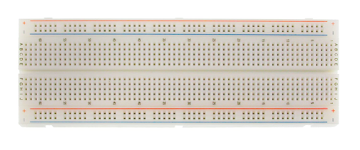
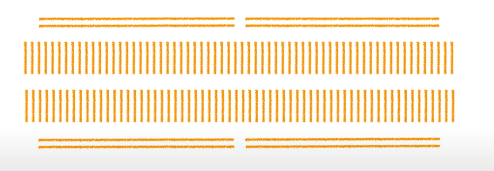
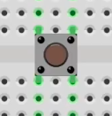

# Embedded Systems

- An embedded system is a computer system that has a dedicated function within a larger mechanical or electrical system.
- Embedded systems talk with the outside world via peripherals
  - A peripheral device is ancillary device used to put information into and get information out.

## Integrated Circuit (IC)

- A set of electronic circuits integrated into one small flat chip of semiconductor material (usually silicon).
- This results in a chip that is orders of magnitude smaller than a circuit that would have to be built by hand using separate electronic components.
- These chips are usually mass-produced, and are used in tons of electronics.
- ICs can be classified into analog, digital, and mixed signal ICs.
  - Digital integrated circuits can contain logic gates, flip-flops, multiplexors, and other circuits, and are usually produced as MCUs, DSPs, or microprocessors. They can also be classified as logic ICs, memory chips, interface ICs, power management ICs, and programmable devices.
  - Analog ICs can include sensors, power management devices, RF chips, and operational amplifiers (op-amps), which process continuous signals and perform functions such as amplification, active filtering, mixing, and demodulation.
  - Mixed-signal ICs can create functions such as analog-to-digital converters (ADC) or digital-to-analog converters (DAC), digital potentiometers, as well as clock/timing ICs.
- Application Specific Integrated Circuit (ASIC)
  - An integrated circuit customized for a particular use
  - a GPU is an ASIC.
- Application-specific standard products (ASSPs)
  - They are customized ICs which used as off-the-shelf components.
  - Their uses include USB interface chips, controller chips for a PC, and a chip for a modem.

## Microcontroller (MCU)

- It is a single integrated circuit which contains at least one CPU (processor core), memory (RAM, flash, ROM), and programmable I/O peripherals.
- They are designed for embedded applications
- Many IoT devices use microcontrollers. Their main advantage is reducing the size and cost of a similar system using separate microprocessors/memory/input/output devices.
- There are development boards that include a microcontroller. It removes the necessity of designing a PCB for the microcontroller.
  - A programeer with a debugger is an additional hardware lays in between the development boards's MCU and the USB input port.
  - Debugger also has a smaller MCU and an have its own clock. It need the installation of a firmware. USB connector should connect to it to debug. It has a jumpper and only works when jumpper are connected.
- Types of Microcontroller
  - PIC Microcontroller - PIC Stands for Peripheral Interface Controller produced by Microchip technology
  - ARM Microcontroller - ARM stands for Advanced RISC Machine.
    - It’s the most popular Microcontrollers Programming in the digital embedded system world
  - 8051 Microcontroller - an 8bit microcontroller created by Intel in 1981.
  - AVR Microcontroller - AVR stands for Alf and Vegard's RISC Processor. It was the modified Harvard architecture machine.
  - MSP Microcontroller - MSP stands for Mixed Signal Processor. It’s the family from Texas Instruments.
- Memory architecture of microcontroller are two types, they are namely:
  - Harvard Memory Architecture Microcontroller: The point when a microcontroller unit has a separate memory address space for the program and data memory, the microcontroller has Harvard memory architecture in the processor.
  - Von Neumann (a.k.a. Princeton) Memory Architecture Microcontroller: The point when a microcontroller has a common memory address for the program memory and data memory, the microcontroller has Princeton memory architecture in the processor.
- Classification According to Instruction Set
  - CISC: CISC is a Complex Instruction Set Computer. It allows the programmer to use one instruction in place of many simpler instructions.
  - RISC: The RISC is stands for Reduced Instruction set Computer, this type of instruction sets reduces the design of microprocessor for industry standards. It allows each instruction to operate on any register or use any addressing mode and simultaneous access of program and data.
- The memory devices are divided into two types, they are
  - Embedded memory microcontroller
  - External memory microcontroller
- Useful Documents
  - Each MCU has:
    - dataset
    - user manual
  - Each development board has a schematics, user manual and specification.
- Memory Map
  - A processor in a MCU can be described by its width of the system bus.
    - 8 bits, it can provide 2^8 memory address on the system bus. from `0x00` to `0xff`
    - 16 bits, it can provide 2^16 memory address on the system bus, from `0x0000` to `0xffff`
    - 32 bits, it can provide 2^32 memory address(4G) on the system bus, from `0x0000_0000` to `0xffff_ffff`
  - `0x` is a prefix that saying the number followed is a hexadecimal number.
  - `_` or a space is used to increase readability
  - Different peripherals is assigned with different range of the the memory address
  - Each Memory address are used to transmit data or set register value on that address
    - A register stores a bit value, the bits data corresponding to settings for peripherals, specified in the manual
    - Bit value size varys based on the MCU spec
    - The reset value is the value used for each bit position after reset
    - Reserved position usually all have the reset value
    - Address offset value is used to getting the register address from the base address, `Base + Offset = Register Address`
    - In the manual every consecutive four bit position represent a value from `0` to `F` for the register
    - Some register are used to read data at its address location in loop
  - Detailed boundaries are stated on the reference manual.
  - The relationship between the range and the assigned peripheral is called a memory map.
- Types of memory
  - Non-volatile - persist after reboot
  - It is the program memory or code memory, stores the logic(instruction) of the program
  - stores constants data
  - stores vector tables
  - Types:
    - ROM(Read Only Memory)
      - MPROM (Mask Programmable Read-Only Memory) - data can be writen only once
      - EPROM (Erasable programmable read-only memory) - data can be erased after dissambling and exposing to ultraviolet light
      - EEPROM (Electrically erasable programmable read-only memory) - data can be erased after changing voltage
    - Flash memory
      - Most popular
      - Data in the FLASH memory is accessed through the Flash controller
    - OTP (One time programmable)
    - FRAM (Ferroelectric random-access memory) - high speed, low power but expensive
- Volatile - clear after reboot
  - It is the data memory
  - It stores temp data, comsumed during run-time
  - It stores variables, it can also stores instructions.
  - Types:
    - SRAM
- Bus Interfaces
  - It is depicted by the MCU block diagrams.
  - Bus interfaces are the communication pathes between processors and peripherals.
  - It allows data from multiple data sources goes into the processor concurrently. The number of concurrent data trasmittion equals the number of buses.
  - There are three types of bus coming out of a processor with Advanced High-performance Bus (AHB) - Full speed, also known as HCLK speed
    - ICode Bus - Instruction Bus
      - Connected to the Flash memory through the Flash controller
      - get program instruction from Flash memory
    - DCode Bus - Data Bus
      - Connected to the Flash memory through the Flash controller
      - get constant data and debug from FLASH memory
    - S-Bus - Connect to SRAM and other peripherals
      - it can also fetch data and instruction from SRAM, it is not connected to the Flash memory.
      - I-Bus and D-Bus uses a subset of the memory addresses of the S-Bus
        - When data is referenced to a memory within I-Bus and D-Bus range, it will not be transmitted through S-Bus
      - All the peripherals will use S-Bus to access the processor.
      - S-Bus will be split into two AHB
        - AHB2 is used for external interfaces like USB and camera which require high I/O
        - AHB1 is used for other internal peripheral like GPIO
      - S-Bus's AHB1 will be split into two Advanced Peripheral Bus(APB) for other peripherals
        - APB1 - Half of the full speed, also known as P1CLK speed.
        - APB2 - One fourth of the full speed, also known as P2CLK speed.
        - GPIO are connected to AHB1 before the split at full speed
- Bus Matrix is where all the inter-connection happens
  - A processor is a master
  - all other peripherals it connects to are slaves.
  - Each bus interface of the master connects to certain peripherals selectively.
- Clock
  - All the peripherals are syncronized by clocks.
  - It determine the SYSCLK, SYSCLK is the main clock for the MCU
  - The clock is depicted by the clock tree in the mannul
  - The higher frenquency the clock has the higher power comsumption the board will have
  - Clock enables data transmit through a pin with 1 or 0 signals over time
  - There are several clock resources:
    - The Cystal Oscillator (external to MCU) it is the high speed external(HSE) clock
      - Have the option to use on board external clock(Crystal mode)
      - Have the option to install own external clock or use dubeg board's clock (External mode)
    - The RC Oscillator (internal to MCU) it is the high speed internal(HSI) clock
    - Phase Locked Group (PLL) (internal to MCU) uses HSE or HSI to boost the systen clock speed much higher
  - All peripherals need to enable the peripheral clock before using or configuring it. It is done by changing values in the clock registers
  - Clock Registers falls within the range called RCC (Reset and Clock Control)
  - The register memoery location is the base address plus the offset stated in the manual
  - MCO is the Microcontroller output signal, the signal can be configured to output to a certain pin for measurement, performed by a USB logic analyzer or a digital oscilloscope. The signal can also act as an external clock for other MCU.
    - 2 pins are connected for measurement, one is the output pin, one is the Ground on the borad.
- An Vector tables is a table of pointers which points to exception handlers.
  - Exceptions include 15 system exceptions and 240 interrupts(external exceptions)
- Interrupt is an event that will break the current flow of the program
  - Generally, interrupt is a subset of excenption
  - They are hardware driven singals
  - It helps program to run in a non-blocking manner
- GPIO(General Purpose Input Output)
  - It has ports, like port A, port B, port C.
  - Each port has multiple pins. Each pin can take 1 bit data(either 1 or 0 at a time) in the memory addresses
  - Address mapping for port registers are divided based on categories like mode, input data, output data etc. Each category has a groups addresses, each corresponding to a specific pin in this port
  - Each GPIO pin is connected to an input buffer and output buffer on the enable line.
    - The enable line can be configured by the GPIO registers.
  - For MCU, The actually pin number for a pin from a certain port is listed in the pin and ball definition table or the MCU schematic.
    - Each MCU comes with a package name, the pin number arrangement of different MCU package is different.
  - Input pin with high impedance state or Hi-Z state make the pin to a floating state by connection it to either high or ground. It is the default state for all input pins when the power is on, and it will lead to leakage current.
    - Hence, internal pull up or pull down resistors are needed for all unused pins.
- Alternate function mapping is a table which explain the alternative functionalities of a MCU pin.
  - Each pin of each port can be mapped to a certain function selected from a group, each function is corresponding to a certain functionality, listed in the table.

### Communication Protocols

#### Inter-Integrated Circuit (I²C)

- Developed by Philips Semiconductor, known today as NXP Semiconductors
- Perfect for talk to sensors or EEPROM

#### Serial Peripheral Interface (SPI)

- It is a synchronous communication protocol
  - synchronous communication has a separate clock line and can run at any speed
  - The speed limitation is from the part spec and singal integrity issues due to line length and other singal' interfance
  - 1 - 10 Mbits per second usually works on SPI connection
- It is developed by Motorola in the 1980s
- It is a de facto standard, it means there is no formal standard for this protocol
- The communication is initiated by a master device, with the following 4 lines connected to the slave device:
  - `SCK`, `CLK`, `SCK` - clock line
  - `SDO`, `MOSI`, `COPI` - Data output for the master, connected to the `SDI` of the slave device
  - `SDI`, `MISO`, `CIPO` - Data input for the master, connected to the `SDO` of the slave device
  - `CS`, or `SS`, or `CS` - chip select
    - when multiple slaves are connected to the master, slaves device can all share the save `SCK`, `SDO`, `SDI` port on the master but each slave has to have a separate `CS` connection with the master
    - chip select lines are actively low, which means they are high by default and low only when the master is talking to the corresponding slave
  - Alternatively, 3 lines can be used when `SDO` and `SDI` shares one line, as a result it will only be a half-duplex communication
  - A daisy chain configuration is a type of connection that all slaves shares the `SCK` and `CS` while the `SDO` of slave A connected to the `SDI` of slave B, where only the first slave connects to the `SDO` of the master and the last slave connects to the `SDI` of the master
- It uses separated lines for data I/O, so it is a full-duplex communication protocol
- The master device pulse the clock singal when the `CS` line is low, the clock has the following settings:
  - The clock polarity (CPOL) can be
    - `0` - clock pulses idles low
    - `1` - clock pulses idles high
  - The clock phase (CPHA)
    - `0` - I/O lines are sampled on the rising edge of clock pulses
    - `1` - I/O lines are sampled on the falling edge of clock pulses
  - SPI has four modes, based on the `CPOL` and `CPHA` values:
    - Mode 0: `CPOL` is 0, and `CPHA` is 0 (most supported)
    - Mode 1: `CPOL` is 0, and `CPHA` is 1
    - Mode 2: `CPOL` is 1, and `CPHA` is 0
    - Mode 3: `CPOL` is 1, and `CPHA` is 1

#### Controller Area Network (CAN) Bus

- It was originally developed by German company Robert Bosch for automotive industry in late 1980's
- Features:
  - Multi-master, broadcast type of bus
    - a node can be added to the bus at any time (hot-plugging)
    - no difference between master and node, all parts can listen and broadcast signals when connected to the CAN bus
    - If any device broadcast logic `1` signal into the bus, the entire bus signal at this moment is logic `1`
  - cheap to implement
  - work in tough environment
  - high data tramsmission speed, up to `1 MBit/Second`
  - Good error handling and error confinement abilities
  - Automatic re-transmission of faulty messages
  - Automatically disconnect faulty physical nodes
  - Functional addressing - data messages do not contain source or destination addresses, only indentifiers relating to their function and/or priority
  - It uses differiential signals rather than single-ended digital singals
    - single-ended digital singals use high voltage to represent logic `1`, and low or ground to represent logic `0`
    - differiential signals use the difference of the two input to transmit signals
      - When difference is big (usally one is at full vcc, one is at 30% vcc), it transmit logic `0` and is in dominant state
      - When difference is small or no difference (usually both voltage are at half of vcc), it transmit logic `1` and is in recessive state
- Parts:
  - CAN node:
    - MCU - used for processing signals and connected to CAN controller
    - CAN controller - connected to the MCU and has to pins connected to CAN Transceiver which are `CAN_RX` for receiving digital signals and `CAN_TX` for transmitting digital signals
    - CAN Transceiver - Convert single-ended digital signals from CAN controller into differiential signals and output as `CANH` high voltage signal and `CANL` low voltage signal
    - CAN Bus Cable - It has a `CANH` line and a `CANL` line, each end of these two lines are connected through a 150 ohm resistor
      - It is a single line of twisted-pair cable
      - It can be shielded or unshielded
      - Singals are balanced and has field-cancelling effects, it will have a low noise emission
      - These two resistors are called the terminating resistors

##### Dev Tools

- [CAN BUS Analyzer Tool](https://www.microchip.com/DevelopmentTools/ProductDetails/PartNO/APGDT002) by Microchip, a hardware that be used to simulate and monitor CAN messages
  - The official driver supports Window only, use [socketcan driver](https://github.com/GENIVI/CANdevStudio#quick-start) for Linux
  - [CANdevStudio](https://github.com/GENIVI/CANdevStudio#quick-start) provides a GUI for CAN development

## Microprocessor

- It can be used to run an OS
- A microprocessor is a device that incorporates the functions of a CPU on a single IC (or a few). It is a clock-driven, register-based digital integrated circuit
- It accepts binary data as input, processes it according to an instruction set stored in its memory, and provides output.
- Different instrument sets determine the different architectures of microprocessors
  - common architectures today are generally 32-bit or 64-bit
- CPUs are almost all implemented on microprocessors, causing the two terms to be practically interchangeable.
- It is most used in personal computers or other chips used for more general purpose applications.
- Digital Signal Processor (DSP)
  - A specialized microprocessor optimized for digital signal processing.
  - optimized for continuous processing in real-time.
  - have better power efficiency and are used in mobile phones or devices with power consumption constraints.

## System on a Chip (SoC)

- An integrated circuit with all the components of a computer, including a CPU, memory, I/O ports, and secondary storage.
- It consumes less power and take up less space than a multi-chip design, and are common in embedded systems.
- It generally refers to a single chip that does everything that used to take up multiple chips, it has at least one MCU in it.
- It is widely used in Smart phones.
- Some common ones are the Cypress Semiconductor Programmable System on a Chip (PSoC) and Altera System on a Programmable Chip (SOPC). On that topic, PSoC solely refers to the family of microcontroller-integrated SoCs produced by Cypress Semiconductor, although there are other programmable SoCs that exist.

## Programmable Logic Device (PLD)

- a more generic terms that refers to an electronic component used to build reconfigurable digital circuits
- they differ from logic gates, which have a fixed function, as PLDs don’t have functions after being manufactured.
- Programmable logic array (PLA)
- Programmable array logic (PAL)
  - PAL was owned by Monolithic Memories, Inc. (MMI) and currently held by Lattice Semiconductor.
- Generic array logic (GAL)
- Field-programmable gate array (FPGA)
  - An FPGA is an integrated circuit that can be configured by a consumer after manufacture (“field-programmable”).
  - Its configuration is specified using a hardware description language (HDL).
  - They contain programmable logic blocks (like AND and XOR) and a hierarchy of reconfigurable interconnects that “wire together” the blocks.
  - These blocks can also contain memory elements (flip-flops, etc.)
  - Common FPGAs are the Xilinx Spartan and Virtex Series and the Altera Stratix and Cyclone Series.
- Complex Programmable Logic Device (CPLD)
  - A programmable logic device which is primarily consisted of a macrocell with logic expressions and operations.
  - It doesn’t require an external configuration ROM (needed by FPGAs) and has less internal state storage and layered logic than FPGAs. CPLDs have thousands to tens of thousands of logic gates, while FPGAs can have up to several millions.
  - They are primarily manufactured by Altera, Atmel, Cypress Semiconductor, Lattice Semiconductor, or Xilinx, and are programmed in VHDL, Verilog HDL, or Standard Test and Programming Language (JAM/STAPL).

## Electronic design automation (EDA)

- A category of software tools for designing electronic systems for integrated circuits (ICs) or printed circuit boards (PCBs).
- Major companies producing EDAs are Altium (Altium Designer), Cadence Design Systems (Verilog, OrCAD), Autodesk (EAGLE), National Instruments (Multisim), and WestDev (Pulsonix). There is also KiCAD, an open-source EDA software, as well as many web-based EDA tools, some of which are web-based versions of the aforementioned EDAs.

## ODROID

- A series of single-board computers capable of running Android and Linux distributions (the name comes from “open” + “Android”).
- The hardware features a SoC with a ARM CPU and an on-chip GPU. SD cards are used to store the operating system.
- The outputs include USB 2.0, USB 3.0, HDMI, and a 3.5 mm jack. There are also lower-level output pins with general-purpose input/output (GPIO) pins supporting common protocols such as I2C. There are also some models with an 8P8C Ethernet port and an eMMC port.
- Common models are the ODROID-C1, ODROID-C2, and the ODROID-XU4.

## [Raspberry Pi](https://huegoxaga.github.io/notes/embedded/raspberry-pi.html)

- A series of single-board computers developed for teaching and protityping purposes.
- The models all featured a Broadcom SoC, with an ARM CPU and an on-chip GPU. SD cards are used to store the operating system, and the outputs include USB ports, HDMI ports, a 3.4 mm jack for audio, and lower-level GPIO pins supporting I2C and other protocols. There are also some models with an 8P8C Ethernet port and an eMMC port.
- Common models are the Model A, Model B, and Zero.

## [Arduino](https://huegoxaga.github.io/notes/embedded/arduino.html)

- An open-source hardware and software company and user community that produces single-board microcontrollers and microcontroller kits.
- Their hardware contains an Atmel 8-bit AVR microcontroller with flash memor and a single or double row of pins that can connect to add-on modules (“shields”) and can be addressable via a I2C serial bus.
- Most models are pre-programmed with a boot loader for uploading programs to the on-chip flash memory. Some of the I/O pins can produce pulse-width modulated signals and receive analog inputs.
- Common boards are the Arduino Pro, Arduino Mega, and Arduino Yun.

## Printed Circuit Board (PCB)

- It mechanically supports and electrically connects electrical or electronic components using conductive tracks, pads and other features etched from one or more sheet layers of copper laminated onto and/or between sheet layers of a non-conductive substrate.
- Components are generally soldered onto the PCB to both electrically connect and mechanically fasten them to it.

## Parts and Sensors

### Resistor

- Use as pull-up resistors - resisors between High output and input pin.
  - connect with digital input pin to prevent floating
- Use as pull-down resistors - resisors between Ground and input pin.
- It is used to limit the current for other components.
- [Click here](http://www.resistor-calculator.com) to calculate resistor info from its color code.

### BreadBoard

- It helps the connection using jumper wires.
- 
- It connects wires internally in the following directions.
- 
- The two vertical sides on top and bottom is usually used as power supplies.

### Button

- Clicking the button will connect the wires of its two side
- Connect to pin of its right side and left side would work.
- 
- For buttons, use delay in a loop is used to debounce.
  - use flag to prevent flashing when holding the button.

### LED

- The longer foot is the anode. It connects to the HIGH.
- The shorter foor is the cathode. It connects to the LOW.
- 220Ω resistor can be used to protect a LED.

### Infrared Obstacle Detection Module

- It has a IR Emitter. It is ab Infrared emitter LED.
- It has a IR Receiver. Infrared receiver that receives signal transmitted by Infrared emitter.
- Distance Adjust can be rotated to adjust detection distance.
  - Couter clockwise decreases distance.
  - Clockwise increases distance.
- Vcc pin accepts 3.3 to 5 Vdc Supply Input
- Gnd pin is Ground Input
- Output pin - Output that goes low when obstacle is in range

### Motor

- When INA pin is HIGH, INB pin is LOW, it rotates clockwise. Otherwise, it rotates counter clockwise.
- When both INA and INB is LOW, motor stops.
- VCC and GND pin receive power input.

### PIR Sensor

- It can be used to detect motion.
- 1 Vcc pin accepts 5V power, 1 GND pin.
- 1 Output pin, Low by default, return High when motion is detected.

### Buzzer

- It can be used to sound the alarm
- It needs to connect with a resistor

### EEPROM

- Usually it cannot read and write at the same time
- It has a max clock speed
- It has a hold pin and write protect pin, and VCC that need to be connected to high
- It takes instructions command as bits, instructions are enable/disable write operation, write and read data from memory on a certain address value and read and write the status register

## Shield and HATs

- It is the term for an expansion board that fits on top of a development board. This is a typical used for Arduino boards
- A "HAT" (Hardware Attached on Top) board is the equivilent term used for the Raspberry PI.
- All of the GPIO pins will connect to the Shields or HATs and extended from them.
  - With a Short header the GPIO pins will not be available on the Shields and HATs.
  - Long header will make the pins available for other connection.
