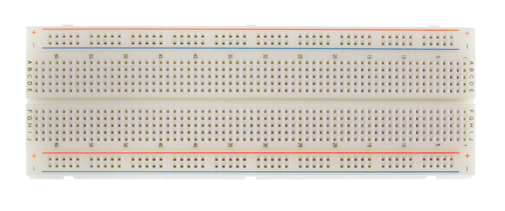
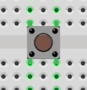

# Arduino

- It is a type of easy-to-use development boards
- It is working under 5V power
- Peripherals are called sheids.

## Board

### Arduino UNO

- The UNO is the most used and documented board of the whole Arduino family.
- 
  - The board is uses the `ATmega328P` microcontroller.
  - It has 14 digital input/output pins (of which 6 can be used as PWM outputs),
  - 6 analog inputs,
  - a 16 MHz ceramic resonator (`CSTCE16M0V53-R0`)
  - a USB connection
    - Code can be compiled and uploaded through the USB using the Arduino IDE
    - It can be powered by using USB connection cable only.
  - a power jack
    - The board can also be powered by the power jack with battery or AC-to-DC adapter in production environment.
  - an ICSP header and a reset button.
- It has a LED on board located at pin 13.
- Each pin can be used for both input pin and output pin.
- A digital pin can output or read input of two state, 5V or 0V.
- It has pins that output DC power.
  - the 5V pin will output 5V current when it is connected to a digital input pin
  - the GND pin is set to groud, it outputs 0V current when it is connected to a digital input pin

## IDE

- The Arduino IDE can be downloaded from [here](https://www.arduino.cc/en/Main/Software)
- There are some setup in the IDE menu before compiling and uploading.
  - set the serial port which is connecting to the borad.
  - set the type of board in use.
- The check mark button is used to compile for syntax verification.
- The Right Arrow button is used to compile and upload code to the board.
- Serial Monitor button is located at top right corner.
  - The baud rate must match the rate specified in connection in code.

### Syntax

- Most C/C++ syntax works in Arduino IDE.
- Constant and Variables can be declared at the top.
  - Variabale name in red is reserved by Arduino IDE
- Predefined constants
  - `HIGH` equals `true`.
  - `LOW` equals `false`.
- There are two methods for any Arduino program
  - The `setup()` method will be ran only once at the beginning of the program, all the setup should be put into this method
  - The `loop()` method will be ran repeatedly throughout life of the program.
  - These two methods can be empty but it must exist.

### Methods

- `pinMode(pinNumber, OUTPUT/INPUT);` defines the pin mode as INPUT or OUTPUT or a certain pin.
  - `pinMode(7, OUTPUT);` The 7th pin will be used as ouput.
  - Must be placed in the `setup()`method
- `digitalWrite(pinNumber, HIGH/LOW);` defines the digital pin mode output state.
- `digitalRead(pinNumber);` defines the digital pin mode input state.
  - It returns a boolean value.
- `delay(length)` delay the program for the number of `ms` specified as the argument.
- `Serial.begin(baudRate)` open a serial connection with certain baud rate.
- `Serial.println(s)` print to serial.
- `Serial.available()` return true when there is user input.
- `Serial.read()` get user input character.
- `Serial.parseInt()` get user input as integer.

## Components

### Resistor

- Use as pull-up resistors - resisors between High output and input pin.
  - connect with digital input pin to prevent floating
  - Arduino has built-in pull-up resistor, it will be activated using `pinMode(pinNumber, INPUT); digitalWrite(pinNumber, HIGH);` in `setup()`.
- Use as pull-down resistors - resisors between Ground and input pin.
  - Arduino has no built-in pull-down resistor.
  - Resistor has be connected manually.
- It is used to other components.
- [Click here](http://www.resistor-calculator.com) to calculate resistor info from its color code.

### BreadBoard

- It helps the connection using jumper wires.
- 
- It connects wires internally in the following directions.
- 
- The two vertical sides on top and bottom is usually used as power supplies.

### Button

- Clicking the button will connect the wires of its two side
- Connect to pin of its right side and left side would work.
- 
- When a button is used to change state the `loop()` to use `delay()` to debounce.
  - use flag to prevent flashing when holding the button.

### LED

- The longer foot is the anode. It connects to the HIGH.
- The shorter foor is the cathode. It connects to the LOW.
- 220Ω resistor can be used to protect a LED.

### Infrared Obstacle Detection Module

- It has a IR Emitter. It is ab Infrared emitter LED.
- It has a IR Receiver. Infrared receiver that receives signal transmitted by Infrared emitter.
- Distance Adjust can be rotated to adjust detection distance.
  - Couter clockwise decreases distance.
  - Clockwise increases distance.
- Vcc pin accepts 3.3 to 5 Vdc Supply Input
- Gnd pin is Ground Input
- Output pin - Output that goes low when obstacle is in range

### Motor

- When INA pin is HIGH, INB pin is LOW, it rotates clockwise. Otherwise, it rotates counter clockwise.
- When both INA and INB is LOW, motor stops.
- VCC and GND pin receive power input.

### PIR Sensor

- It can be used to detect motion.
- 1 Vcc pin accepts 5V power, 1 GND pin.
- 1 Output pin, Low by default, return High when motion is detected.

### Buzzer

- It can be used to sound the alarm
- It needs to connect with a resistor
