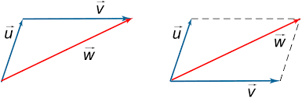

# Basic Math

## Arithmetic

### Roman Numeral System

- Roman Numeral System uses the following character to represent numbers:
  - `I`(1)
  - `X`(10)
  - `C`(100)
  - `M`(1000)
  - `V`(5)
  - `L`(50)
  - `D`(500)
- The following rules are satisfied when writing and reading roman numerals:
  - Two or three same digits (from I, X, C, M) in a row represent the sum of their individual value. For example: `II = 2; CCC=300; MMM=3000;`
  - Two digits where the smaller one is after the bigger represent their sum. For example: `VI = 6; XI = 11; LV=55;`
  - Two digits where the smaller one is in front of the bigger represent their difference. For example: `IV = 4; IX = 9; XL=40;`
  - There can only be put one smaller digit (from `I`, `X`, `C`) in front of a bigger; the smaller letter can be one fifth (1/5) or one tenth (1/10) of the larger one; For example, 99 cannot be `IC` as `I` is one hundredth part of `C`. Instead, 99 can be written as `XCIX` (90 + 9).
  - There can be one, two or three of the same digits that are smaller written after a bigger digit, in which case their value will be added together and added again to the bigger digit. For example: there can only be `CM=900`, but there can be `MCCC=1300`.
  - `V`, `L`, `D` cannot be used repeatly in a row

### Significant Digits

- `~` is used to on a `0` to represent significant digits.
- Accuracy is represented by the number of significant digits.
- Precision is represented by the place value of the right-most digit.
- Calculation involved in significant digits
  - and - use precision
  - and / use sig dig
  - when together, retain the sig dig and use precision or sig dig according to the last operation.
- ENGINEERING FORMAT
  - use only exponent that can be divided by 3. Ex. E+3 E+9
- Number prefix

| Prefix | Abrre | Value | Name     |
| ------ | ----- | ----- | -------- |
| tera   | T     | 10^12 | trillion |
| giga   | G     | 10^9  | billion  |
| mega   | M     | 10^6  | million  |
| kilo   | k     | 10^3  | thousand |
| hecto  | h     | 10^2  | hundred  |
| deca   | da    | 10^1  | ten      |
|        | 10^0  | one   |          |

### Number Theory

- Number theory is the branch of mathematics concerned with the integers.
- A **prime number** is an integer greater than 1 whose only positive divisors are 1 and itself.
- A **composite number** is an integer greater than 1 that is not a prime. It can be written as a product of integers greater than 1.
- The **factors** of a composite number is all the integer that can can divide the number into an integer.
- Test for Primality - Test if a number if a prime
  - It can be done by checking if the number is divisible by any prime number in the range from 2 to its square root.
- Prime factorization - Prime factorization of a number is to find a product of primes with the same value
  - Ex, $$28050 = 2\times3\times5^2\times11\times17$$ (this is the format for prime factorization result)

> #### The Fundamental Theorem of Arithmetic
>
> Every integer greater than 1 is either prime or can be expressed as a product of primes in a unique order in which the factors occur.

#### Divisibility Rules

- Divisibility rule for 2: All even numbers are divisible by 2;
- Divisibility rule for 3: A number, n, is divisible by 3 if and only if the sum of its digits is divisible by 3;
- Divisibility rule for 4: A number, n, is divisible by 4 if and only if the last two digits form a number divisible by 4;
- Divisibility rule for 5: A number, n, is divisible by 5 if and only if the number finishes at 0 or 5;
- Divisibility rule for 6: If a number, n, is divisible by 2 and 3 at the same time, it is divisible by 6;
- Divisibility rule for 7: For this rule we need to repeat the following step:
  the last digit doubled subtracted this doubled value from the first part(132 for 1327) of the number. Repeat the step as necessary. If the last number is divisible by 7 than n is divisible by 7.
- Divisibility rule for 8: A number, n, is divisible by 8 if the last three digits form a number divisible by 8.
- Divisibility rule for 9: A number, n, is divisible by 9 if and only if the sum of its digits is divisible by 9;
- Divisibility rule for 10: A number, n, is divisible by 10 if and only if the number finishes at 0;
- Divisibility rule for 11: A number, n, is divisible by 11 if and only if the alternating sum(put - and + in between )(order doesn’t matter) of its digits is divisible by 11; when find the divisibility rule of a large number, try the condition that satisfied all the rules for its biggest factor found above.

#### GCF & LCM

- A Greatest Common Factor, GCF, of two (or more) numbers is the biggest number that we can divide with (is a factor of) both numbers.
  - It can be express as $$A \cap B$$, when A and B are the set of factors of the two numbers.
- A Least Common Multiple, LCM, of two (or more) numbers is the smallest number that both numbers will divide into.
  - It can be express as $$A \cup B$$, when A and B are the set of factors of the two numbers.
- Euclidian Algorithm
  - It can be used to find the GCF of two large numbers.
  - For Example, find the GCF of 125,460 and 365,840.
    1. $$365840 = 2 \times 125460 + 114920$$
    2. $$125460 = 1 \times 114920 + 10540$$
    3. $$114920 = 10 \times 10540 + 9520$$
    4. $$10540 = 1 \times 9520 + 1020 $$
    5. $$9520 = 9 \times 1020 + 340 $$
    6. $$1020 = 3 \times 340 + 0$$

#### Number Systems

- It is used to represent numbers. It can be one of the follows:
  - Decimal - A decimal number system is consisted of `1` and `9`.
  - Binary - A binary number system is consisted of `1` and `0`
    - one binary number has the size of one bit
  - Octor - A octor number system is consisted of `0` - `7`.
  - Hex - A hex number is system consisted of `1` to `9`, then `A` to `F`.
    - one hex number has the size of one byte
- Convert from other number system to decimal number system
  - for left side before ‘.’ sign
    - from left to right digit one by one, add the number and times the number that can be represent in one digit in the corresponding system(binary 2, oct 8 hex 16) , operation ends with adding the last digit.
  - for right side before ‘.’ sign
    - from right to left digit one by one, add the number and divide the number that can be represent in one digit in the corresponding system(binary 2, oct 8 hex 16) , operation ends with dividing the last digit.
- Convert from decimal number system to other number system
  - for left side before ‘.’ sign
    - divide the number by 2/8/16 record the reminder. keep the integer then keep dividing until reach 0. Use the reminders to compose the new number from right to left.
  - for right side before ‘.’ sign
    - times the decimal with 2/8/16, record all the integer, and keep only the decimal then keep multiplying. the new number are composed by the recorded integer from right to left.
- Conversion between octal and hexadecimal numbers
  - Use binary number as a medium.
    - octal can be changed to a group of 3 binary.
    - Hexadecimal can be changed to a group of 4 binary.
- Representing negative binary numbers
  - SIGN MAGNITUDE NUMBER SYSTEM
    - Use the first digit represent sign, for `8`-bit register, `10000001` is `-1`, `00000001` is `1`
  - ONE’s COMPLEMENT NUMBER SYSTEM
    - change `0` to `1` and `1` to `0` for the number. still, starts with `0` is positive number. `1` is negative.
    - for conversion of negative number simply convert them back to normal form.
    - no change needed to convert positive number
  - TWO’s COMPLEMENT NUMBER SYSTEM
    - based on one’s complement add an `1` in the end.
    - to convert it to decimal, add a minus sign on the left most digit and use the standard method to add rest of the digit into a decimal number.
    - to expanding register size filling the left register positions with the original most left value.
- shortcut for binary subtraction.
  - convert the subtrahend to two’s complement and add with minuend, if the result has more digit than original register size trucate it and it is called overflow.

## Algebra

### Vector

- Vectors has both magnitude and direction
  - Magnitude can never be negative
  - A scalar only represents magnitude, and it can be negative
- A vector from point `P` points to `Q` can be denoted as a letter with hat $$\vec{v}$$ or a bold letter $$\mathbf{v}$$, or other notations like $$\overrightarrow{PQ}=v_{x}\hat{x}+v_{y}\hat{y}=v_{x}\hat{i}+v_{y}\hat{j}=v_{1}\hat{i}+v_{2}\hat{j}=v_{1}\hat{x}+v_{2}\hat{y}=\langle v_{x},v_{y} \rangle=\langle v_{1},v_{2} \rangle$$
  - A 2-D vector is represented by two components
- The magnitude of a vector equals $$|\hat{v}|=\sqrt{v_x^2+v^2_y}$$
- When the magitude and direction of a vector are known, its two components can be obtained by using `cos` and `sin`
- When multiply a vector with a scalar, $$c\hat{v}=c(x_x\hat{i}+y_y\hat{j})=cx_x\hat{i}+cy_y\hat{j}$$
- A unit vector has magnitude that always equals to `1`, it is used to indicate direction
  - The unit vector of any given vector is $$\frac{\hat{v}}{|v|}$$
- Vectors can be added using the triangle rule(left), and the parallelogram rule(right)
  - 
  - If the components of a vector are known, simply add them together
- One vector subtract one other vector is the same as add the other vector with opposite direction, or it can be directly subtracted using the following rule
  - 
  - If the components of a vector are known, simply subtract them separately
- A dot product of two vectors is, $$\vec{A}\vec{B}=|\vec{A}||\vec{B}|\cos{\theta}$$ where `θ` is the angle between the two vectors
  - It returns a scalar that describes the magnitude and how close the vectors are
  - When the angle is smaller than `±90+360n` degrees the result is positive
  - It returns 0, the the angle is `90+360n` degress
  - It returns a negative values the angle is greater than `±90+360n` degrees
  - When the components of the vectors are known, dot product is the sum of the product of the `x` component of the two vectors and the `y` component of the two vectors
  - Based on the above properties, the angle between two vectors can be found when the components of them and the magnitude of them are known, $$\cos{\theta}=\frac{A_x B_x + A_y B_y}{|\vec{A}||\vec{B}|}$$

## Geometry
