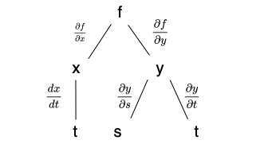

# Calculus

## Limit

### Definition

- Intuitive Definitions
  - Definition of a Limit
    - Suppose _`f(x)`_ is defined when `x` is near the number `a`. (This means that f is defined on some open interval that contains a, except possibly at a itself.) Then we write $$\lim_{x \to a}f(x)=L$$ and say "the limit of `f(x)`, as x approaches a, equals L" if we can make the values of _`f(x)`_ arbitrarily close to L (as close to L as we like) by restricting x to be sufficiently close to a (on either side of a) but not equal to a.
  - Definition of One-Sided Limits
    - $$\lim_{x \to a^-}f(x)=L$$ and say the left-hand limit of _`f(x)`_ as x approaches a [or the limit of f sxd as x approaches `a` from the left] is equal to `L` if we can make the values of _`f(x)`_ arbitrarily close to `L` by taking `x` to be sufficiently close to a with `x` less than `a`.
    - $$\lim_{x \to a^+}f(x)=L$$ if we require that x be greater than a, we get "the right-hand limit of _`f(x)`_ as `x` approaches `a` is equal to `L`".
  - Definition of an Infinite Limit
    - Let `f` be a function defined on both sides of `a`, except possibly at `a` itself. Then $$\lim_{x \to a}f(x)= \infty$$ means that the values of _`f(x)`_ can be made arbitrarily large (as large as we please) by taking `x` sufficiently close to `a`, but not equal to `a`.
    - Let `f` be a function defined on both sides of `a`, except possibly at `a` itself. Then $$\lim_{x \to a}f(x)= - \infty$$ means that the values of _`f(x)`_ can be made arbitrarily large negative by taking `x` sufficiently close to `a`, but not equal to `a`.
  - Definition of a Limit at Infinity
    - Let _f_ be a function defined on some interval $$(a, \infty)$$. Then $$\lim_{x \to \infty}f(x)= L$$ means that the values of _f(x)_ can be made arbitrarily close to _L_ by requiring _x_ to be sufficiently large.
    - Let _f_ be a function defined on some interval $$(a, -\infty)$$. Then $$\lim_{x \to - \infty}f(x)= L$$ means that the values of _f(x)_ can be made arbitrarily close to _L_ by requiring _x_ to be sufficiently large negative.
  - Definition of an Infinite Limit at Infinity
    - Let _f_ be a function defined on some interval $$(a, \infty)$$. Then $$\lim_{x \to \infty}f(x)= \infty$$ means that for every positive number _M_ there is a corresponding positive number _N_ such that if $$x > N$$ then $$f(x) > M$$
- Precise Definitions
  - Definition of a Limit
    - Let _`f`_ be a function defined on some open interval that contains the number _`a`_, except possibly at _`a`_ itself. Then we say that the limit of _`f(x)`_ as _`x`_ approaches _`a`_ is _`L`_, and we write $$\lim_{x \to a}f(x) = L$$ if for every number $$\epsilon > 0$$ there is a number $$\delta > 0$$ such that, if $$0 < |x-a| < \delta$$ then $$|f(x) - L| < \epsilon$$
  - Definition of One-Sided Limits
    - $$\lim_{x \to a^-}f(x) = L$$ if for every number $$\epsilon > 0$$ there is a number $$\delta > 0$$ such that, if $$a - \delta < x < a$$ then $$|f(x) - L| < \epsilon$$
    - $$\lim_{x \to a^-}f(x) = L$$ if for every number $$\epsilon > 0$$ there is a number $$\delta > 0$$ such that, if $$a < x < a + \delta $$ then $$|f(x) - L| < \epsilon$$
  - Definition of an Infinite Limit
    - Let _`f`_ be a function defined on some open interval that contains the number _`a`_, except possibly at _`a`_ itself. Then $$\lim_{x \to a}f(x) = \infty$$ means that for every positive number _M_ there is a positive number $$\delta$$ such that if $$0 < |x-a| < \delta$$ then $$f(x) > M$$
    - Let _`f`_ be a function defined on some open interval that contains the number _`a`_, except possibly at _`a`_ itself. Then $$\lim_{x \to a}f(x) = - \infty$$ means that for every positive number _M_ there is a negetive number $$\delta$$ such that if $$0 < |x-a| < \delta$$ then $$f(x) < N$$
  - Definition of a Limit at Infinity - Let _f_ be a function defined on some interval $$(a, \infty)$$. Then $$\lim_{x \to \infty} f(x) = L$$ means that for every $$\epsilon > 0$$ there is a corresponding number _N_ such that if $$x > N$$ then $$| f(x) - L| < \epsilon$$ - Let _f_ be a function defined on some interval $$(-\infty , a)$$. Then $$\lim_{x \to -\infty} f(x) = L$$ means that for every $$\epsilon > 0$$ there is a corresponding number _N_ such that if $$x < N$$ then $$| f(x) - L| < \epsilon$$
- $$\lim_{x \to a}f(x)=L$$ if and only if $$\lim_{x \to a^+}f(x)=L$$ and $$\lim_{x \to a^-}f(x)=L$$
- The vertical line `x = a` is called a vertical asymptote of the curve $$y= f(x)$$ if at least one of the following statements is true:
  - $$\lim_{x \to a}f(x)= \infty$$
  - $$\lim_{x \to a^-}f(x)= \infty$$
  - $$\lim_{x \to a^+}f(x)= \infty$$
  - $$\lim_{x \to a}f(x)=- \infty$$
  - $$\lim_{x \to a^-}f(x)=- \infty$$
  - $$\lim_{x \to a^+}f(x)=- \infty$$
  - Example: $$\lim_{x \to 0^+} \ln{x}=- \infty$$
- the line _y = mx + b_ is called a slant(oblique) asymptote where $$\lim_{x \to \infty} [f(x)-(mx+b)]=0$$ if $$m \neq 0$$
- A function _f_ is continuous at a number a if $$\lim_{x \to a}f(x) = f(a)$$
- A function _f_ is continuous from the right at a number _a_ if $$\lim_{x \to a^+}f(x) = f(a)$$
- A function _f_ is continuous from the left at a number _a_ if $$\lim_{x \to a^-}f(x) = f(a)$$
- A function _f_ is continuous on an interval if it is continuous at every number in the interval. (If _f_ is defined only on one side of an endpoint of the interval, we understand continuous at the endpoint to mean continuous from the right or continuous from the left.)
- The line _y = L_ is called a horizontal asymptote of the curve _y = f(x)_ if either $$\lim_{x \to a}f(x)= - \infty$$ or $$(a, -\infty)$$. Then $$\lim_{x \to - \infty}f(x)= L$$
  - For Example:
    - $$\lim_{x \to - \infty}\tan^{-1}{x}= - \frac{\pi}{2} $$
    - $$\lim_{x \to \infty}\tan^{-1}{x}= \frac{\pi}{2} $$
    - $$\lim_{x \to - \infty} e^x = 0$$
- Definition of the Number _e_
  - _e_ is the number such that $$\lim_{h \to 0} \frac{e^h-1}{h} = 1$$
  - So, $$e = \lim_{x \to 0} (1+x)^{\frac{1}{x}}$$ or $$e = \lim_{x \to \infty} \left(1+ \frac{1}{n}\right)^n$$
- L'Hospital's Rule - Suppose _f_ and _t_ are differentiable and $$g'(x) \neq 0$$ on an open interval _I_ that contains _a_ (except possibly at _a_). Suppose that $$\lim_{x \to a}f(x) = 0$$ and $$\lim_{x \to a}g(x) = 0$$ or that $$\lim_{x \to a}f(x) = \pm \infty$$ and $$\lim_{x \to a}g(x) = \pm \infty$$ In other words, we have an indeterminate form of type `0/0` or $$\infty / \infty$$. Then $$\lim_{x \to a} \frac{f(x)}{g(x)}=\lim_{x \to a} \frac{f'(x)}{g'(x)}$$ if the limit on the right side exists (or is opposite/negative inifinity)

### Laws

- Limit Laws, Suppose that `c` is a constant and the limits $$\lim_{x \to a} f(x)$$ and $$\lim_{x \to a} g(x)$$ exist. Then:
  - $$\lim_{x \to a} [f(x)+g(x)]=\lim_{x \to a} f(x)+\lim_{x \to a} g(x)$$ Sum Law
  - $$\lim_{x \to a} [f(x)-g(x)]=\lim_{x \to a} f(x)-\lim_{x \to a} g(x)$$ Difference Law
  - $$\lim_{x \to a} [cf(x)]=c \lim_{x \to a} f(x)$$ Constant Multiple Law
  - $$\lim_{x \to a} [f(x)g(x)]=\lim_{x \to a} f(x) \cdot \lim_{x \to a} g(x)$$ Product Law
  - $$\lim_{x \to a} \frac{f(x)}{g(x)}=\frac{\lim_{x \to a} f(x)}{\lim_{x \to a} g(x)}$$ if $$\lim_{x \to a} g(x) \neq 0$$ Quotient Law
  - $$\lim_{x \to a} [f(x)]^n = \left[\lim_{x \to a} f(x)\right]^n$$ where n is a positive integer, Power Law
  - $$\lim_{x \to a}c=c $$
  - $$\lim_{x \to a}x=a $$
  - $$\lim_{x \to a} x^n=a^n $$ where n is a positive integer
  - $$\lim_{x \to a} \sqrt[n]{x}=\sqrt[n]{a} $$ where `n` is a positive integer (If `n` is even, we assume that `a > 0`.)
  - $$\lim_{x \to a} \sqrt[n]{f(x)}=\sqrt[n]{\lim_{x \to a} f(x)} $$ where `n` is a positive integer. If `n` is even, we assume that $$\lim*{x \to a}f(x) > 0$$. Root Law

### Properties

- Direct Substitution Property If _`f`_ is a polynomial or a rational function and _`a`_ is in the domain of _`f`_ , then $$\lim_{x \to a}f(x) = f(a)$$
- If $$f(x)=g(x)$$ when $$x \neq a$$, then $$\lim_{x \to a}f(x) = \lim_{x \to a}g(x)$$ provided the limits exist.

### Theorem

- $$\lim_{x \to a}f(x) = L$$ if and only if $$\lim_{x \to a_-}f(x) = L = \lim_{x \to a_+}f(x)$$
- If $$f(x) \leqslant g(x)$$ where _`x`_ is near _`a`_ (except possibly at _`a`_) and the limits of _`f`_ and _`g`_ both exist as _`x`_ approaches _`a`_, then $$\lim_{x \to a}f(x) \leqslant \lim_{x \to a}g(x)$$
- The Squeeze Theorem - If $$f(x) \leqslant g(x) \leqslant h(x)$$ when _`x`_ is near _`a`_ (except possibly at _`a`_) and $$\lim_{x \to a}f(x)= \lim_{x \to a}h(x) = L$$ then $$\lim_{x \to a}g(x) = L$$
- If _f_ and _g_ are continuous at _a_ and _c_ is a constant, then the following functions are also continuous at _a_:
  - _f + g_
  - _f - g_
  - _cf_
  - _fg_
  - $$\frac{f}{g}$$ if $$g(a) \neq 0$$
- Any polynomial is continuous everywhere; that is, it is continuous on $$\mathbb{R} = (- \infty, \infty)$$.
- Any rational function is continuous wherever it is defined; that is, it is contin- uous on its domain.
- The following types of functions are continuous at every number in their domains:
  - polynomials
  - rational functions
  - root functions
  - trigonometric functions
  - exponential functions
  - inverse trigonometric functions
  - logarithmic functions
- If _f_ is continuous at _b_ and $$\lim_{x \to a}g(x) = b$$
  - then $$\lim_{x \to a}f(g(x)) =f(b)$$.
  - In other words, $$\lim_{x \to a}f(g(x)) =f\left(\lim_{x \to a}g(x)\right)$$
- If _g_ is continuous at _a_ and _f_ is continuous at _g(a)_, then the composite function $$f \circ g$$ given by $$(f \circ g)(x) = f(g(x))$$ is continuous at _a_.
- The Intermediate Value Theorem - Suppose that _f_ is continuous on the closed interval $$[a,b]$$ and let _N_ be any number between _f(a)_ and _f(b)_ , where $$f(a) \neq f(b)$$. Then there exists _a_ number _c_ in $$(a,b)$$ such that _f(c) = N_.
- If $$r > 0$$ is a rational number, then $$\lim_{x \to \infty}\frac{1}{x^r}= 0$$ If $$r > 0$$ is a rational number such that $$x^r$$ is defined for all _x_, then $$\lim_{x \to - \infty}\frac{1}{x^r}= 0$$

### Related Solving Methods

- use _f_ over the recipical of _g_ for Indeterminate products, in order to use the L'Hospital's Rule.
- solving the the limit of one polynomial over another, divide everything by the highest power of the variable
- Based on the geometric properties and the squeeze theorem, $$\lim_{x \to \infty}\frac{\sin{\theta}}{\theta}= 1$$ and $$\lim_{x \to \infty}\frac{\cos{\theta}}{\theta}= 0$$.
- When using L'Hospital's Rule, try differentiate the numerator and the denominator multiple times until an result can be found
- Infinity times infinity is infinity
- For L'Hospital's Rule when an indeterminate form is not a fraction, like infinity to the power of zero, substitue the expression to `y` and take the nature log of the both side. and find the value of `lny` and get the value of `y`

## Derivatives

### Definition

- Tangent Line - The tangent line to the curve $$y = f(x)$$
  - at the point $$P(a, f(a))$$ is the line through _P_ with slope $$m = \lim_{x \to a} \frac{f(x)-f(a)}{x-a}$$ provided that this limit exists.
  - Optionally, $$m = \lim_{h \to 0} \frac{f(a+h)-f(a)}{h}$$
  - Or it can be $$\lim_{\Delta x \to 0} \frac{\Delta y}{\Delta x} = \lim_{x_2 \to x_1} \frac{f(x_2)-f(x_1)}{x_2 - x_1} $$
- The derivative of a function _f_ at a number _a_, denoted by $$f'(a)$$ is $$f'(a) = \lim_{h \to 0} \frac{f(a+h)-f(a)}{h}$$ (also known as the first principle)
  - It is the function that returns the slope of the tangent as dependent variable.
  - It can also represent the instantaneous rate of change.
  - The derivateve of a function can be also denoted as
    - $$\frac{dy}{dx}$$, known as Leibniz notation.
      - Does not have to be `dy` over `dx`, anything below is the current independent variable.
      - The notation itself can be calculated since it represent a relationship in fraction notation. For example, `dy/dx = (dy/dz)/(dx/dz)`
    - $$\frac{d}{dx}(x)$$ or $$\frac{d}{dx}f(x)$$
    - $$f'(x)$$
    - $$y'$$
    - $$Dy$$ where `D` is the derivative operator
    - $$\dot{x}$$ if _x_ represents time
    - All of the notation represents how much `y` changes when `x` changes.
- Higher Derivatives
  - The derivatives of a derivative is called the second derivative, it can be denoted as follows:
    - $$\frac{d}{dx}\left(\frac{dy}{dx}\right)$$, which means the derivative of `dy/dx`
    - $$\frac{d^2 y}{d x^2}$$
    - $$f''(x)$$
    - $$y''$$
    - $$y^{(2)}$$, brackets are required to distinguish the notation from `y` square
    - $$D^{2}y$$ where `D` is the derivative operator
    - $$\ddot{x}$$
  - Same idea for third and fourth and higher derivatives.
- A function _f_ is differentiable at a if _f'(a)_ exists. It is differentiable on an open interval (_a, b_) [or $$(a, \infty)$$ or $$(-\infty, a)$$ or $$(-\infty, \infty)$$] if it is differentiable at every number in the interval.
- The number _f(c)_ is a
  - local maximum value of _f_ if $$f(c) \geqslant f(x)$$ when _x_ is near _c_.
  - local minimum value of _f_ if $$f(c) \leqslant f(x)$$ when _x_ is near _c_.
- Let _c_ be a number in the domain _D_ of a function _f_. Then _f(c)_ is the
  - absolute maximum value of _f_ on _D_ if $$f(c) \geqslant f(x)$$ for all _x_ in _D_.
  - absolute minimum value of _f_ on _D_ if $$f(c) \leqslant f(x)$$ for all _x_ in _D_.
  - the highest value amongst all of the local maximum and left and right end values is the absolut maximum of _f_ on _D_, and vice versa for the absolute minimum
- A critical number(point) of a function _f_ is a number _c_ in the domain of _f_ such that either _f'(c) = 0_ or _f'(c)_ does not exist.
  - the nature of critical number includes three senarios
    - local maximum
    - local minimum
    - niether
  - If _f_ has a local maximum or minimum at _c_, then _c_ is a critical number of _f_.
- If the graph of _f_ lies above all of its tangents on an interval _I_, then it is called concave upward on _I_. If the graph of _f_ lies below all of its tangents on _I_, it is called concave downward on _I_.
- A point _P_ on a curve _y = f(x)_ is called an inflection point if _f_ is continuous there and the curve changes from concave upward to concave downward or from concave downward to concave upward at _P_.
- A function _F_ is called an antiderivative of _f_ on an interval _I_ if `F'(x)=f(x)` for all _x_ in _I_.
- The derivative of polar functions
  - Polar coordinates uses the distance to origin and the angle `θ` between the line to origin and x-axis to represent the location of a point. Instead of using `x`, `y` values in Cartesian coordinates.
  - When converting a point from cartesian coordinates to polar coordinates, $$r = \sqrt{x^2+y^2}$$ and $$\theta = \tan^{-1}{\left(\frac{y}{x}\right )}$$
  - When converting a point from polar coordinates to cartesian coordinates, _`x = rsinθ`_ and _`y = rcosθ`_
  - Then function that uses `θ` as its indenpendent variable and `r` as its dependent variable are called polar function.
    - Using selected `θ` value to graph the polar function. polar function simplfy problem related to functions that have circular shape.
  - The derivative `dy/dx` of a polar function is calculated by:
    - `dy/dθ` can be obtained from _`y = rcosθ`_, which is $$r \cos{\theta}+ \frac{dy}{d \theta} \sin{\theta}$$.
    - `dx/dθ` can be obtained from _`x = rsinθ`_, which is $$-r \sin{\theta}+ \frac{dy}{d \theta} \cos{\theta}$$.
    - Then, $$\frac{dy}{dx} = \frac{\frac{dy}{d \theta}}{\frac{dx}{d \theta}}$$
- Partial Derivatives
  - When a function has more than one independent variable, the partial derivative can be used to represent how much the dependent variable changes when one of its independent variables changes while keeping the other independent variable constant.
  - Symbol `∂` specifically refers to partial derivative, while `d` means the function has only one variable
  - For `f(x, y)` it can have two derivatives which are `∂f/∂x` and `∂f/∂y`.
  - For `f(x, y)`, $$\frac{\partial f}{\partial x}=\lim_{h \to 0} \frac{f((x+h),y)-f(x,y)}{h}$$
  - Partial derivatives of function `f(x, y) = z` in terms of `x` can be denoted as
    - $$\frac{\partial f}{\partial x}$$
    - $$\frac{\partial z}{\partial x}$$
    - $$f_x$$
    - $$z_x$$
    - $$D_x f$$
  - Function with multiple independent variable has a multi-demensional graph, parial derivative only looks at the rate of change between one independent variable and the dependent variable in one plane. All other independent variable will be kept in the result and the derivative function will have a reduced demension (by 1).
  - Higher partial derivatives differentiate the variables of a function with two or more variables more than onece, they can be denoted as follows
    - For `f(x, y)`, differentiating in terms of `x` twice gives $$\frac{\partial}{\partial x}\left(\frac{\partial f}{\partial x}\right)=\frac{\partial^2f}{\partial^2x}=(f_x)_x=f_{xx}=D^2_{xx}f$$
    - For `f(x, y)`, differentiating in terms of `x` first, then `y` gives $$\frac{\partial}{\partial y}\left(\frac{\partial f}{\partial x}\right)=\frac{\partial^2f}{\partial y \partial x}=(f_x)_y=f_{xy}=D^2_{xy}f$$, it is also known as higher mixed partial derivatives
    - Same idea when differentiating partially for three or more times
- The position vector indicates the position of a particle relative to the origin
  - the position can be defined by parametric equations which is depended on variables for time, angle etc., $$\vec{r}(t)=f(t) \hat{i} + g(t) \hat{j}$$
- The derivative of the position vector $$\vec{r}(t)=f(t) \hat{i} + g(t) \hat{j}$$ is $$\vec{r}'(t)=f'(t) \hat{i} + g'(t) \hat{j}$$
  - The second derivate of the position vector is $$\vec{r}''(t)=f''(t) \hat{i} + g''(t) \hat{j}$$
- The unit tangent vector $$\hat{T}(t)$$ is a unit vector that is tangent to the change of the position vector
  - It has the same direction as the derivate of the position vector at any given point, $$\hat{T}(t)=\frac{\vec{v}'(t)}{|\vec{v}'(t)|}$$
- The unit normal vector is a unit vector that is tangent to the change of the unit tangent vector
  - It has the same direction as the second derivate of the position vector at any given point
  - The unit normal vector will always point toward the "inside" of how a curve is curving
  - The function of the unit normal vector for the x component is the same as the function of the unit normal vector for the y component with opposite sign, the function of the unit normal vector for the y component is the same as the function of the unit normal vector for the x component, proven by using the angle `𝛟` that is counter-clockwise angle from the positive x-axis to the position vector, then the unit tangle vector can be written as $$\hat{T}(\phi)=\cos{\phi} \hat{i}+\sin{\phi}\hat{j}$$, then the unit normal vector $$\hat{N}(\phi)=\hat{T}(\phi+\frac{\pi}{2})=\cos{(\phi+\frac{\pi}{2})} \hat{i}+\sin{(\phi+\frac{\pi}{2})}\hat{j}=-\sin{\phi} \hat{i}+\cos{\phi}\hat{j}$$

### Rules

- Derivative of a Constant Function $$\frac{d}{dx}(c)=0$$
- The Power Rule - $$\frac{d}{dx}(x^n)=nx^{n-1}$$
- The Constant Multiple Rule - If _c_ is a constant and _f_ is a differentiable function, then $$\frac{d}{dx}[cf(x)]=c \frac{d}{dx}f(x)$$
- The Sum Rule - If _f_ and _g_ are both differentiable, then $$\frac{d}{dx}[f(x)+g(x)]= \frac{d}{dx}f(x)+\frac{d}{dx}g(x)$$
- The Difference Rule - If _f_ and _g_ are both differentiable, then $$\frac{d}{dx}[f(x)-g(x)]= \frac{d}{dx}f(x)-\frac{d}{dx}g(x)$$
- Derivative of the Natural Exponential Function - $$\frac{d}{dx}(e^x)=e^x$$
- The Product Rule - If _f_ and _g_ are both differentiable, then $$\frac{d}{dx}[f(x)g(x)]=f(x) \frac{d}{dx}[g(x)]+g(x) \frac{d}{dx}[f(x)]$$
- The Quotient Rule - If _f_ and _g_ are differentiable, then $$\frac{d}{dx}\left[\frac{f(x)}{g(x)}\right]=\frac{g(x) \frac{d}{dx}[f(x)]-f(x) \frac{d}{dx}[g(x)]}{[g(x)]^2}$$
- The Chain Rule - If _g_ is differentiable at _x_ and _f_ is differentiable at _g(x)_, then the composite function $$F=f \circ g$$ defined by $$F(x)=f(g(x))$$is differentiable at _x_ and _F'_ is given by the product $$F'(x)=f'(g(x)) \cdot g'(x)$$ In Leibniz notation, if _y = f(u)_ and _u = g(x)_ are both differentiable functions, then $$\frac{dy}{dx}= \frac{dy}{du} \frac{du}{dx}$$
  - The version 1 of the chain rule works on the composite function directly
  - The version 2 of the chain rule specifically requires the substitute of the inner function as a variable. e.g. `u`

### Derivatives of Common Functions

- Derivatives of Exponential Functions
  - $$a^x=a^x\ln a$$
- Derivatives of Trigonometric Functions
  - $$\frac{d}{dx} (\sin x)=\cos x$$
  - $$\frac{d}{dx} (\cos x)=-\sin x$$
  - Reorganize `sinx` and `cosx` can derive the derivatives of the following trig functions
    - $$\frac{d}{dx} (\tan x)=\frac{d}{dx} (\frac{\sin x}{\cos x})=\sec^2 x$$
    - $$\frac{d}{dx} (\csc x)=\frac{d}{dx} (\frac{1}{\sin x})=-\csc x \: \cot x$$
    - $$\frac{d}{dx} (\sec x)=\frac{d}{dx} (\frac{1}{\cos x})=\sec x \: \tan x$$
    - $$\frac{d}{dx} (\cot x)=\frac{d}{dx} (\frac{1}{\tan x})=-\csc^2 x$$
- Derivatives of Inverse Trigonometric Functions
  - $$\frac{d}{dx}(\sin^{-1}{x})=\frac{1}{\sqrt{1-x^2}}$$
  - $$\frac{d}{dx}(\cos^{-1}{x})=-\frac{1}{\sqrt{1-x^2}}$$
  - $$\frac{d}{dx}(\tan^{-1}{x})=\frac{1}{1+x^2}$$
  - $$\frac{d}{dx}(\csc^{-1}{x})=-\frac{1}{x \sqrt{x^2-1}}$$
  - $$\frac{d}{dx}(\sec^{-1}{x})=\frac{1}{x \sqrt{x^2-1}}$$
  - $$\frac{d}{dx}(\cot^{-1}{x})=-\frac{1}{1+x^2}$$
- Derivative of Logarithmic Functions
  - $$\frac{d}{dx}(\log_{b}{x})=\frac{1}{x \ln{b}}$$
  - $$\frac{d}{dx}(\ln{x})=\frac{1}{x}$$ or $$\frac{d}{dx} \ln{|x|}=\frac{1}{x}$$
- Derivatives of Hyperbolic Functions
- Derivatives of Inverse Hyperbolic Functions

### Theorem

- If _f_ is differentiable at _a_, then _f_ is continuous at _a_.
- The only solutions of the differential equation _dy/dt=ky_ where _k_ is a constant, are the exponential functions $$y(t) = y(0)e^{kt}$$
  - _dy/dt=ky_ is called the law of natural growth if _k>0_ or the law of natural decay if _k<0_.
- The Extreme Value Theorem - If _f_ is continuous on a closed interval [_a, b_] then _f_ attains an absolute maximum value _f(c)_ and an absolute minimum value _f(d)_ at some numbers _c_ and _d_ in [_a, b_].
- Fermat’s Theorem - If _f_ has a local maximum or minimum at _c_, and if _f'(c)_
  exists, then _f'(c) = 0_.
- Rolle’s Theorem - Let _f_ be a function that satisfies the following three hypotheses, Then there is a number _c_ in (_a, b_) such that _f'(c)=0_:
  1. _f_ is continuous on the closed interval [_a, b_].
  2. _f_ is differentiable on the open interval (_a, b_).
  3. _f(a) = f(b)_
- The Mean Value Theorem - Let _f_ be a function that satisfies the following hypotheses, Then there is a number _c_ in (_a, b_) such that $$f'(c) = \frac{f(b)-f(a)}{b-a}$$ or, equivalently, $$f(b)-f(a)=f'(c)(b-a)$$ (compare to the Rolle’s Theorem the horizontal tangent line is changed to a tangent line with slope as _f'(c)_)
  1. _f_ is continuous on the closed interval [_a, b_].
  2. _f_ is differentiable on the open interval (_a, b_).
- If _f'(x)=0_ for all _x_ in an interval (_a, b_), then _f_ is constant on (_a, b_).
  - If _f'(x)-g'(x)_ for all _x_ in an interval (_a, b_), then _f - g_ is constant on (_a, b_); that is, _f(x)=g(x)+c_ where _c_ is a constant.
- Clairaut's Theorem - For higher mixed partial derivatives, the order in which the variables are differentiated does not mateer, as long as each variable is differentiated the same number of times it appears in the higher miexed partial derivateive
  - i.e. $$f_{xy}=f_{yx}$$
- If _F_ is an antiderivative of _f_ on an interval _I_, then the most general
  antiderivative of _f_ on _I_ is _F(x) + C_ where _C_ is an arbitrary constant.

### Solving Methods for Related Problem

- Chain rule applys to all variable except the one that is at the denomination in the Leibniz notation.
  - If `dx` is the variable that is at the denomination in the Leibniz notation and `y` is the variable that will be applied by chain rule. When the relationship between `y` and `x` is unknown, use `y'` or `dy/dx` to represent the derivative of `y` in respect to `x`.
- Implicit differentiation. This consists of differentiating both sides of the equation with respect to target variable and then solving the resulting equation for _y'_, where _y_ is the dependent variable.
  - When differentiating the dependent variable, chain rule is required
  - The result should be an expression which is consisted of _x_ and _y_.
- Logarithmic differentiation - The calculation of derivatives of complicated functions involving products, quotients, or powers can often be simplified by taking logarithms. The method used in the following example is called logarithmic differentiation.
- linear approximation - or tangent line approximation of _f_ at _a_ uses the tangent line of the function at _a_ to replace the original funtion, then make prediction about values that is close to _a_. As a result we have the linear approximation _L(x)_ equals to $$f(a)+f'(a)(x-a)$$.
- The Closed interval Method - To find the absolute maximum and minimum values of a continuous function _f_ on a closed interval [_a, b_]:
  1. Find the values of all critical numbers of _f_ in (_a, b_).
  2. Find the values of the endpoints of the interval.
  3. The largest of the values from Steps 1 and 2 is the absolute maximum value; the smallest of these values is the absolute minimum value.
- Increasing/Decreasing Test
  - If _f'(x)>0_ on an interval, then _f_ is increasing on that interval.
  - If _f'(x)<0_ on an interval, then _f_ is decreasing on that interval.
- The First Derivative Test - Suppose that _c_ is a critical number of a continuous function _f_.
  - If _f'_ changes from positive to negative at _c_, then _f_ has a local maximum at _c_.
  - If _f'_ changes from negative to positive at _c_, then _f_ has a local minimum at _c_.
  - If _f'_ is positive to the left and right of _c_, or negative to the left and right of _c_, then _f_ has no local maximum or minimum at _c_.
  - If $$f'(x) > 0$$ for all _`x < c`_ and $$f'(x) < 0$$ for all _`x > c`_, then _f(c)_ is the absolute maximum value of _f_.
  - If $$f'(x) < 0$$ for all _`x < c`_ and $$f'(x) > 0$$ for all _`x > c`_, then _f(c)_ is the absolute minimum value of _f_.
- Concavity Test
  - If _f''(x)>0_ for all _x_ in _I_, then the graph of _f_ is concave upward on _I_.
  - If _f''(x)<0_ for all _x_ in _I_, then the graph of _f_ is concave downward on _I_.
- The Second Derivative Test - Suppose _f''_ is continuous near _c_.
  - If _f'(c)=0_ and _f''(c)>0_, then _f_ has a local minimum at _c_.
  - If _f'(c)=0_ and _f''(c)<0_, then _f_ has a local maximum at _c_.
  - If _f'(c)=0_ and _f''(c)<0_, then no conclusions can be made and only first derivative test can be used
- The Newton's method can be used to find the root(solution) of a high order function.
  - Pick a random value $$x_1$$, then calculate `x - f(x)/f'(x)`, then treat the result $$x_2$$ as $$x_1$$ and repeat the calculation, repeat the process then the result value will be closer and closer to the root.
  - When the $$x_n$$ is the root value the new result will not change since $$f(x_n) = 0$$ in this case.
  - This method uses the fact that the intersection between the slope of a random point and x-axis is close to the root.
  - It works no matter the starting point is at left side or right side of the root.
  - For a function with multiple roots, `x`s from differect section should be attept for each root.
  - Sometimes a wrong point may be picked when it is the (local) minimum/maximum point that makes `f'(x) = 0`.
- Common Polar Graphs - a flower shape with leaves growing from the origin.
  - `r = a sin(kθ)`
    - When `k` is odd, `k` equals to the number of leaves. and the leaf overlap with y-axis and point upward with `k = 1`, and the one of the leaves overlap with y-axis and points downward when `k = 3`, when `k = 5` the leaf points upward and so on.
    - When `k` is even, it has `2k` number of leaves and they spread evenly in all direction with no leaves overlap with all axis in four direction.
  - `r = a cos(kθ)`
    - there is always one leaf on the positive direction of the x-axis.
    - When `k` is odd, `k` equals to the number of leaves. There is alway one leaf on the positive direction of the x-axis, and all other leaves spread evenly. No leaves overlap with the other 3 direction on the axis.
    - When `k` is even, it has `2k` number of leaves and they spread evenly in all direction with four leaves always overlap with all axis in four direction.
  - `r = 1 + k sinθ`
    - When `k = 0` it is a circle
    - When `k > 0` it is a heart shape growing upwards as k increse and have an empty hole inside when `k > 1`
    - When `k < 0` it is a heart shape growing downward as k decrease and have an empty hole inside when `k > -1`
- When solving partial derivative just treat all other variable as constant and use the same methods and rules for a regular derivative problem.
  - When solving partial derivatives for composite function, chain rule applies and a tree diagram can be drawn.
    - the tree diagram represents the dependency of all the variables of a composite function, where the root node is the dependent variable, and end nodes are the independent variable respect to each intermediate functions
    - From top to bottom, each node is a partial derivative of the parent node in terms of the current node
    - To find the partial derivatives of any variables, trace from the root node and multiply all imternediate partial derivatives. If one variable appears in multiple root node, add the product together
    - e.g. for `f(x,y)`, `x=g(t)`, `y=h(s,t)`
      - Tree diagram: 
      - $$\frac{\partial f}{\partial s}= \frac{\partial f}{\partial y}\cdot \frac{\partial y}{\partial s}$$
      - $$\frac{\partial f}{\partial t}= \frac{\partial f}{\partial x}\cdot \frac{d x}{d t}+ \frac{\partial f}{\partial y}\cdot \frac{\partial y}{\partial t}$$
    - Remember to subsitute the variable which you are solving the partial derivatives for, in the final answer
  - Partial derivatives can simplfy some complicated implicit derivative by wrap all variable (dependent or independent) into a composite function and make it has a zero on on side of the equation. Then draw the tree diagram the use the above rule, differentiate both side for the partial derivitives of the target variable, solve all of them and find the target derivative
    - The tree diagram for the wrapper function has all variables from the root node, then specific child node in the next layer
- Function with multiple independent variables can still be used to solve for a regular derivative for a certain independent variable, in this case other independent variable can not be treated as a constant and all rules for variables like chain rules should apply.

## Integral

### Definition

- The area _A_ of the region _S_ that lies under the graph of the continuous function _f_ is the limit of the sum of the areas of approximating rectangles:
  - $$A=\lim_{n \to \infty} R_n= \lim_{n \to \infty}[f(x_1) \Delta x+f(x_2) \Delta x+ \ldots +f(x_n) \Delta x]$$
- Definition of a Definite Integral - If _f_ is a function defined for $$a \leqslant x \leqslant b$$, we divide the interval [_a, b_] into _n_ subintervals of equal width $$\Delta x = (b-a)/n$$. We let $$x_0(=a),x_1,x_2, \ldots ,x_n(=b)$$ be the endpoints of these subintervals and we let $$x^*_1,x^*_2, \ldots ,x^*_n$$ be any sample points in these subintervals, so $$x^*_i$$ lies in the _ith_ subinterval $$[x_{i-1},x_i]$$. Then the definite integral of _f_ from _a_ to _b_ is $$\int^b_a f(x) dx=\lim_{n \to \infty} \sum_{i=1}^n f(x^*_i) \Delta x$$ provided that this limit exists and gives the same value for all possible choices of sample points. If it does exist, we say that f is integrable on [_a, b_].
  - sample point usually is the right endpoint of the _ith_ subinterval
  - sample point can also be the mid point.
- Indefinite Integrals - $$\int f(x) \; dx = F(x)$$ means _F'(x)=f(x)_
  - Indefinite Integrals represents a function, Definite Integrals represents a value.
- Definition of Volume - Let _S_ be a solid that lies between _x = a_, _x = b_. If the cross-sectional area of _S_ in the plane $$P_x$$, through _x_ and perpendicular to the x-axis, is _A(x)_, where _A_ is a continuous function, then the volume of S is $$V = \lim_{n \to \infty} \sum^n_{i=1} A(x^*_i) \Delta x = \int^b_a A(x) \; dx$$
- Formula for integration by parts is as $$\int u \; dv = uv - \int v \; du$$
- integration by parts also works for definite integral. $$\int^b_a f(x)g'(x) \; dx=f(x)g(x)]^b_a - \int^b_a g(x)f'(x) \; dx$$
- Definition of an Improper Integral of Type 1(infinite boundary for infinite integrals)
  - If $$\int^t_a f(x) \; dx$$ exists for every number $$t \geqslant a$$, $$\int^{\infty}_{a} f(x) \; dx=\lim_{t \to \infty} \int^t_a f(x) \; dx$$ provided this limit exists (as a finite number).
  - If $$\int^b_t f(x) \; dx$$ exists for every number $$t \leqslant b$$, $$\int^{b}_{- \infty} f(x) \; dx=\lim_{t \to - \infty} \int^b_t f(x) \; dx$$ provided this limit exists (as a finite number).
  - The improper integrals are called convergent if the corresponding limit exists and divergent if the limit does not exist. If both $$\int^{\infty}_{a}f(x)$$ and $$\int^{a}_{- \infty}f(x)$$ are convergent, then we define $$\int^{\infty}_{- \infty}f(x) \; dx=\int^{a}_{- \infty}f(x) \; dx+ \int^{\infty}_{a}f(x) \; dx$$ where any real number _a_ can be used.
- Definition of an Improper Integral of Type 2(infinite boundary for definite integrals)
  - If _f_ is continuous on [_a, b_) and is discontinuous at _b_, then $$\int^b_a f(x) \; dx = \lim_{t \to b^-} \int^t_a f(x) \;dx$$ if this limit exists (as a finite number).
  - If _f_ is continuous on (_a, b_] and is discontinuous at _b_, then $$\int^b_a f(x) \; dx = \lim_{t \to a^+} \int^b_t f(x) \;dx$$ if this limit exists (as a finite number).
  - The improper integral is called convergent if the corresponding limit exists and divergent if the limit does not exist.
  - If _f_ has a discontinuity at _c_, where _a < c < b_ and both integrals are convergent, then we define $$\int^b_a f(x) \; dx=\int^c_a f(x) \; dx + \int^b_c f(x) \; dx$$

### Theorem

- If _f_ is continuous on [_a, b_], or if _f_ has only a finite number of jump discontinuities, then f is integrable on [_a, b_]; that is, the definite integral $$\int^b_a f(x) \; dx$$ exists.
- If _f_ is integrable on [_a, b_], then $$\int^b_a f(x) \; dx=\lim_{n \to \infty} \sum_{i=1}^n f(x_i) \Delta x$$ where $$\Delta x= \frac{b-a}{n}$$ and $$x_i=a+i \Delta x$$
- the Fundamental theorem of calculus
  - If _f_ is continuous on [_a, b_], then the function _g_ defined by $$g(x)= \int^x_a f(t) \; dt \; \; \; a \leqslant x \leqslant b$$ is continuous on [_a, b_] and differentiable on (_a, b_), and $$g'(x)=f(x)$$.
  - If _f_ is continuous on [_a, b_], then $$\int^b_a f(x) \; dx = F(b) - F(a)$$ where _F_ is any antiderivative of _f_, that is, a function such that _F'=f_.
- Net Change Theorem - The integral of a rate of change is the net change: $$\int^b_a F'(x) \; dx=F(b)-F(a)$$
- The Mean Value Theorem for Integrals - If _f_ is continuous on [_a, b_], then there exists a number _c_ in [_a, b_] such that $$f(c)=f_{avg}=\frac{1}{b-a} \int^b_a f(x) \; dx$$ that is, $$\int^b_a f(x) \; dx = f(c)(b-a)$$
- Comparison Theorem - Suppose that _f_ and _g_ are continuous functions with $$f(x) \geqslant g(x) \geqslant 0$$ for $$x \geqslant a$$
  - If $$\int^{\infty}_a f(x) \; dx$$ is convergent, then $$\int^{\infty}_a g(x) \; dx$$ is convergent.
  - If $$\int^{\infty}_a g(x) \; dx$$ is divergent, then $$\int^{\infty}_a f(x) \; dx$$ is divergent.

### Properties

- Properties of the Definite Integral
  - $$\int^a_b f(x) \; dx=- \int^b_a f(x) \; dx$$
  - $$\int^a_a f(x) \; dx=0$$
  - $$\int^b_a c \; dx=c(b-a)$$ where _c_ is any constant.
  - $$\int^b_a cf(x) \; dx=c \int^b_a f(x) \; dx$$ where _c_ is any constant.
  - $$\int^b_a [f(x)+g(x)] ; dx=\int^b_a f(x) ; dx + \int^b_a g(x) \; dx$$
  - $$\int^b_a [f(x)-g(x)] \; dx=\int^b_a f(x) \; dx - \int^b_a g(x) \; dx$$
  - $$\int^c_a f(x) \; dx + \int^b_c f(x) \; dx = \int^b_a f(x) \; dx$$
- Comparison Properties of the Integral
  - If $$f(x) \geqslant 0$$ for $$a \leqslant x \leqslant b$$, then $$\int^b_a f(x) \; dx \geqslant 0$$.
  - If $$f(x) \geqslant g(x)$$ for $$a \leqslant x \leqslant b$$, then $$\int^b_a f(x) \; dx \geqslant \int^b_a g(x) \; dx$$.
  - If $$m \leqslant f(x) \leqslant M$$ for $$a \leqslant x \leqslant b$$, then $$m(b-a) \leqslant \int^b_a f(x) \; dx \leqslant M(b-a)$$
- Properties of the Indefinite Integral
  - $$\int cf(x) \; dx=c \int f(x) \; dx$$
  - $$\int k \; dx=kx+C$$
  - $$\int [f(x)+g(x)] \; dx=\int f(x)\; dx+ \int g(x)\; dx$$
  - $$\int x^n \; dx= \frac{x^{n+1}}{n+1}+C \; (n \neq -1)$$
  - $$\int \frac{1}{x} \; dx=\ln{|x|}+C$$
  - $$\int e^x \; dx = e^x +C$$
  - $$\int b^x \; dx = \frac{b^x}{\ln b} +C$$
  - $$\int \sin x \; dx= - \cos x +C$$
  - $$\int \cos x \; dx= \sin x +C$$
  - $$\int \sec^2 x \; dx= \tan x +C$$
  - $$\int \csc^2 x \; dx= - \cot x +C$$
  - $$\int \sec x \; \tan x \; dx= \sec x +C$$
  - $$\int \csc x \; \cot x \; dx=- \csc x +C$$
  - $$\int \tan x \; dx=\ln \; |\sec x| +C$$
  - $$\int \cot x \; dx=\ln \; |\sin x| +C$$
  - $$\int \sec x \; dx=\ln \; |\sec x+\tan x | +C$$
  - $$\int \csc x \; dx=\ln \; |\csc x-\cot x | +C$$
  - $$\int \frac{1}{x^2+1} dx=\tan^{-1} x+C$$
  - $$\int \frac{1}{\sqrt{1-x^2}} dx=\sin^{-1} x+C$$
  - $$\int \sinh x \; dx=\cosh x +C$$
  - $$\int \cosh x \; dx=\sinh x +C$$
  - $$\int \frac{1}{x^2+a^2} \; dx=\frac{1}{a} \tan^{-1} \left(\frac{x}{a}\right)+C$$
  - $$\int \frac{1}{\sqrt{a^2-x^2}} \; dx= \sin^{-1} \left(\frac{x}{a}\right)+C$$, _a > 0_
- The Substitution Rule If _u=g(s)_ is a differentiable function whose range is an interval _I_ and _f_ is continuous on _I_, then $$f(g(x))g'(x)dx=\int f(u) \; du$$
- The Substitution Rule for Definite Integrals - If _g'_ is continuous on [_a, b_] and _f_ is continuous on the range of _u = g(x)_, then $$\int^b_a f(g(x))g'(x)dx=\int^{g(b)}_{g(a)}f(u) \; du$$
- Integrals of Symmetric Functions Suppose _f_ is continuous on [_-a, a_].
  - If f is even [_f(-x) = f(x)_], then $$\int^a_{-a} f(x) \; dx=2 \int^a_0 f(x) \; dx$$
  - If f is odd [_f(-x) = -f(x)_], $$\int^a_{-a} f(x) \; dx=0$$
- Midpoint rule - $$\int^b_a f(x) \; dx \approx M_n = \Delta x [f(\overline{x}_1)+f(\overline{x}_2)+ \cdots +f(\overline{x}_n)]$$ where $$\Delta x= \frac{b-a}{n}$$ and $$\overline{x}_i = \frac{1}{2}(x_{i-1}+x_i)=$$ midpoint of $$[x_{i-1},x_i]$$
- Trapezoidal Rule - $$\int^b_a f(x) \; dx \approx T_n = \frac{\Delta x}{2}[f(x_0)+2f(x_1)+2f(x_2)+ \cdots +2f(x_{n-1})+2f(x_n)]$$ where $$\Delta x= (b-a)/n$$ and $$x_i = a + i \Delta x$$
  - It treats the area as the sum of many trapezoidals.
- Simpson’s Rule - $$\int^b_a f(x) \; dx \approx S_n = \frac{\Delta x}{3}[f(x_0)+4f(x_1)+2f(x_2)+4f(x_3)+ \cdots +2f(x_{n-2})+4f(x_{n-1})+f(n)]$$ where n is even and $$\Delta x= (b-a)/n$$
- If K is a value that $$\left|f''(x) \right| \leqslant K$$ for $$a \leqslant x \leqslant b$$
  - the errors in the Trapezoidal Rules is $$|E_T| \leqslant \frac{K(b-a)^3}{12n^2}$$
  - the errors in the Midpoint Rules is $$|E_M| \leqslant \frac{K(b-a)^3}{24n^2}$$
- Error Bound for simpson’s rule - If $$\left| f^{(4)}x \right| \leqslant K$$ for $$a \leqslant x \leqslant b$$ $$|E_S| \leqslant \frac{K(b-a)^5}{180n^4}$$

### Techniques

- The area _A_ of the region bounded by the curves _y = f(x)_, _y = g(x)_, and the lines _x = a_, _x = b_, where _f_ and _g_ are continuous and $$f(x) \geqslant g(x)$$ for all _x_ in [_a, b_], is $$A = \int^b_a [f(x) - g(x)] \; dx$$
- Generally, the area between the curves _y = f(x)_, _y = g(x)_, and the lines _x = a_, _x = b_ is $$A = \int^b_a |f(x) - g(x)| \; dx$$
- Method of cylindrical shells - The volume of a cylindrical shapes, obtained by rotating about the y-axis the region under the curve _y = f(x)_ from _a_ to _b_, is $$V = \int^b_a 2 \pi x f(x) \; dx$$ where $$0 \leqslant a < b$$
  - Since the volume of a cylindrical shell is $$V=2 \pi rh \Delta r$$
- the average value of _f_ on the interval [_a, b_] is $$f_{avg}=\frac{1}{b-a} \int^b_a f(x) \; dx$$
- Integration By Parts is the reversed way of doing differentiation using the product rule
  - A problem can be solved by integral by parts if the function can be represented by one sub function times the differentiated function of another one.
  - Choose the term that will not being intergrated during the process by the `LIATE` order
    - L = Log, I = Inverse Trig, A = Algebraic, T = Trigonometric, E = Exponential
    - Terms on the left is harder to integrate then terms on the right
- Integration By Substitution is the reversed way of doing differentiation using the chain rule
  - Chain rules can be used to solved an integral by substitute a subfunction in along with _du_ when and differential function of the sub function is found and the relationship between _du_ and _dx_ is found.
- When integrate a fraction of two high order(greater than 1) polynomials, use partial fraction to split the fraction to two simpler one and then integrate, it can make:
  - $$\frac{a_3x+b_3}{(a_1x+b_1)(a_2x+b_2)}=\frac{A}{(a_1x+b_1)}+\frac{B}{(a_2x+b_2)}$$, where `A` and `B` are constant
  - $$\frac{a_3x+b_3}{(a_1x+b_1)(a_2x+b_2)^2}=\frac{A}{(a_1x+b_1)}+\frac{B}{(a_2x+b_2)}+\frac{C}{(a_2x+b_2)^2}$$, where `A`, `B`, `C` are constant
  - $$\frac{a_3x^2+b_3}{(a_1x+b_1)(a_2x^2+b_2)}=\frac{A}{(a_1x+b_1)}+\frac{Bx+C}{(a_2x^2+b_2)}$$, where `A`, `B`, `C` are constant
- When the nominator has higher order than the denominator use long division
- Trigonometric Integrals 7.2 7.3 7.4 7.5
- The Arc Length Formula - If _f'_ is continuous on [_a, b_] then the length of the curve _y = f(x)_, $$a \leqslant x \leqslant b$$, is $$L=\int^b_a \sqrt{1+[f'(x)]^2} \; dx$$ or $$L=\int^b_a \sqrt{1+\left(\frac{dy}{dx}\right)^2} \; dx$$ using Leibniz notation.
  - the surface area of the surface obtained by rotating the curve _y = f(x)_, $$a \leqslant x \leqslant b$$, about the x-axis as $$S=\int^b_a 2 \pi y \sqrt{1+\left(\frac{dy}{dx}\right)^2} \; dx$$
    - The surface area of a cone is $$A=\pi rl$$, the surface area of a cone when its top is cut with side length `l` is $$A=2 \pi rl$$
    - when rotate about the x-axis, uses $$S=\int^b_a 2 \pi y \sqrt{1+\left(\frac{dx}{dy}\right)^2} \; dy$$
  - If _x = f(y)_, uses `dy/dx`.
- Double integral is used to calculate the area of a graph by using `dx` times `dy`. It can be expressed as $$\int^{x_2}_{x_1} dx \int^{y_2}_{y_1} dy$$ or $$\int^{y_2}_{y_1} \int^{x_2}_{x_1} dx dy$$ or $$\int^{x_2}_{x_1} \int^{y_2}_{y_1} dy dx$$.
  - The first diffrential is associated with the last integral sign, The second diffrential is associated with the first integral sign,
  - `dy` can be evaluated first and the other variable `x` can be considered as constant, then the result for integral of `dy` can be subsituted by `x` then the integral of `dx` can then be evaluated.
  - Optionally, `dx` can be evaluated first and considering `y` as constant. then subsitute `x` by expression of `y` then take the integral of `dy` and get the result.

## Differential Equation

### Definition

- It solves a function, represented by a variable by using its relationship with its derivates
- First Order Differential Equation - it is an equation that contains both the function itself and its derivates. For example, $$\frac{dx}{dt}=x^2 t$$ where _x = f(t)_. Then, solve for the function _f(t)_
  - Linear First Order - _y' + P(x)y = Q(x)_ where _P(x)_, _Q(x)_ can be either a constant or a function of `x`
    - Homogeneous when _Q(x)_ is zero
    - Non-homogeneous when _Q(x)_ is not zero, _Q(x)_ can be called the driven function
  - Non-linear First Order - anything first order equation that is not linear like _y' = f(x, y)_ where _f(x, y)_ can be a mix of `x` and `y` like `(x+y+1)^2`
- Second Order Differential Equation - it is an equation that contains both the function itself and its first and second derivates. For example, $$\frac{d^2y}{dx^2}-2 \frac{dy}{dx}+8y=0$$ or it can be _y'-2y'+8y = 0_ where _y = f(x)_. Then, solve for the function _f(x)_
  - Linear Second Order has a form as _y'' + P(x)y' + Q(x)y = S(x)_ where _P(x)_, _Q(x)_, _S(x)_ can be either a constant or a function of x.
    - Homogeneous when _S(x)_ is zero
    - Non-homogeneous when _S(x)_ is not zero, _S(x)_ can be called the driven function.
  - Linear Second Order - Any second order equation that is not linear
- The solution will have a constant C that make differential equations have infinite solutions and this is called the general solution.
  - When a set of value called initial condition is given, the constant value can be solved. Then, a particular solution is found
- A slope field can be drawn to represent the differential equation
  - the derivates of the unkown function can be drawn as short lines with different slopes
  - different points on graph has different slopes
  - fill the graph with short lines that represent a slope at that point
- Any lines that can follow the curves on the slope field can be a solution to the differential equation
  - Those lines are called the solution curves

### Techniques

- Solving First Order Differential Equation
  - For equations has variable _x_, _y_ and _y'_ or _dy/dx_ and has the form as _g(y)y' = f(x)_ use Separation of Variables - place _x_ and _dx_ on one side of the equation and _y_ and _dy_ on the other side, then integrate both side of the function.
    - Separation of Variables works for all homogeneous linear first order differential equation _y' + f(x)y = 0_, integrate the both side after separation and take the power of _e_ for both side will the general solution as $$y=c e^{- \int{f(x)dx}}$$.
  - For homogeneous first order differential equations in the form as _y' = F(x/y)_ which is not separable, substitute `u = x/y` into _F(x/y)_ and form a separable expression as _u + xu' = f(u)_, because _u = y/x_ -> _y = ux_ -> _y' = u + xu'_. When _f(u)_ is solved, subsistute _y/x_ back to get the answer.
    - The variable _y/x_ is mostly formed by dividing both side of the expression by _x_ or _x^2_.
  - For non-homogeneous linear first order differential equation _y' + f(x)y = r(x)_, multiply both sides of the equation by an integrating factor $$P(x)=e^{\int P(x) \; dx}$$
  - For Non-linear first order differential equations use substitution method.
  - The exact differential equations - _F(x, y(x))_ can be solved if _M(x, y)dx + N(x, y)dy = 0_ where _dF/dx = M_ and _dF/dy = N_.
  - Solving Second Order Differential Equation
    - For equations like has variables _F(x, y', y'')_ it can be reduced to first order by substituting _p = dy/dx_ and _y'' = dp/dx_.
    - Linear non-homogeneous second order differential equation, get the homogeneous solution by solving the homogeneous version of the equation and get the paricular solution by solving the driven function. Then, get the final solution by adding the homogeneous solution to the paricular solution
- Laplace Transform - convert differential equation into an algebraic equation

## Infinite Sequences and Series

### Definition

- A sequence can be thought of as a list of numbers written in a definite order: $$a_1,a_2,a_3,a_4, \ldots, a_n, \ldots$$
  - The elements can be described as the _nth_ term of the sequence.
  - The sequence can also be denoted by $${a_n}$$ or $${a_n}^{\infty}_{n=1}$$
  - Some sequences can be defined by giving a formula for the nth term.
- Arithmetic progression - When the difference between successive terms of a sequence is always the same number, the sequence is called Arithmetic, `a1, a1+d, a1+2d, a1+3d, ...`
  - The `nth` term of arithmetic sequence is: `an =a1 +(n-1)d` where `a1` is the first term and `d` is the difference.
  - The sum of the first n terms of an arithmetic sequence is: `S=(2a1+(n-1)d)*n/2`, first plus last times `n` divided by `2`, where `a1` is the first term and `d` is the difference
- Geometric Progression - When the ratio of successive terms of a sequence is always the same nonzero number, the sequence is called Geometric. `a1, a1⋅r, a1⋅r2, a1⋅r3, …`
  - the nth term of geometric sequence is: `an = a1* r ^（ n - 1）`, where `a1` is the first term and r(`r ≠ 0`) is the common ratio
  - the sum of the first n terms of a geometric sequence is: `Sn=a1*(1-r^n)/(1-r)`
  - For an infinite geometric series: converges at 0 if the ratio satisfies `|r| < 1`. The sum T will be `a1/(1-r)` since `r^n -> 0`.
- The Fibonacci sequence $${f_n}$$ is defined recursively by the conditions $$f_1=1 ; \;\;\; f_2=1 ;\;\;\; f_n=f_{n-1}+f_{n-2} ;\;\; n \geqslant 3$$
  - Binet form of the nth Fibonacci number can be calculated using the Binet formula, $$F_n = \frac{\phi^n - \overline{\phi}^n}{\sqrt{5}}$$ where phi(ϕ) equals to the golden ratio $$\phi = \frac{1+ \sqrt{5}}{2}$$ and $$\overline{\phi} = \frac{1- \sqrt{5}}{2}$$.
- Intuitive Definition of Sequences' Limit - A sequence $${a_n}$$ has the limit _L_ and we write $$\lim_{n \to \infty} a_n=L$$
  - If L exists we say the sequence converges (or is convergent). Otherwise, we say the sequence diverges (or is divergent).
- Precise Definition of Sequences' Limit - A sequence $${a_n}$$ has the limit _L_ and we write $$\lim_{n \to \infty} a_n=L$$ if for every $$\epsilon > 0$$ there is a corresponding integer _N_ such that if _n > N_ then $$|a_n-L| < \epsilon$$
- $$\lim_{n \to \infty} a_n= \infty$$ means that for every positive number _M_ there is an integer _N_ such that if _n > N_ then $$a_n > M$$
- A sequence $${a_n}$$ is called increasing if $$a_n < a_{n+1}$$for all $$n \geqslant 1$$, that is, $$a_1 < a_2 < a_3 < \cdots$$. It is called decreasing if $$a_n > a_{n+1}$$ for all $$n \geqslant 1$$.
  - A sequence is monotonic if it is either increasing or decreasing.
- A sequence $${a_n}$$ is bounded above if there is a number _M_ such that $$a_n \leqslant M$$ for all $$n \geqslant 1$$. It is bounded below if there is a number _m_ such that $$m \leqslant a_n$$ for all $$n \geqslant 1$$.
  - If it is bounded above and below, then the sequence is a bounded sequence.
- In general, if we try to add the terms of an infinite sequence $${a_n}^{\infty}_{n=1}$$ we get an expression $$a_1+a_2+a_3+ \cdots +a_n+ \cdots$$ which is called an infinite series (or just a series) and is denoted, for short, by the symbol $$\sum^{\infty}_{n=1} a_n$$ or $$\sum a_n$$
- Given a series $$\sum^{\infty}_{n=1} a_n=a_1+a_2+a_3+ \cdots$$, the partial sum of the first _n_ terms is $$s_n = \sum^{n}_{i=1} a_i=a_1+a_2+ \cdots +a_n$$
- Sum of the series - If the sequence is convergent and its limit exists as a real number, then the series is called convergent and we write $$\sum^{\infty}_{n=1} a_n=s$$ The number _s_ is called the sum of the series. If the sequence is divergent, then the series is called divergent.
- A series $$\sum a_n$$ is called absolutely convergent if the series of absolute values $$\sum \left| a_n \right|$$ is convergent.
- A series is called conditionally convergent if it is convergent but not absolutely convergent.
- A power series is a series of the form $$\sum^{\infty}_{n=0} c_nx^n=c_0+c_1x+c_2x^2+ c_3x^3 + \cdots$$ where _x_ is the variable, and the _c_'s are constants called the coefficients of the series.
  - If _c_ are all 1, the power series becomes the geometric series.
  - If replace _x_ with (_x - a_), it is called a power series in (_x - a_) or a power series centered at _a_ or a power series about _a_.
- Taylor’s Inequality - If $$\left|f^{(n+1)}(x)\right| \leqslant M$$ for $$|x-a| \leqslant d$$, then the remainder $$R_n(x)$$ of the Taylor series satisfies the inequality $$\left|R_n(x) \right| \leqslant \frac{M}{(n+1)!} |x-a|^{n+1}$$ for $$\left|x-a \right| \leqslant d$$
- The Binomial Series - If _k_ is any real number and _|x| < 1_, then $$(1+x)^k = \sum^{\infty}_{n=0} \left( \begin{array}{c} k \ n \end{array} \right) x^n=1+kx+ \frac{k(k-1)}{2!} x^2+ \frac{k(k-1)(k-2)}{3!}x^3+ \cdots$$
- P768

### Properties

- Limit Laws for Sequences
  - P697
- The geometric series $$\sum^{\infty}_{n=1} ar^{n-1}=a+ar+ar^2+ \cdots$$ is convergent if _|r| < 1_ and its sum is $$\frac{a}{1-r}$$, if $$\left|r \right| \geqslant 1$$, the geometric series is divergent.
- The p-series $$\sum^{\infty}_{n=1} \frac{1}{n^p}$$ is convergent if _p > 1_ and divergent if $$p \leqslant 1$$

### Theorem

- If $$\lim_{n \to \infty} f(x)=L$$ $$f(n)=a_n$$ when _n_ is an integer, then $$\lim_{n \to \infty} a_n=L$$
- If $$\lim_{n \to \infty} \left|a_n \right|=0$$, then $$\lim_{n \to \infty} a_n=0$$
- If $$\lim_{n \to \infty} a_n=L$$ and the function _f_ is continuous at _L_, then $$\lim_{n \to \infty} f(a_n)=f(L)$$
- The Squeeze Theorem can also be adapted for sequences.
- Monotonic Sequence theorem - Every bounded, monotonic sequence is convergent.
- If the series $$\sum^{\infty}_{n=1} a_n$$ is convergent, then $$\lim_{n \to \infty} a_n=0$$
- If $$\sum a_n$$ and $$\sum b_n$$ are convergent series, then so are the series $$\sum ca_n$$ (where c is a constant), $$\sum (a_n+b_n)$$ and $$\sum (a_n-b_n)$$, and
  - $$\sum^{\infty}_{n=1} ca_n=c \sum^{\infty}_{n=1} a_n$$
  - $$\sum^{\infty}_{n=1} (a_n+b_n)=\sum^{\infty}_{n=1} a_n + \sum^{\infty}_{n=1} b_n$$
  - $$\sum^{\infty}_{n=1} (a_n-b_n)=\sum^{\infty}_{n=1} a_n - \sum^{\infty}_{n=1} b_n$$
- Alternating Series Estimation Theorem - If $$s = \sum (-1)^{n-1} b_n$$, where $$b_n > 0$$, is the sum of an alternating series that satisfies $$b_{n+1} \leqslant b_n$$ and $$\lim_{n \to \infty} b_n = 0$$ then $$\left|R_n \right| = \left|s - s_n \right| \leqslant b_{n+1}$$
- Theorem If a series is absolutely convergent, then it is convergent.
- For a given power series $$\sum^{\infty}_{n=0} c_n(x-a)^n$$, there are only three possibilities:
  - The series converges only when _x = a_.
  - The series converges for all _x_.
  - There is a positive number R such that the series converges if `_|x - a| < R_` and diverges if `_|x - a| > R_`.
    - The number R is called the radius of convergence of the power series.
- Differentiation and integration of power Series - P754
- If _f_ has a power series representation (expansion) at _a_, that is, if $$f(x)= \sum^{\infty}_{n=0} c_n (x-a)^n$$ _|x - a| < R_ then its coefficients are given by the formula $$c_n = \frac{f^{(n)}(a)}{n!}$$
  - subsititute coefficients formula into the power series returns the Taylor series $$f(x)= \sum^{\infty}_{n=0} \frac{f^{(n)}(a)}{n!} (x-a)^n$$
    - It returns the Taylor series of the function _f_ at _a_ (or about _a_ or centered at _a_)
    - When _a = 0_ it becomes Maclaurin series. $$f(x)= \sum^{\infty}_{n=0} \frac{f^{(n)}(0)}{n!} x^n$$
- If $$f(x)=T_n(x)+R_n(x)$$, where $$T_n$$ is the nth-degree Taylor polynomial of _f_ at _a_ and $$\lim_{n \to \infty} R_n(x) = 0$$ for _|x - a| < R_, then _f_ is equal to the sum of its Taylor series on the interval _|x - a| < R_.

### Methods

- `N` is a Fibonacci number if and only if `5N^2 + 4` or `5N^2 – 4` is a square number of an integer.
- the sums of diagonals of Pascal Triangle forms the Fibonacci sequence
  - For a Pascal Triangle, row = 11^rownumber
- Test for Divergence if $$\lim_{n \to \infty} a_n$$ does not exist or if $$\lim_{n \to \infty} a_n \neq 0$$, then the its series is divergent.
- The Integral Test - Suppose _f_ is a continuous, positive, decreasing function on $$[1, \infty)$$ and let $$a_n=f(n)$$. Then the series $$\sum^{\infty}_{n=1} a_n$$ is convergent if and only if the improper integral $$\int^{\infty}_{1} f(x) \; dx$$ is convergent. Otherwise the series is divergent.
- Remainder Estimate for the Integral Test - Suppose $$f(k)=a_k$$ where _f_ is a continuous, positive, decreasing function for $$x \geqslant n$$ and $$\sum a_n$$ an is convergent. If $$R_n=s-s_n$$, where _Sn_ is the partial(estimated) sum, then $$\int^{\infty}_{n+1} f(x) \; dx \leqslant R_n \leqslant \int^{\infty}_{n} f(x) \; dx$$ where the remainder $$R_n$$ represents the size the error. when $$s_n$$, the sum of the first n terms, is used as an approximation to the total sum.
- The Comparison Test - Suppose that $$\sum a_n$$ and $$\sum b_n$$ are series with positive terms.
  - If $$\sum b_n$$ is convergent and $$a_n \leqslant b_n$$ for all _n_, then $$\sum b_n$$ is also convergent.
  - If $$\sum b_n$$ is divergent and $$a_n \geqslant b_n$$ for all _n_, then $$\sum b_n$$ is also divergent.
- The Comparison Test - Suppose that $$\sum a_n$$ and $$\sum b_n$$ are series with positive terms. If $$\lim_{n \to \infty} \frac{a_n}{b_n}=c$$ where _c_ is a finite number and _c > 0_, then either both series converge or both diverge.
- Alternating Series Test - If the alternating series $$\sum^{\infty}_{n=1} (-1)^{n-1} b_n=b_1-b_2+b_3-b_4+ \cdots \; \; \; b_n > 0$$ satisfies
  - $$b_{n+1} \leqslant b_n$$ for all _n_
  - $$\lim_{n \to \infty} b_n = 0$$ then the series is convergent.
- The Ratio Test
  - $$\lim_{n \to \infty} \left| \frac{a_{n+1}}{a_n} \right| = L < 1$$, then the series $$\sum^{\infty}_{n=1} a_n$$ is absolutely convergent, and therefore convergent.
  - If $$\lim_{n \to \infty} \left| \frac{a_{n+1}}{a_n} \right| = L > 1$$ then the series $$\sum^{\infty}_{n=1} a_n$$ is divergent.
  - $$\lim_{n \to \infty} \left| \frac{a_{n+1}}{a_n} \right| =  1$$ the Ratio Test is inconclusive\; that is, no conclusion can be drawn about the convergence or divergence of $$\sum^{\infty}_{n=1} a_n$$.
- The Root Test
  - If $$\lim_{n \to \infty} \sqrt[n]{\left| a_n \right|}=L < 1 $$, then the series $$\sum^{\infty}_{n=1} a_n$$ is absolutely convergent, and therefore convergent.
  - If $$\lim_{n \to \infty} \sqrt[n]{\left| a_n \right|}=L > 1 $$ or $$\lim_{n \to \infty} \sqrt[n]{\left| a_n \right|}=\infty$$ then the series $$\sum^{\infty}_{n=1} a_n$$ is divergent.
  - If $$\lim_{n \to \infty} \sqrt[n]{\left| a_n \right|}=1$$, the Root Test is inconclusive.
