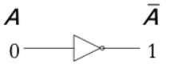
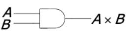
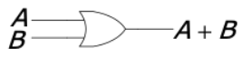
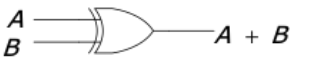
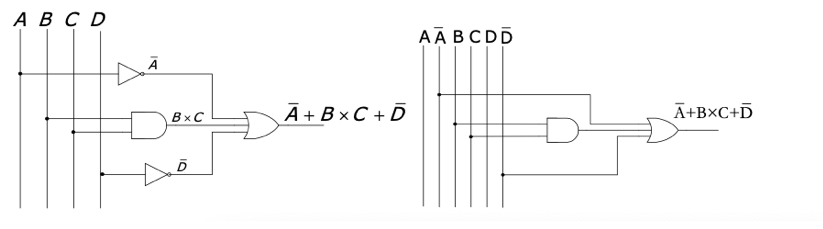
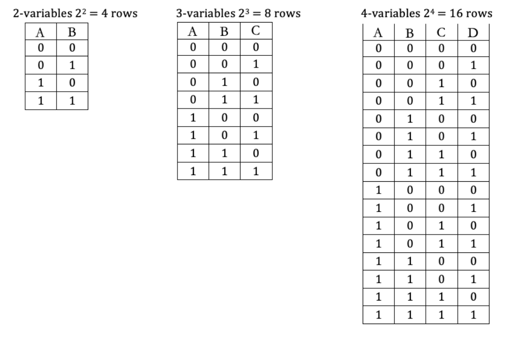
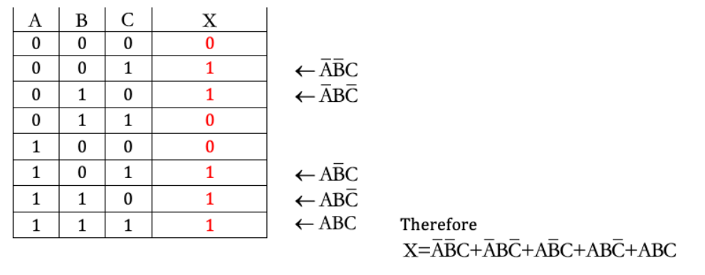
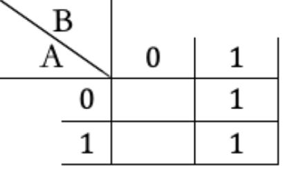
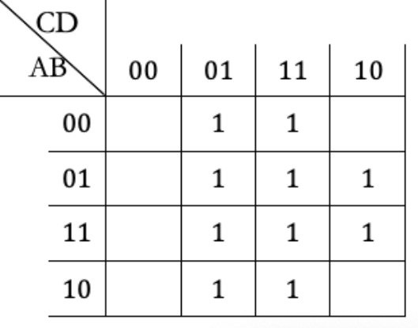

# Discrete Mathematics

## Sets

- A set is a collection of objects or elements
- Relationships among sets can be pictured in Venn diagrams
  - The universal set is represented by a rectangular region
  - subsets of the universal set are usually represented by circular disks drawn within the rectangular region
  - Sets that are not known to be disjoint should be represented by overlapping circles
- Common Universal Sets
  - `C`, complex numbers
  - `R`, real numbers
  - `Q`, rational numbers
  - `N`, natural numbers, `{0, 1, 2, 3, ...}`
  - $$N^*$$, natural nubmers excluding zero, `{1, 2, 3, ...}`
  - `Z`, all integers
  - `Z+`, positive integers

### Definition

- Empty set (denoted $$\emptyset$$) is a subset of all sets
- Elements in a set are grouped inside a pair of curly brackets
  - The order of the elements is not important
    - e.g. $$\{1,2,3\}=\{2,3,1\}$$
  - When order matters, use ordered pair. Its elements are grouped in round brackets
    - e.g. $$(1,2,3)\neq(2,3,1)$$
- Two sets are equal if every element in the first is also in the second and every elemnt in the second is also in the first
  - Thus, `A = B` if and only if $$A\subseteq B$$ and $$A\subseteq B$$
  - If $$A\subseteq B$$, but $$A\neq B$$ then A is a proper subset of B, $$A\subset B$$
- the `union` of sets `A` and `B` we mean the set consisting of all the elements that are in `A` or in `B`
  - It is denoted `A U B`
  - Thus, $$A\cup B=\{x:x\in A \ \text{or} \ x\in B\}$$
    - Expression on the right is called predicates
- the `intersection` of sets `A` and `B` is the set consisting of all the elements that are in both `A` and `B`
  - It is denoted `A ∩ B`
  - Thus, $$A\cap B=\{x:x\in A \ \text{and} \ x\in B\}$$
  - If the intersection of two sets is the empty set, then these sets are said to be disjoint
- the `difference` of sets A and B, is the set consisting of the elements in A that are not in B
  - It is denoted `A - B`
  - Thus, $$A-B=\{x:x\in A \ \text{and} \ x\notin  B\}$$
- `Universal Set` - a set containing all of the elements of interest in a particular situation
  - Given a universal set `U` and a subset `A` of `U`, the set `U - A` is called the complement of `A` and is denoted $$\overline{A}$$
- the `Cartesian product` of `A` and `B` is the set consisting of all the ordered pairs `(a, b)`, where $$a\in A$$ and $$b\in B$$
  - It is denoted `A x B`
  - Thus, $$A\times B=\{(a,b):a\in A \ \text{and} \ b\in B\}$$
- If `R` is a subset of `A x B`, it can be called a relation from set `A` to set `B`, and if `(x, y)` is an element of `R`, we will say that `x` is related to `y` by `R`, written as `x R y`, instead of $$(x,y)\in R$$
  - If `x R y` exists (which means `(x, y)` can be found in `R`), it equals true and vice versa
- A relation from a set `S` to itself is called a relation on `S`
- A relation `R` on a set `S` may have any of the following special properties:
  1. If for each `x` in `S`, `x R x` is true, then `R` is called `reflexive`
  2. If `y R x` is true whenever `x R y` is true, then `R` is called `symmetric`
  3. If `x R z` is true whenever `x R y` and `y R z` are both true, then `R` is called `transitive`
     - Sort the relation set and find if each pair of `x R y` and `y R z` has a related `x R z`
     - `x R y` and `x R z` or `y R z` and `x R z` can refer to the same relation
- A relation that is reflexive, symmetric, and transitive is called an equivalence relation
- Equivalence class is a subset of some equivalence relation `R` which includes all elements that are equivalent to each other
  - Equivalence class of `x` is a subset of `R` which each elements `y` is equivalent to `x`, denoted as $$[x]=\{y|(x,y)\in R\}$$
- The equivalence classes of an equivalence relation `R` on set `S` divide `S` into disjoint subsets, such a family of subsets of `S` is called a `partition` of `S`, it has the following properties
  - No subset is empty
  - Each element of `S` belongs to some subset
  - Two distinct subsets are disjoint
- Functions can be described as a relationship between set `X` and `Y`
  - Notation $$f:X\rightarrow Y$$
  - `X` is the domain (or pre-image) and `Y` is the codomain (or image)
  - The ralation `f` is a set map from set `X` to set `Y`, it consists of all possible `(x, y)` pairs as `x R y`
  - If `f` is a function, for every `x` in set `X` is related to one or more `y` in `Y`
- Types of relations in functions:
  - `one-to-one` - Every input has a unique output, not every image needs to have a pre-image
  - `onto` - Every image has a pre-image, multiple input can have the same output
  - `one-to-one correspondance` - Every input has exactly one unique output and every output has exactly one unique input
    - When function is `one-to-one` and `onto`

### Theorem

- $$A\cup B=B\cup A$$ and $$A\cap B=B\cap A$$ (commutative laws)
- $$(A\cup B)\cup C=A\cup (B\cup C)$$ and $$(A\cap B)\cap C=A\cap (B\cap C)$$ (associative laws)
- $$A\cup (B\cap C)=(A\cup B)\cap(A\cup C)$$ and $$A\cap (B\cup C)=(A\cap B)\cup(A\cap C)$$ (distributive laws)
- $$\overline{\overline{A}}=A$$
- $$A\cup\overline{A}=U$$
- $$A\cap \overline{A}=\emptyset$$
- $$A\subseteq A\cup B$$ and $$B\subseteq A\cup B$$
- $$A\cap B\subseteq A$$ and $$A\cap B\subseteq B$$
- $$A-B=A\cap \overline{B}$$
- $$\overline{(A\cup B)}=\overline{A}\cap\overline{B}$$ and $$\overline{(A\cap B)}=\overline{A}\cup\overline{B}$$ (De Morgan’s Laws)
- Let `R` be an equivalence relation on a set `S`
  - If `x` and `y` are elements of `S`,then `x` is related to `y` by `R` if and only if `[x] = [y]`
  - Two equivalence classes of `R` are either equal or disjoint
- An equivalence relation `R` gives rise to a partition `P` in which the members of `P` are the equivalence classes of `R`
- Conversely, a partition `P` induces an equivalence relation `R` in which two elements are related by `R` whenever they lie in the same member of `P`
  - Moreover, the equivalence classes of this relatio nare the members of `P`

## Modular Arithmetic

- Modular arithmetic is a system in which all numbers up to some positive integer `n` are used.

### Division Algorithm

- When an integer _(a)_ is divided by a positive integer _(b)_ we get a quotient _(q)_ and a remainder*(r)*.
  - For example, `a = 365840 and b = 125460 a = bq + r`

### Modular Systems

- The integers (a) and (b) are **congruent modulo** `m` (where m is a natural number greater than 1) if and only if the difference `a – b`  is divisible by `m`. hence `a` and `b` both have the same remainder when divided by `m`.
- $$a \equiv b$$ _(mod m)_, From where `a - b = k·m` (for some integer `k`)
- It also means that there is calculation among the positional number in each mod `n` system.
- It is like a is circling around a circle of `0` to `m-1` and ends up at `b`.
- so `b` is like the positional number for a which is counting around the circle.
- $$\equiv$$ symbol means the value on the left and right have the same positional number `b`
- $$Z_m$$ is the set of all unique congruent classes set of `mod m`
  - A congruent class $$[a]=\{a+mk\;|\;k\in\mathbb{Z}\}$$ in $$Z_m$$
  - $$Z_m$$ contains all distinct congruent classes in a set as `{[0], [1], ..., [m-1]}`
  - Arithmetic operation between congruent class can be performed between individual element from the two sets that have the same `k` value

### Properties & Techniques

- If $$a \equiv b$$ _(mod n)_ and $$c \equiv d$$ _(mod n)_ then:
  - $$a + c \equiv b + d$$ _(mod n)_
  - $$a - c \equiv b - d$$ _(mod n)_
  - $$a \cdot c \equiv b \cdot d$$ _(mod n)_
  - $$a^k \equiv b^k$$ _(mod n)_
  - module equation holds by plus and multiply, power operations on both sides. (position number on both sides change together)
- Module equation holds by plus and multiply operations with unknowns on both sides
- $$ax\equiv b$$ _(mod m)_ is called a Congruence equation , unknown `x` is always an integer, `x` will be solved as follow.
  - $$x\equiv b$$ _(mod m)_, where be is an positive integer that is smaller than `m`.
  - The solution for all positive values can also be represented as $$x \in {b, b+m,b+2m, \dotsc }$$ or $$x \in \emptyset$$ if no solution is found.
- As a result, if you want to evaluate `mod p` of an expression just do the arithmetic calculate of both side normally and then simplify by taking the remainder after dividing by p.
  - The remainder of a negative number is the negative remain add one full circle.
- In order to find the positional `b` of a large number with exponent.
  - find position for the base and the raise the power of the base position number and then find the positional number for the newly generated number.
  - Sometimes when base is not `1` and the exponent is still too big, see if it can be `-1`.
  - Sometimes the base is divisible on the mod `n`
- Arithmetic operation between congruent classes can be treated as simple arithmetic operation between the value in `[]`. In the end, reduce the final result to smallest positive integer in `mod m`
  - e.g. `[3]`+`[5]` in $$Z_6$$ is `[3 + 5]`=`[8]` $$[3+5]=[8]\equiv [2]$$ _(mod 6)_
  - Modular properties still applies for simplification, e.g. for $$[8]^4$$ in $$Z_12$$, $$[8^4]=[64]^2\equiv [4]^2=[16]\equiv[4]$$ _mod 12_

### Application

#### Check Digit

- The following application has the check digit located at the last digit.
- Airline Tickets - The check digit is the remainder of the main part divided by 7.
- Social Insurance Number
  - Luhn algorithm
    - Remove the check digit x
    - Double the even position digits from left and add their digits: (only here: if 12, add 1 and 2. if 14 its 1+4)
    - Add the rest of the digits:
    - multiply by -1
    - The check digit is mod 10
- UPC – Universal Product Code
  - _check digit =_ $$-(3a_11+a_10+3a_9+a_8+3a_7+a_6+3a_5+a_4+3a_3+a_2+3a_1); (mod: 10)$$
- ISBN – International Standard Book Number
  - $$a_0 = a_9+2a_8+3a_7+4a_6+5a_5+6a_4+7a_3+8a_2+9a_1 ; (mod : 11)$$>)

#### Round-Robin Tournament

- Each team must play against every team once.
- In even number of teams
  - each team plays in every round
  - the number of rounds is 1 less than the total number of teams.
- In odd number of teams
  - one team stays with a `bye` (has no match to play)in every round
  - the number of rounds is the same as the total number of teams.
- In a tournament with N teams
  - Team X will be playing against X in round r, `Y = r-X (mod N or N-1)`
  - When N is odd and Y = X(assumes there is a unknown team x that plays with itself), the team is assigned a bye.
  - When N is even, the schedule is made as there are one less number of teams mod is (N-1) and in case Y = X, the team is assigned to play with Team N.
    - round 0 is round N.
    - careful about TeamN in even Team situation.

#### Euclidian Algorithm

- it can be intepreted as calculating the mod of the two precedent numbers
  1. step `-1`, 365840
  2. step `0`, 125460
  3. step `1`, 114920 ($$365840 \equiv 125460$$)
  4. step `2`, 10540 ($$125460 \equiv 114920$$)
  5. step `3`, 9520 ($$114920 \equiv 10540$$)
  6. step `4`, 1020 ($$10540 \equiv 9520$$)
  7. step `5`, 340 ($$9520 \equiv 1020$$)
  8. step `5`, 0 ($$1020 \equiv 340$$)
  9. As a result, GCF(125460, 365840) = 340
- The extended Euclidian algorithm can find `x` and `y` such that `mx + ny = GCD(m, n)`
  - For `m = 539` and `n = 396`
    | i | $$q_i$$ | $$r_i$$ | $$x_i$$ | $$y_i$$ |
    |----|---------|---------|---------|---------|
    | | | $$x_{i-2}-x_{i-2}\cdot q_i$$ | $$y_{i-2}-y_{i-2}\cdot q_i$$ |
    | -1 | | 539 | 1 | 0 |
    | 0 | | 396 | 0 | 1 |
    | 1 | 1 | 143 | 1 | -1 |
    | 2 | 2 | 110 | -2 | 3 |
    | 3 | 1 | 33 | 3 | -4 |
    | 4 | 3 | 11 | -11 | 15 |
    | 5 | 3 | 0 | 36 | -49 |
  - `GCD(539, 396) = 11`
  - `x = -11`, `y = 15` since `539(-11) + 396(15)=11`
  - Adjust the `x`, `y` to a factor if the right side of the equation is a product of `GCD(m, n)` and an integer

#### RSA System

- Steps to create a RSA system
  1. Pick two prime numbers `p` and `q`
  2. Find `n` and `ϕ`, where `n = p·q` and `ϕ = (p-1)(q-1)`
  3. Find randomly pick an encoding exponent `e` that `GCD(e, ϕ) = 1`
  4. Find decoding exponent `d`, where `e·d + ϕ·y = 1`
  5. `n` and `e` will be released for public, and `d` will be kept as a secret
  6. If `m` is the a message represented as a numeric value and `s` is the secret message represented as another numeric value
     - Use $$s=m^e$$ _mod n_ to encode
     - Use $$m=s^d$$ _mod n_ to decode

## Graphs

- Vertices are points on the graph
  - For a triangle, vertices can be written as `{A, B, C}`
- Edges are lines on the graph connected by two vertices
  - For a triangle, edges can be written as `{a, b, c}` or `{(A, B), (A, C), (A, C)}`
  - It can be represented by lower case letters or a pair of vertices like AB or $$\overline{AB}$$
  - When two vertics are connected by an edge, they are adjacent vertices
- A complete graph is when every vertex is connected to every other vertex in that graph
  - A triangle is a complete graph
- The degree of a graph of a vertex equals the number of edges that vertex connected to, e.g. `deg(A) = 2` if edges `AB`, `AC` exists
- Adjacency matrix has all vertices of a graph represent each row and column, then each element in the matrix is the number of edges between the column vertex and row vertex
  - It will be a `n` by `n` matrix if it has `n` vertices
  - The diagonal of such matrix is always zero since on edges between the vertex itself
  - The matrix always equals to its transpose, it is symmetric and it will keep the same when reflected by the diagonal
- Adjacency list uses a list form to represent the adjacency of a graph, it uses each vertex as the key and the value is a list a vertices it conncected to
  - For a triangle, `A: B, C`, `B: A, C`, `C: A, B`
- Chromatic number of a graph is the number of colors required for coloring a graph, so two adjacent vertices can't have the same color

### Tree

- A tree is a graph that is connected and has no cycles
- It has exactly one simple path between any pair of vertices
- A tree with `N` edges has `N+1` vertices
- When an additional edge is added to any tree, a cycle will be formed
- A tree with more than one vertex has at least two vertices of degree one
- Spanning tree - a tree of a graph that has all the vertices
  - When finding the spanning tree for a given graph, BFS or DFS algorithm can be used
  - BFS finds the shortest spanning tree
  - DFS finds the longest spanning tree
  - During traversal, use alphabetical order within the same depth (or queue)
- Weighted trees - the edges of the tree have weights
  - The weight of a tree is the sum of weights of all the edges
- Minimal Spanning Tree - It's a spanning tree with the least weight in a graph
- Maximal Spanning tree - It's a spanning tree with the maximum weight in a graph
  - PRIM's algorithm is used to find the min spanning tree, find and draw the shortest edge(s) from the root, then amount all edges connected to the chosen edge find and draw the shortest edge(s), then amongst all edge(s) connected to the chosen edge(s) find and draw the shortest edge(s) until all vertices are covered. As a result the sum of all the chosen edges should be the minimum
    - Find the longest edges for the max spanning tree
- A binay tree is a rooted tree in which each vertex has a maximum of 2 children
  - Rooted tree is a tree with a root node
  - Root node is the start (top) of the tree without having any parents
  - Parent node is any node with at least one child
- When constructing a binary tree, assign the first weight to root, then put anything smaller to the left child, and anything larger to the right child, etc. Also make sure all weights from the left-subtree should be smaller than the parent of this subtree, and all weights from the right-subtree should be larger than parent node

## Counting

- Systematic listing - Methods used for count objects
  - One-Part Tasks: use lists
  - Two-Part Tasks: use tables
  - Multiple-Part Tasks: use trees
- Fundamental Counting Principle
  - Under uniformity (independent and equally possibility) criterion: For one taks invloves multiple step, the way it can be done is equals to products of the ways in different steps.
- Factorial
  - $$n! = n\times(n-1)\times(n-2)\times\ldots\times2\times1$$
  - By definition: $$0!=1$$
- Arrangements(order matters) of `n` Distinct Objects
  - It equals to $$n!$$
  - if same objects are found in the group(Ex, same color same letter same age in an arrangement), its arrangement can be calculated by dividing $$n!$$ by the factorial of the size of special group.
- Permutations(order matters) is the ways of making arrangements of small group r from a big group n
  And order matters
  - It equals to $$_nP_r=\frac{n!}{(n-r)!}$$
  - Ex, pick three card from five card, $$5\times4\times3=\frac{5!}{2!}=\frac{5!}{(5-3)!}$$
- Combination is like permutations but order doesn't matter
  - It euqals to $$_nC_r=\frac{n!}{r!(n-r)!}$$
  - Extra `r!` in the formula is used to make orders not matter.
- Strategies
  - Draw graph and make analogy to solve different senareio in questions.
  - Methods using steps of Combination and Pemutation (e.g. $${_6}P_2 \cdot {_5}C_4$$) is more reliable.
  - When finding all combination using steps like $${_5}C_2 \cdot {_3}C_2$$, be aware of duplicated cases, because steps itself have order which combination doesn't care about
  - The idea of dividing into event and analysis the independence is crutial.
- Critical Path Analysis
  - It can be solved by drawing PERT (Program Evaluation and Review Technique) chart.
    - PERT chart list the sequence of all task with time
  - It finds the longest path
- Counting with Generating Functions
  - From a counting perspective, coeficient of an algebraic term is the number of ways to get the same term
    - In $$(a+b)^n$$, the number of ways to get $$a^kb^{n-k}$$ is $$_nC_k$$
  - The selection of term `x` can be expressed as $$x^n$$ and `n` means the number of time it is selected, then all possible number of ways to select `0` until `n` of `x` can be identified in polynomials as $$c_0x^0+c_1x^1+c_2x^2+/cdots +c_nx^n$$ where constant $$c_n$$ represents number of ways to select `n` of `x`
  - Expression like $$(x^0+x^1+/cdots +x^n)$$ is used to represents the number of ways to choose `n` of `x` when `0` to `n` of `x` must be selected once
  - plus sign means `or`
  - the meaning of `x` changes based on the context, e.g. choose 2 fruits from 2 apples and 2 oranges, $$G(x)=(x^0+x^1+x^2)(x^0+x^1+x^2)=x^4+2x^3+3x^2+2x+1$$
    - Since $$x^2$$ has coeficient `3`, there are `3` ways to get two fruits, becuase this example doesn't care which `x` is apple and which `x` is orange, `x` in the function means any fruits
    - When the number of a second or more items neeed to be counted, use another variable in the generating functions
  - When there are specific requirements in selecting an object like "must choose in pair", change the expression accordingly, $$(x^0+x^2+x^4+\cdots)$$

## Boolean Algebra

- A logical statement can have two values, True (1) and False (0)
- Statement that is always true is called Tautology
- Boolean Constant is a value that does not change during an operation. It can have values of 1 or 0 only
- Boolean Variable is a value that can change during an operation (but only from 1 to 0 or from 0 to 1). They are represented by uppercase letters from `A` to `Z`
- Logical statements can be assigned a value of a constant or a variable and can be combined with Boolean operations. The basic Boolean operations are:
  - Negation (NOT) - `-A`, `¬A`, `~A`
    - not `A`
  - Conjunction (AND) - `A X B`, `A ∧ B`
    - Both `A` and `B`
  - Disjunction (OR) - `A + B`, `A ∨ B`
    - Either `A` or `B` or both
  - Exclusive Disjunction (XOR) - `A ⊕ B`
    - Either `A` or `B` but not both
  - Conditional (If...then) - `A → B`
    - `A` implies `B`
    - `A → B = False` only when `A` is `True` but `B` is `False`
    - If `A → B`:
      - Converse - `B → A`
      - Inverse - `~A → ~B`
      - Contra positive - `~B → ~A`
  - Biconditional - `A ↔ B`
    - `A` if and only `B`
    - `A ↔ B` is `True` when `A` and `B` are same
- Using Block Diagram Symbol
  - NOT Gate 
  - AND Gate 
  - OR Gate 
  - XOR Gate 
  - To represent a expression 
- If an expression is made up of several smaller expressions (terms) OR-ed together, the expression is in Sum Form. (`A + B + C`)
- If an expression is made up of several smaller expressions AND-ed together, the expression is in product form. (`A X B X C`)
- If every term of the sum form is a product of the variables, the expression is in Sum-of-Product (SOP) form. `A X B + B X C`
- If every term of the product form is a sum of variables, the expression is in Product-of-Sum (POS) form. (`(A + B) X (B + C)`)

### Manipulate Boolean Expression

- Here are the laws related to boolean expressions. Each law has an `AND` form and an `OR` form
  - Identity law: `1A = A`, `0 + A = A`
  - Null law: `0A = 0`, `1 + A = 1`
  - Idempotent law: `AA = A`, `A + A = A`
  - Inverse law: $$A \overline{A} = 0$$, $$A + \overline{A} = 1$$
  - Commutative law: `AB = BA`, `A + B = B + A`
  - Associative law: `(AB)C = A(BC)`, `(A + B) + C = A + (B + C)`
  - Distributive law: `A + BC = (A + B)(A + C)`, `A(B + C) = AB + AC`
  - Absorption law: `A(A + B) = A`, `A + AB = A`
  - De Morgan's law: $$\overline{AB} = \overline{A} + \overline{B} $$, $$\overline{A+B} = \overline{A} \overline{B} $$
  - $$A (\overline{A} + B) = AB$$, $$A + \overline{A}B = A+B$$

### Truth Tables

- It is used to list all the possible combination of the boolean variable in an expression.
- 
  - Parts of the expression and be written in additional columns on the right.
  - The parts of an expression can be combined using correspoding operation.
- An unknown expression can be solved using truth table.
  - 

### Karnaugh Maps

- It can be used to represent the result of a unknown expresssion according all the possible combination of its variables.
- For two variables:
  - 
  - 
  - 
- From a given Boolean expression, the cells that correspond to terms in the expression will have 1s and the other cells will stay empty. In order to group 1s (to loop 1s) we have the following rules:
  - we can only make loops of one, two, four, eight, … (power of 2 only) 1s;
  - we can loop 1s that are adjacent, above and below, and side by side, but not diagonally;
  - we can include 1s that are already looped in a new loop to form a bigger group;
    - the loops are only rectangular, not T- or L-shaped;
  - we make the biggest loops possible and
  - we make the smallest amount of loops.
- For all previous Boolean expressions, each term contained all variables present. If an expression has terms that are missing a variable (or more variables) we can expand that term by adding all possible combinations of the missing variable (variables).

### Application

#### Parity Checking

- For binary data, one extra bit is used in the end to make sure the total number of 1's is even for even parity checking or odd for odd parity checking
- This method can only detect one bit error
- Decoding is done by removing extra bit
- Send message with the parity bit twice for error detection
  - When there is a one bit difference in two messages the message that matches the parity bit will be the correct one
  - It can't find the correct message when error happens in pairs
- The efficiency of a code word can be calculated as the percentage of `# of bits of the actual message / # of bits transmitted`
- The Hamming distance is the number of bits in which the 2 code words disaggree
  - e.g the Hamming distance between messages `101011` and `010011` is `3` because they have 3 bits different
