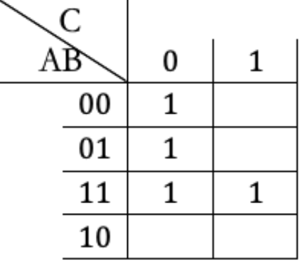

# Discrete Mathematics

## Modular Arithmetic

- Modular arithmetic is a system in which all numbers up to some positive integer `n` are used.

### Division Algorithm

- When an integer*(a)* is divided by a positive integer*(b)* we get a quotient*(q)* and a remainder*(r)*.
  - For example, `a = 365,840 and b = 125,460 a = bq + r`

### Modular Systems

- The integers (a) and (b) are **congruent modulo** `m` (where m is a natural number greater than 1) if and only if the difference `a – b`  is divisible by `m`. hence `a` and `b` both have the same remainder when divided by `m`.
-  _(mod m)_, From where `a - b = k·m` (for some integer k)
- It also means that there is calculation among the positional number in each mod n system.
- It is like a is circling around a circle of 0 to m-1 and ends up at b.
  so b is like the positional number for a which is counting around the circle.

### Modular Arithmetic

- If  _(mod n)_ and  _(mod n)_ then:
  -  _(mod n)_
  -  _(mod n)_
  -  _(mod n)_
  -  _(mod n)_
- module equation holds by plus and multiply, power operations on both sides. (position number on both sides change together)
  module equation holds by plus and multiply operations with unknowns on both sides.
- As a result, if you want to evaluate `mod p` of an expression just do the arithmetic calculate of both side normally and then simplify by taking the remainder after dividing by p.
- The remainder of a negative number is the negative remain add one full circle.
-  is called a Congruence equation , unknown `x` is always an integer, `x` will be solved as follow.
  - , where be is an positive integer that is smaller than `m`.
  - The solution for all positive values can also be represented as  or  if no solution is found.
- In order to find the positional b of a large number with exponent.
  - find position for the base and the raise the power of the base position number and then find the positional number for the newly generated number.
  - Sometimes when base is not 1 and the exponent is still too big, see if it can be -1.
  - Sometimes the base is divisible on the mod n.

### Application

- The following application has the check digit located at the last digit.
  - Airline Tickets - The check digit is the remainder of the main part divided by 7.
  - Social Insurance Number
    - Luhn algorithm
      - Remove the check digit x
      - Double the even position digits from left and add their digits: (only here: if 12, add 1 and 2. if 14 its 1+4)
      - Add the rest of the digits:
      - multiply by -1
      - The check digit is mod 10
  - UPC – Universal Product Code
    - _check digit =_ 
  - ISBN – International Standard Book Number
    - >)
- Round-Robin Tournament
  - Each team must play against every team once.
  - In even number of teams
    - each team plays in every round
    - the number of rounds is 1 less than the total number of teams.
  - In odd number of teams
    - one team stays with a `bye` (has no match to play)in every round
    - the number of rounds is the same as the total number of teams.
  - In a tournament with N teams
    - Team X will be playing against X in round r, `Y = r-X (mod N or N-1)`
    - When N is odd and Y = X(assumes there is a unknown team x that plays with itself), the team is assigned a bye.
    - When N is even, the schedule is made as there are one less number of teams mod is (N-1) and in case Y = X, the team is assigned to play with Team N.
      - round 0 is round N.
      - careful about TeamN in even Team situation.

## Boolean Algebra

- A logical statement can have two values, True (1) and False (0)
- Boolean Constant is a value that does not change during an operation. It can have values of 1 or 0 only;
- Boolean Variable is a value that can change during an operation (but only from 1 to 0 or from 0 to 1). They are represented by uppercase letters from `A` to `Z`;
- Logical statements can be assigned a value of a constant or a variable and can be combined with Boolean operations. The basic Boolean operations are:
  - Negation (NOT) - `-A`
    - not `A`
  - Conjunction (AND) - `A X B`
    - Both `A` and `B`
  - Disjunction (OR) - `A + B`
    - Either `A` or `B` or both.
  - Exclusive Disjunction (XOR) - `A ⊕ B`
    - Either `A` or `B` but not both.
- Using Block Diagram Symbol
  - NOT Gate 
  - AND Gate 
  - OR Gate 
  - XOR Gate 
  - To represent a expression 
- If an expression is made up of several smaller expressions (terms) OR-ed together, the expression is in Sum Form. (`A + B + C`)
- If an expression is made up of several smaller expressions AND-ed together, the expression is in product form. (`A X B X C`)
- If every term of the sum form is a product of the variables, the expression is in Sum-of-Product (SOP) form. `A X B + B X C`
- If every term of the product form is a sum of variables, the expression is in Product-of-Sum (POS) form. (`(A + B) X (B + C)`)

#### Manipulate Boolean Expression

- Here are the laws related to boolean expressions. Each law has an `AND` form and an `OR` form
  - Identity law: `1A = A`, `0 + A = A`
  - Null law: `0A = 0`, `1 + A = 1`
  - Idempotent law: `AA = A`, `A + A = A`
  - Inverse law: , 
  - Commutative law: `AB = BA`, `A + B = B + A`
  - Associative law: `(AB)C = A(BC)`, `(A + B) + C = A + (B + C)`
  - Distributive law: `A + BC = (A + B)(A + C)`, `A(B + C) = AB + AC`
  - Absorption law: `A(A + B) = A`, `A + AB = A`
  - De Morgan's law: , 
  - , 

#### Truth Tables

- It is used to list all the possible combination of the boolean variable in an expression.
- 
  - Parts of the expression and be written in additional columns on the right.
  - The parts of an expression can be combined using correspoding operation.
- An unknown expression can be solved using truth table.
  - 

#### Karnaugh Maps

- It can be used to represent the result of a unknown expresssion according all the possible combination of its variables.
- For two variables:
  - 
  - 
  - 
- From a given Boolean expression, the cells that correspond to terms in the expression will have 1s and the other cells will stay empty. In order to group 1s (to loop 1s) we have the following rules:
  - we can only make loops of one, two, four, eight, … (power of 2 only) 1s;
  - we can loop 1s that are adjacent, above and below, and side by side, but not diagonally;
  - we can include 1s that are already looped in a new loop to form a bigger group;
    - the loops are only rectangular, not T- or L-shaped;
  - we make the biggest loops possible and
  - we make the smallest amount of loops.
- For all previous Boolean expressions, each term contained all variables present. If an expression has terms that are missing a variable (or more variables) we can expand that term by adding all possible combinations of the missing variable (variables).
