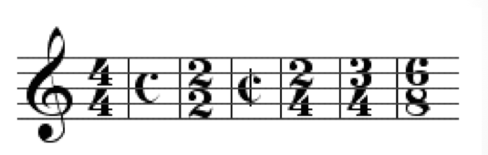
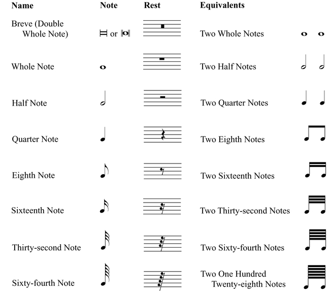

# Music Theory

## Pitch

- Music Alphabet `C D E F G A B` are used as the pitch name
  - The pitch name after `B` will be repeated as `C` which is one octave higher than the previous `C`
  - To distinguish `C`s in various range append a number, on a piano the lowest `C` is `C1`. The next `C` after `B1` is `C2`.
- From the keyboard perspective: `C` is the left of the group of 2 black key.
- From the frequency perspective: `A4` has `440Hz`(variation applies)
  - one octave higher means double the frequency, hence `A3 = 220Hz`, `A5= 880Hz`
  - In general: 
  - `n` is the steps away from the key with known frequency 
- Pitch class is a group of pitch with the same name, `A3` and `A4` are in one pitch class.
- `C4` is middle `C`. It is the `C` notes in the middle of the piano keyboard.
- Blacks are described by using left white key letter name plus sharp sign(`#`) or right withe key plus flat(b) sign.
- `#` and `b` and `♮` sign are called accidentals which are placed on the left side of notes to represent sharp and flat.
- double accidentals: `X`(double sharp) and `bb` (double flat)
- qualification is the process of adding accidentals on the staff.
- enharmonic - one pitch two name
  - notes like B# and C, Fb and E are enharmonic equivalent
  - all black key notes and notes C E F B have enharmonic note names.
- Clef
  - Treble Clef - `C5` on the second space count from top
  - Bass Clef - `C3` on the second space count from the bottom
- Staff
  - staff is made up by 5 horizontal lines.
- Grand staff
  - a combination of treble clef and bass clef is called the grand staff.
  - 
    - Treble Clef at the top
    - Bass Clef at the bottom
- ledger line
  - It is the extra short line for notes outside the staff’s five lines.
- white keys on the keyboards are represented by the lines and spaces.
- Guitar player used treble clef and bass players use bass clef. the actual sounds is one octave lower than the notes on the staff.
- piano player use treble clef for the right hand and bass clef for the left hand. and play the exact notes indicated on the staff.
- Key signature is a group of flats and sharps indicate the key.
  - All the pitches defined as flat or sharp will be flatted or sharpened when encountered.
- The key that is being used throughout the tune or indicated by the key signature is the momentary key.

## Rhythm

- rhythmic value means the duration or the number of beats.
- rhythmic unit is the beats
- speed is the bpm(beats per minute)
- a dot adds the note half of its original rhythmic value.
- Time Signature 
- bottom number indicates 2(half note) or 4(quarter note) or 8(eighth note) is treated as one pulse.
- upper number indicates how many pulse in one measure(bar).
- 4/4 is known as common time `C`.
- 2/2 is known as `cut` time, vertical bar on `C`
- Simple meters have 2 notes per beat.
  - If there are 2 beat per bar. It is called a simple duple.
  - If there are 3 beat per bar. It is called a simple triple.
  - If there are 4 beat per bar. It is called a simple quadruple.
- Compound meters have 3 notes per beat.
  - If there are 2 beat per bar. It is called a compound duple.
  - If there are 3 beat per bar. It is called a compound triple.
  - If there are 4 beat per bar. It is called a compound quadruple.
- Ties - they are curves across muliple notes
  - For notes with the same pitch, the rhythm of the two will be added up and treated as one note.
  - For notes with the different pitches, there will make continuous sound.
- A number like 3, 5 , 7 underneath a group of notes will generally add an extra note in the original rhythmic gap.
- A rest defines the length of silence.
- See the charts for all notes and rests
  - 

## Amplitude

- notation
  - `f` strong
  - `p` weak
  - `<` stronger and stronger
  - `<` weaker and weaker

## Intervals

- It is consisted of two notes with a certain distance.
- half-step or `<HS>` is the interval between two adjacent notes on the keyboard.
- whole step or `<WS>` is made up by two consecutive half step.
- octave is the interval between two adjacent notes with the same lettername on the keyboard.
- one octave has 12 half-step in between.
- tetrachord is a group of four notes in sequence.
- major tetrachord is four note using `<WS><WS><HS>` interval sequence.
- minor tetrachord is four note using `<WS><HS><WS>` interval sequence.
  - only consecutive ascending letter names should be used.
- Harmonic intervals have two notes of the interval playing at the same.
- Melodic intervals are when two notes play one by one in sequence.
- A simple interval have no more than one octave in between.
- A compound interval is a simple interval plus one octave
  - A compound interval has the same quality as its equvilent simple interval
- Unison intervals have one note with zero step.

### Diatonic Interval

- diatonic interval are those with an upper note belong to the major scale starts from the tonic note.
- diatonic interval can be either:
  - perfect(upper notes is the 4th, 5th and 8th note of the current scale) Ex, Perfect 5th.
  - major(upper notes belongs to all others) Ex, Major 3rd.

### Chromatic Intervals

- chromatic intervals are intervals that modified from diatonic in following ways.
  - Major interval - `<HS>` = minor interval
  - Major interval - `<WS>` = diminished interval
  - major interval + `<HS>` = augmented interval
  - perfect interval - `<HS>` = diminished interval
  - perfect interval + `<HS>` = augmented interval
  - Ex, C and G is a perfect 5th, C and G# is an augmented 5th.
- A tritone is a diminished fourth or augmented fourth.
  - It has three whole step in between and it cut one octave in half.
  - It generates an unpleasant sound.

### Consonance and Dissonance Intervals

- Consonance Intervals has:
  - Perfect Consonance Intervals
    - Unison
    - Perfect Fifth
    - Octave
    - Perfect Fourth
      - When it is melodic, it is more like a consonance interval
      - When it is harmonic, it is more like a dissonance interval
  - Imperfect Consonance Intervals
    - Major Third
    - Major Sixth
- Dissonance Intervals has:
  - Major Second
  - Major Seventh
  - All other chromatic intervals
- Resolution happens when a dissonance interval is followed by a consonance interval
  - Maximum resolution happens when the dissonance interval resolve into its closet and most perfect consonance interval
  - For the consonance interval used for resolution, emphasis the upper notes with additional notes one octave lower will enhance the sense of resolution

## Scales

- Scale is a combination of two tetrachord separated by a `<WS>` interval.
- the lower part is called the lower tetrachord, the higher part is called the upper tetrachord.
- the letter name of the starting note represent the key of the major scale.
- The nth degree of a scale, is its nth note count from its key note. It is denoted by roman letter `I-VII`
- Tonic means the first degree of a scale.

### Major Scale

- Major scale has a major tetrachord as both the lower and upper tetrachord.`<WS><WS><HS><WS><WS><WS><HS>`
- Diatonic solfeg syllables gives each degree of a **major scale** a name
  - from 1st to 7th, `DO` `RE` `MI` `FA` `SO` `LA` `TI`
- about the active and resting property, In general:
  - DO is the most resting tone
  - MI and SO are resting tone
  - RE and LA are mildly active, resolved by whole-step.
  - FA and TI are very active, resolved by half-step.
- the resolution property is the tendency of the tone which wants to move up or move down to the resting tone.

### Minor Scale

- Minor scale has a minor tetrachord as the lower tetrachord. There are three types of minor scale:
  - Melodic minor scale: - the upper tetrachord is a major tetrachord.
  - Harmonic minor scale: - the upper tetrachord is `<HS><Mi3><HS>`
    - `<Mi3>` is a 3 half-steps interval.
  - Natural minor scale: - the upper tetrachord is `<HS><WS><WS>`
- for a major scale, its Aeolian mode is the relative minor. this relative minor is a natural minor scale has the same key signature as that major scale.
- Chromatic solfeg C#-DI D#-RI F#-FI G#-SI A#-LI Db-RA Eb-ME Gb-SE Ab-LE Bb-TE
- Minor key signature is applied for the natural minor scale only, additional accidentals are used to represent harmonic and melodic minor scale.
  - from a natural minor scale, the harmonic minor scale raises its 7th degree by half-step.
  - from a harmonic minor scale, the melodic minor scale raises its 6th degree by half-step.

### Modes

- Also known as Modal scales
- They are scale that start at different degree of a major scale(mostly).
- The major scale that the mode is based on is called the relative major.
- start from the 1st degree to 7th degree, each scale is called:
  - Ionian, Dorian, Phrygian, Lydian, Mixolydian, Aeolian, Locrian.
- Lettername is used to describe the starting note, with the music alphabet which indicate the degree of the relative major the starting note is on.
  - Ex, D Dorian mode is C major starts from D. C major is the relative major of D Dorian.

### the Circle of Fifths

- The circle of fifths or the circle of fourths are tetrachords connected by `<WS>`s
- the letter names of the tetrachord are used to draw the circle in sequence.
- The C major tetrachord is on the top of the circle, it goes to the higher major tetrachord in clockwise direction.
  - 
- On the circle of fifths
  - From C counter-clockwise, each major key adds one flats(on fourth degree).
  - From C clockwise, each major key adds one sharps(on seventh degree).
- For key signatures, sharps and flats add from left to right in the order corresponding to the circle of fifths.

## Chords

- Arpeggios - play a chord one by one from low to high or high to low.
- Voice leading occurs on the top notes of each chord

#### Triad

- It is a chord consisting of three notes
- root - the note on the first degree of the scale
- 3rd - the note on the third degree of the scale
- 5th - the note on the fifth degree of the scale

| Chord Name           | Composition                     | Chord Symbol                                     |
| -------------------- | ------------------------------- | ------------------------------------------------ |
| the Major Triad      | root, major 3rd, perfect 5th    | `C` or `CMa`, `CM`, `CΔ`, `CMaj` - C major triad |
| the Minor Triad      | root, minor 3rd, perfect 5th    | `Cmi`or `Cmin`,`Cm`,`C-` - C minor triad         |
| the Augmented Triad  | root, major 3rd, augmented 5th  | `C+` or `Caug` - C augmented triad               |
| the Diminished Triad | root, minor 3rd, diminished 5th | `Cº` or `Cdim` - C diminished triad              |

- inversions
  - root position - root, 3rd, 5th
  - 1st inversion - 3rd, 5th, root
  - 2nd inversion - 5th, root, 3rd
- diatonic triads are triads that can be found in the major scale. all the diatonic triads can be found as follows:
  - on the 1st degree of major scale: a major triad
  - on the 2nd degree of major scale: a minor triad
  - on the 3rd degree of major scale: a minor triad
  - on the 4th degree of major scale: a major triad
  - on the 5th degree of major scale: a major triad
  - on the 6th degree of major scale: a minor triad
  - on the 7th degree of major scale: a diminished triad
  - The augmented triad is not found in the major scale it is the only non-diatonic triad. the internal interval(interval between notes) are the same for all its inversions.
- Triad plurality - are triads that can be found from different major scale.
  - one major and minor chord can be found from three different major scale.
- Diminished chords don’t have this property since it has a one to one relationship with every major scale.
- Triads can also add octaves for any one of the three notes, it will still be a triad and its quality will stay the same.

#### Four-part Chord

- It has four notes, also known as seventh chord

| Chord Name          | Composition                             | Chord Symbol                                           |
| ------------------- | --------------------------------------- | ------------------------------------------------------ |
| major seventh       | root, major 3rd, perfect 5th, major 7th | `Cma7` or `CMaj7`, `Cmaj7`, `CM7`, `CΔ7`               |
| major sixth         | root, major 3rd, perfect 5th, major 6th | `C6` or `CMaj6`, `Cmaj6`, `CM6`                        |
| minor seventh       | root, minor 3rd, perfect 5th, minor 7th | `Cmi7` or `Cmin7`, `Cm7`, `C-7`                        |
| dominant seventh    | root, major 3rd, perfect 5th, minor 7th | `C7`                                                   |
| minor major seventh | root, minor 3rd, perfect 5th, major 7th | `CmiMa7` or `Cmima7`, `CmiΔ7`, `C-ma7`, `C-Δ7`, `CmM7` |
| minor sixth         | root, minor 3rd, perfect 5th, major 6th | `Cmi6` or `Cmin6`, `Cm6`, `C-6`                        |

- all four-part chord contains a perfect 5th.
- Using notes in a major scale only, the following diatonic four-part chord can be found when is starts on different degree.

| Chord Name                 | Starting Degree |
| -------------------------- | --------------- |
| major 7th or major 6th     | 1st degree      |
| minor 7th                  | 2nd degree      |
| minor 7th                  | 3rd degree      |
| major 7th or major 6th     | 4th degree      |
| dominant 7th               | 5th degree      |
| minor 7th                  | 6th degree      |
| minor 7th with flatted 5th | 7th degree      |

- plurality rules can be derived from the above conclusion.
- four-part chords have a root position and 1st, 2nd, 3rd inversion.

#### Five-part Chord

- It has five notes, also known as ninth chord

| Chord Name             | Composition                       | Chord Symbol                                        |
| ---------------------- | --------------------------------- | --------------------------------------------------- |
| minor 9th              | minor 7th + major 9th interval    | `Cmi9` or `Cmin9`, `Cmi7(9)`,`Cm9`, `C-9`           |
| dominant 9th           | dominant 7th + major 9th interval | `C9` or `G7(9)`, `G7(add9)`                         |
| suspended dominant 9th | 7sus + major 9th interval         | `C9sus` or `Gsus9`, `G11`                           |
| major 9th              | major 7th + major 9th interval    | `Cma9` or `CMaj9`, `Cmaj9`, `CMa7(9)`, `CM9`, `CΔ9` |
| major six nine         | major 6th + major 9th             | `C69` or `CMa69`, `6(add9)`, `M69`, `CΔ69`          |

#### Suspended chord

- generally refer to a replacement of the 3rd of a chord.
- perfect 4th interval is the default interval to replace the original chord.
- Chord symbol
  - `Csus` or `Csus4` - C suspended major triad
  - `Cmi sus` or `Cmisus4` - C suspended minor triad
  - `C7sus` or `C7 sus4`, `Csus7` - C suspended dominant seventh

#### Altered chord

- deals with the fifth of a chord, either flat or sharp.
- lower 5th of a C major triad become C(b5) - C major triad with flatted 5th
- raise 5th of a C minor become Cmi(#5)- C minor triad with sharped 5th
  - It is also the 1st inversion of a major triad.
- raise the 5th of a C major triad is C+, lower the 5th of a C minor triad is Cº
- same for four-part chords. Ex:
  - Cma7(b5)
  - Cma7(#5)
  - C6(b5)
  - C6(#5) undesirable, practically does not exist.
  - C7(b5)
  - C7(#5) has another chord symbol `C+7`
  - Cmi7(#5)
  - Cmi7(b5) also called half diminished(C,C7), it is four-part chord that starts at the seventh degree of a major scale

#### Added chord

- add a note form a certain interval from the root.

| Chord Name         | Composition                             | Chord Symbol                                              |
| ------------------ | --------------------------------------- | --------------------------------------------------------- |
| C major 'add nine' | root, major 3rd, perfect 5th, major 9th | `Cadd9` or `C(add9)`, `C(9)`, `C2`, `Cadd2`               |
| C minor 'add nine' | root, minor 3rd, perfect 5th, major 9th | `Cmi(add9)` or `Cmi(add9)`, `Cmi(9)`, `Cmi2`, `Cmi(add2)` |

- sometimes the major 9th interval can be one octave lower and become a major 2nd.
- omitted chord
- omit a note from a chord on certain interval from the root.
- chord name: C major 'add nine omit three'
- composition: root, perfect 5th, major 9th
- chord symbol `Cadd9(omit3)` or `Cadd9(no3)`, `Csus2` , `C2`
  - It is equivalent to `Cma9` remove 3rd and 7rd, so it sounds very non-definitive.

#### Chord Progression

- are the repeated flow of chord in a piece of music, represented by a series of degrees of the root for the chord in a certain scale. all of the notes are picked from the scale.
- Ex, In C major scale, II is a minor triad.
- Ex, II-V-I progression is used in many music
- four-part chords have typical chord progression like `II-V-I`, `Dmi7-G7-Cma7`
- Using a four-part chord doesn’t mean that all the notes are used. The 3rd and 7th are the signature for the chord. among all the variation the top notes can be used to represent this progression like 7 - 3 - 7 voicing or 3 - 7 - 3 voicing.
- using five-part chord can add some complex to the original chord progression.
- Shell voicing - All combination of of the two notes, one from 3rd or minor 3rd and one from 7th or dominant 7th can define the quality of the chord and hence it can be called the shell of the chord.
- Non-chord tones are notes that does not belongs to the current chord.

## Improvision

- The elements of improvision can be as follows:
  - Scales - Run the main scale of the current music
    - starting at different notes can make a difference. Especially, 7th, 6th.
    - Break the scales with a 4th or 3rd can also be commonly seen.
  - Arpeggios - Using Arpeggios instead of Scale or combine them together.
  - Chords - Using chords cooresponding to the left hand.
  - Chromaticism - Using the notes that is half step higher or lower to decorate the initial starting notes.
